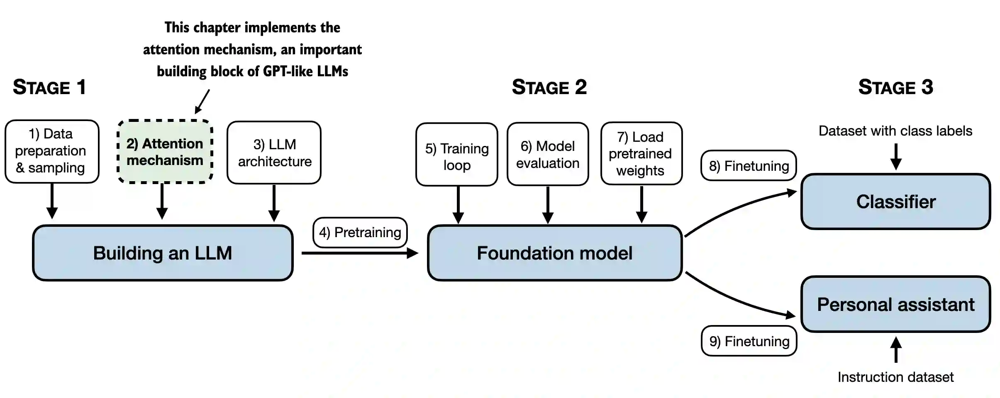

[TOC]

# Transformer相关

## 理解Embedding层和线性层的区别

- Pytorch中的Embedding层实现了与执行矩阵乘法的线性层相同的功能
- 我们使用Embedding层的原因是计算效率

### Embedding层

```python
import torch
import torch.nn as nn
print("PyTorch version:", torch.__version__)

idx = torch.tensor([2, 3, 1])

num_idx = max(idx) + 1

output_dim = 5

torch.manual_seed(123)

embedding_layers = nn.Embedding(num_idx, output_dim)

embedding_layers.weight
```

```
Parameter containing:
tensor([[ 0.3374, -0.1778, -0.3035, -0.5880,  1.5810],
        [ 1.3010,  1.2753, -0.2010, -0.1606, -0.4015],
        [ 0.6957, -1.8061, -1.1589,  0.3255, -0.6315],
        [-2.8400, -0.7849, -1.4096, -0.4076,  0.7953]], requires_grad=True)
```

```python
embedding_layers(torch.tensor([1]))
```

```
tensor([[ 1.3010,  1.2753, -0.2010, -0.1606, -0.4015]],
       grad_fn=<EmbeddingBackward0>)
```

- 来可视化一下看看发生了什么

  

- 现在，让我们转换之前定义的所有训练示例

  ```python
  idx = torch.tensor([2, 3, 1])
  embedding_layers(idx)
  ```

  ```
  tensor([[ 0.6957, -1.8061, -1.1589,  0.3255, -0.6315],
          [-2.8400, -0.7849, -1.4096, -0.4076,  0.7953],
          [ 1.3010,  1.2753, -0.2010, -0.1606, -0.4015]],
         grad_fn=<EmbeddingBackward0>)
  ```

  

### Linear层

- 现在，我们将要证明上面的Embedding层实现了与nn完全相同的功能，即Pytorch中一个热编码表示的线性层

- 首先，我们将token IDs转换为一个热表示

  ```python
  onehot = torch.nn.functional.one_hot(idx)
  onehot
  ```

  ```
  tensor([[0, 0, 1, 0],
          [0, 0, 0, 1],
          [0, 1, 0, 0]])
  ```

- 接下来，我们初始化一个线性层，它进行矩阵乘法 **XW^T**

  ```python
  torch.manual_seed(123)
  linear = torch.nn.Linear(num_idx, output_dim, bias=False)
  linear.weight
  ```

  ```
  Parameter containing:
  tensor([[-0.2039,  0.0166, -0.2483,  0.1886],
          [-0.4260,  0.3665, -0.3634, -0.3975],
          [-0.3159,  0.2264, -0.1847,  0.1871],
          [-0.4244, -0.3034, -0.1836, -0.0983],
          [-0.3814,  0.3274, -0.1179,  0.1605]], requires_grad=True)
  ```

- 需要注意的是，Pytorch中的线性层也使用小的随机权重进行初始化。要直接将其与上面的Embedding层进行比较，我们必须使用相同的小随机权重

  ```python
  linear.weight = torch.nn.Parameter(embedding_layers.weight.T.detach())
  ```

- 现在，我们可以在输入的热编码表示上使用线性层

  ```python
  linear(onehot.float())
  ```

  ```
  tensor([[ 0.6957, -1.8061, -1.1589,  0.3255, -0.6315],
          [-2.8400, -0.7849, -1.4096, -0.4076,  0.7953],
          [ 1.3010,  1.2753, -0.2010, -0.1606, -0.4015]], grad_fn=<MmBackward0>)
  ```

- 正如我们所看到的，这与我们使用Embedding层时得到的结果完全相同

  ```python
  embedding_layers(idx)
  ```

  ```
  tensor([[ 0.6957, -1.8061, -1.1589,  0.3255, -0.6315],
          [-2.8400, -0.7849, -1.4096, -0.4076,  0.7953],
          [ 1.3010,  1.2753, -0.2010, -0.1606, -0.4015]],
         grad_fn=<EmbeddingBackward0>)
  ```

- 第一个训练示例的token ID的计算

  

  

- 由于每一个热编码行中除一个索引外的所有索引都为0（按设计），因此此矩阵乘法基本上与查找一个热元素相同

- 在一个热编码上使用矩阵乘法相当于嵌入层查找，但如果我们使用大的Embedding矩阵，则可能效率低下，因为存在大量浪费的乘零运算

## Transformer基础架构


可以看到，**Transformer**由**Encoder**（编码器）和**Decoder**（解码器）两个部分组成。

- Encoder部分
  - **Embedding**：首先获取输入的sentence，经过embedding之后获得输入句子的embedding向量。其中embedding向量是由句子的每一个单词的embedding组成
  - **位置编码**：将获得的输入Embedding与位置的Embedding相加。具体的公式在Decoder部分详细说明。
  - **Multi-Head Attention**：由于获得的输入embedding是一个向量矩阵，每一行为每个单词的embedding以及相应的位置信息。值得注意的是，每一个Encoder Block输出的矩阵维度与输入完全一致。
  - **残差连接**
  - **LayerNorm**
  - **前馈神经网络**
- Decoder部分
  - **Embedding**：与Encoder部分相同
  - **位置编码**：包含了每一个单词在句子内所在位置的信息。保存了单词在句子序列中的绝对位置或者相对位置。当输入序列为整段文本时，为绝对位置；若是单个句子的时候，为相对位置。
  - **Masked Multi-head Attention**：第一个多头注意力机制使用了masked操作，用于掩盖序列之后的信息，防止信息泄露，避免过拟合
  - **Add & Norm**：残差连接与层归一化
  - **Feed Forward**：前馈神经网络，即多层感知器
  - **linear & Softmax**：线性变换层以及最后输出概率


### Layer Normalization（层归一化的作用）


#### 为什么不用Batch Normalization

### 位置编码详解

位置编码包含了每一个单词在句子内所在位置的信息。保存了单词在句子序列中的绝对位置或者相对位置。当输入序列为整段文本时，为绝对位置；若是单个句子的时候，为相对位置。

论文中使用了一个公式


- 泛化能力强
- 唯一性


### 为什么需要使用掩码


### 自注意力机制详解


### 多头注意力机制详解


### **为什么要除以根号dk**

- 雅可比矩阵导数尽量不会变为0

- 概率分布的方差不会太大


# 微调

## 什么是微调

微调就是将像GPT-3这样的通用模型，转化为像ChatGPT这样专门用于聊天的模型。即将通用模型转化为用于某一个特定用途的模型。

- 微调对模型实际上做了什么
  - 它使得模型能够处理比提示词（Prompt）更长的数据，使得模型不仅能够访问数据，还可以从中学习，通过这个学习过程，能够将其转化为某一特定用途的模型
  - 帮助模型产生更加一致的输出和行为
  - 帮助模型减少幻觉，即减少模型编造事物的情况
- 微调缺点
  - 数据质量和数量要求
  - 成本问题
- 微调的作用：
  - 改变模型的行为：
  - 学习新的知识
  - 以上均是
- 微调的步骤
  - 使用LLM，通过提示工程来识别一个任务
  - 找到一些它做的还可以的任务
  - 选择一个任务
  - 为这项任务收集一些输入和输出
  - 使用这些数据微调一个小的LLM

## 微调在整个训练过程的位置

- 训练过程
  - 预训练：数据是来自于网络上的庞大语料。费时费钱
  - 微调：通过微调得到一个优化的模型。与预训练不同的地方是微调所需的数据要比预训练少得多，因为是在一个训练好的模型上再训练

## 指令微调

指令微调是微调的一种类型，有时也被称为指令调整。


## 数据准备

数据所需要求

- 高质量
- 多样的
- 真实的
- 大量

收集数据的步骤

- 收集指令-响应对
- 组合这些对
- 对数据进行分词，添加填充或截断数据
- 分为训练集和测试集


# 从零到一搭建LLM

## 一、文本数据处理

本章主要介绍数据准备以及采样，为LLM准备输入数据


### 1.1 理解word Embedding

- 嵌入有多种形式，LLM中我们主要关注文本嵌入


- LLM与高维空间中的 Embedding 向量共同起作用
- 由于我们无法可视化这样的高维空间，下图说明了一个 2维 嵌入空间


### 1.2 Tokenizer 文本

- 在本节中，我们将文本标记化，这意味着将文本分解为更小的单元，例如单个单词和标点符号


- 接下来加载我们需要的文本

  ```python
  import os
  import urllib.request
  
  if not os.path.exists('../../../Data/the-verdict.txt'):
      url = ("https://raw.githubusercontent.com/rasbt/"
             "LLMs-from-scratch/main/ch02/01_main-chapter-code/"
             "the-verdict.txt")
      file_path = "the-verdict.txt"
      urllib.request.urlretrieve(url, file_path)
      
  with open('../../../Data/the-verdict.txt', 'r', encoding='utf-8') as f:
      raw_text = f.read()
  
  print(f"Total number of article: {len(raw_text)}")
  print(raw_text[:99])
  ```

  ```
  Total number of article: 20479
  I HAD always thought Jack Gisburn rather a cheap genius--though a good fellow enough--so it was no 
  ```

- 目标：tokenize 文本为 LLM 所用

  - 基于一些简单的数据开发一个简单的 tokenizer，以便于之后使用
  - 以下正则表达式是将其以 **空格** 进行分割

  ```python
  import re
  
  text = "Hello, world. This is a test."
  result = re.split(r'(\s)', text)
  
  print(result)
  ```

  ```
  ['Hello,', ' ', 'world.', ' ', 'This', ' ', 'is', ' ', 'a', ' ', 'test.']
  ```

  ```python
  result = [item for item in result if item.strip()]
  print(result)
  ```

  ```
  ['Hello,', 'world.', 'This', 'is', 'a', 'test.']
  ```

- 处理其他无意义字符

  ```python
  text = "Hello, world. Is this-- a test?"
  
  result = re.split(r'([,.:;?_!"()\']|--|\s)', text)
  result = [item.strip() for item in result if item.strip()]
  print(result)
  ```

  ```
  ['Hello', ',', 'world', '.', 'Is', 'this', '--', 'a', 'test', '?']
  ```

  

  ```python
  preprocessed = re.split(r'([,.:;?_!"()\']|--|\s)', raw_text)
  preprocessed = [item.strip() for item in preprocessed if item.strip()]
  print(preprocessed[:30])
  ```

  ```
  ['I', 'HAD', 'always', 'thought', 'Jack', 'Gisburn', 'rather', 'a', 'cheap', 'genius', '--', 'though', 'a', 'good', 'fellow', 'enough', '--', 'so', 'it', 'was', 'no', 'great', 'surprise', 'to', 'me', 'to', 'hear', 'that', ',', 'in']
  ```

- 计算总的token长度

  ```python
  print(len(preprocessed)) # 4690
  ```

### 1.3 将 tokens 转换为token IDs

- 接下来，将文本 tokens 转换为 token IDs，以便于之后可以通过 Embedding 层对其进行处理


- 从这些 tokens，我们可以构建一个包括所有 tokens 的词表

  ```python
  # 进行去重
  all_words = sorted(set(preprocessed))
  vocab_size = len(all_words)
  
  print(vocab_size) # 1130
  ```

  ```python
  # 构建词表
  vocab = {token:integer for integer,token in enumerate(all_words)}
  for i, item in enumerate(vocab.items()):
      print(item)
      if i >= 20:
          break
  ```

  ```
  ('!', 0)
  ('"', 1)
  ("'", 2)
  ('(', 3)
  (')', 4)
  (',', 5)
  ('--', 6)
  ('.', 7)
  (':', 8)
  (';', 9)
  ('?', 10)
  ('A', 11)
  ('Ah', 12)
  ('Among', 13)
  ('And', 14)
  ('Are', 15)
  ('Arrt', 16)
  ('As', 17)
  ('At', 18)
  ('Be', 19)
  ('Begin', 20)
  ```

- 构建一个tokenizer类

  ```python
  class SimpleTokenizerV1:
      def __init__(self, vocab):
          '''
          Tokenizer类
          :param vocab: 词表 
          '''
          self.str_to_int = vocab
          self.int_to_str = {i:s for s, i in vocab.items()}
          
      def encode(self, text):
          preprocessed = re.split(r'([,.?_!"()\']|--|\s)', text)
          preprocessed = [
              item.strip() for item in preprocessed if item.strip()
          ]
          ids = [self.str_to_int[s] for s in preprocessed]
          return ids
      
      def decode(self, ids):
          text = " ".join([self.int_to_str[i] for i in ids])
          
          text = re.sub(r'\s+([,.?!"()\'])', r'\1', text)
          return text
  ```

  - encode 函数将词表转换为 token IDs

  - decode 函数将 token IDs 转换回文本

    

- 我们可以用tokenizer将文本转换为整数，这些整数可以作为 LLM 的 Embedding 输入层

- 将 token IDs decode 回文本

### 1.4 加入特殊文本tokens

- 为未知单词添加一些“特殊”标记并表示文本的结尾是很有用的


- 一些 tokenizer 使用特殊的 tokens 来帮助 LLM 提供额外的上下文

- 其中一些特殊 tokens 是
  - **[BOS]**（序列的开始）标记文本的开始
  - **[EOS]**（序列结束）标记文本的结束位置（这通常用于连接多个不相关的文本，例如，两篇不同的维基百科文章或两本不同的书，等等）
  - **[PAD]**（填充）如果我们训练批量大小1的LLM（我们可能包括多个不同长度的文本；使用填充 token，我们将较短的文本填充到最长的长度，使所有文本的长度相等）
  - **[UNK]** 表示未包含在词汇表中的词汇
- 请注意，GPT-2 不需要上述任何 tokens，而只使用 <|endoftext|> token 来降低复杂性
- **<|endoftext|>** 类似于上面提到的 [EOS] token
- GPT还使用 <|endoftext|> 进行填充（因为我们在对批处理输入进行训练时通常使用掩码，所以无论如何我们都不会使用填充的 tokens，所以这些 tokens 是什么并不重要）
- GPT-2 不对词汇表外的单词使用 <|UNK|> 标记；相反，GPT-2 使用了一个字节对编码（BPE）标记器，它将字分解为子字单元，我们将在后面的部分中讨论


```python
tokenizer = SimpleTokenizerV1(vocab)

text = "Hello, do you like tea. Is this-- a test?"

tokenizer.encode(text)

# 会报错 KeyError: 'Hello'
```

- 由于词表中未包含 Hello 一词，因此上述操作会报错

- 为了处理这种情况，我们可以向词表中添加特殊的标记，如 <|UNK|>，以表示未知单词

- 由于我们已经扩展词表，让我们添加一个 <|endoftext|> 标记，它在 GPT-2 训练中表示文本的末尾

  ```python
  preprocessed = re.split(r'([,.?_!"()\']|--|\s)', raw_text)
  preprocessed = [item.strip() for item in preprocessed if item.strip()]
  
  all_tokens = sorted(list(set(preprocessed)))
  all_tokens.extend(["<|endoftext|>", "<|unk|>"])
  
  vocab = {token:integer for integer, token in enumerate(all_tokens)}
  
  len(vocab.items()) # 1161
  ```

  ```python
  for i, item in enumerate(list(vocab.items())[-5:]):
      print(item)
  ```

  ```
  ('younger', 1156)
  ('your', 1157)
  ('yourself', 1158)
  ('<|endoftext|>', 1159)
  ('<|unk|>', 1160)
  ```

- 我们还需要相应地调整 tokenizer，以便于知道何时以及如何使用新的 <|UNK|> token

  ```python
  class SimpleTokenizerV2:
      def __init__(self, vocab):
          '''
          Tokenizer类
          :param vocab: 词表 
          '''
          self.str_to_int = vocab
          self.int_to_str = {i:s for s, i in vocab.items()}
          
      def encode(self, text):
          preprocessed = re.split(r'([,.?_!"()\']|--|\s)', text)
          preprocessed = [
              item.strip() for item in preprocessed if item.strip()
          ]
          preprocessed = [
              item if item in self.str_to_int
              else "<|unk|>" for item in preprocessed
          ]
          
          ids = [self.str_to_int[s] for s in preprocessed]
          return ids
      
      def decode(self, ids):
          text = " ".join([self.int_to_str[i] for i in ids])
          
          text = re.sub(r'\s+([,.?!"()\'])', r'\1', text)
          return text
  ```

- 用修正后的 tokenizer 尝试一下

  ```python
  tokenizer = SimpleTokenizerV2(vocab)
  
  text1 = "Hello, do you like tea?"
  text2 = "In the sunlit terraces of the palace."
  
  text = " <|endoftext|> ".join((text1, text2))
  
  print(text)
  ```

  ```
  Hello, do you like tea? <|endoftext|> In the sunlit terraces of the palace.
  ```

  ```python
  tokenizer.encode(text)
  ```

  ```
  [1160,
   5,
   362,
   1155,
   642,
   1000,
   10,
   1159,
   57,
   1013,
   981,
   1009,
   738,
   1013,
   1160,
   7]
  ```

  ```python
  tokenizer.decode(tokenizer.encode(text))
  ```

  ```
  '<|unk|>, do you like tea? <|endoftext|> In the sunlit terraces of the <|unk|>.'
  ```

### 1.5 BytePair编码

- GPT-2 使用字节对编码（BPE）作为其标记器

- 它允许模型将不在其预定义词汇表中的单词分解为更小的子单词单元甚至单个字符，使其能够处理词表外的单词

- 例如，如果GPT-2的词汇表中没有单词“unmiliarword”，它可能会将其标记为[“unfam”、“iliar”、“word”]或其他一些子单词细分，这取决于其经过训练的BPE合并

- 原始的BPE标记器可以在这里找到：https://github.com/openai/gpt-2/blob/master/src/encoder.py

- 在本章中，我们将使用OpenAI开源tiktoken库中的BPE标记器，该库在Rust中实现其核心算法，以提高计算性能

- 我创建了一个笔记本，并排比较这两种实现的bytepair_encoder（tiktoken比示例文本快5倍）

  ```python
  import importlib
  import tiktoken
  
  tokenizer = tiktoken.get_encoding("gpt2")
  text = (
      "Hello, do you like tea? <|endoftext|> In the sunlit terraces"
       "of someunknownPlace."
  )
  
  integers = tokenizer.encode(text, allowed_special={"<|endoftext|>"})
  
  print(integers)
  ```

  ```
  [15496, 11, 466, 345, 588, 8887, 30, 220, 50256, 554, 262, 4252, 18250, 8812, 2114, 1659, 617, 34680, 27271, 13]
  ```

  ```python
  strings = tokenizer.decode(integers)
  
  print(strings)
  ```

  ```
  Hello, do you like tea? <|endoftext|> In the sunlit terracesof someunknownPlace.
  ```

- BPE标记器将未知单词分解为子单词和单个字符

  

### 1.6 滑动窗口数据采样

- 我们训练LLM一次生成一个单词，因此我们希望相应地准备训练数据，其中序列中的下一个单词表示要预测的目标

  

  ```python
  with open("../../../Data/the-verdict.txt", "r", encoding="utf-8") as f:
      raw_text = f.read()
  
  enc_text = tokenizer.encode(raw_text)
  print(len(enc_text)) # 5145
  ```

- 对于每一个文本块，我们需要输入和目标。由于我们希望模型预测下一个单词，因此目标是向右移动一个位置的输入

  ```python
  enc_sample = enc_text[50:]
  context_size = 4
  
  x = enc_sample[:context_size]
  y = enc_sample[1:context_size+1]
  
  print(f'x: {x}')
  print(f'y:      {y}')
  ```

  ```
  x: [290, 4920, 2241, 287]
  y:      [4920, 2241, 287, 257]
  ```

- 一个接着一个，预测如下

  ```python
  for i in range(1, context_size + 1):
      context = enc_sample[:i]
      desired = enc_sample[i]
      
      print(context, '------>', desired)
  ```

  ```
  [290] ------> 4920
  [290, 4920] ------> 2241
  [290, 4920, 2241] ------> 287
  [290, 4920, 2241, 287] ------> 257
  ```

  ```python
  for i in range(1, context_size+1):
      context = enc_sample[:i]
      desired = enc_sample[i]
  
      print(tokenizer.decode(context), "---->", tokenizer.decode([desired]))
  ```

  ```
   and ---->  established
   and established ---->  himself
   and established himself ---->  in
   and established himself in ---->  a
  ```

- 我们使用滑动窗口方法，将位置更改+1

  

- 创建数据集和数据加载器，从输入文本数据集中提取块

  ```python
  import torch
  from torch.utils.data import DataLoader, Dataset
  
  class GPTDatasetV1(Dataset):
      def __init__(self, txt, tokenizer, max_length, stride):
          '''
          :param txt: 文本 
          :param tokenizer: 
          :param max_length: 滑动窗口最大长度 
          :param stride: 滑动步长
          '''
          self.input_ids = []
          self.tar_ids = []
          
          token_ids = tokenizer.encode(txt, allowed_special={"<|endoftext|>"})
          
          for i in range(0, len(token_ids) - max_length, stride):
              input_chunk = token_ids[i:i + max_length]
              tar_chunk = token_ids[i + 1:i + max_length + 1]
              self.input_ids.append(torch.tensor(input_chunk))
              self.tar_ids.append(torch.tensor(tar_chunk))
              
      def __len__(self):
          return len(self.input_ids)
      
      def __getitem__(self, idx):
          return self.input_ids[idx], self.tar_ids[idx]
      
  def create_dataloader_v1(txt, batch_size=4, max_length=256,
                           stride=128, shuffle=True, drop_last=True,
                           num_workers=0):
      tokenizer = tiktoken.get_encoding("gpt2")
      
      dataset = GPTDatasetV1(txt, tokenizer, max_length, stride)
      
      dataloader = DataLoader(
          dataset,
          batch_size=batch_size,
          shuffle=shuffle,
          drop_last=drop_last,
          num_workers=0
      )
      return dataloader
  ```

- 针对上下文大小为4的LLM测试批大小为1的数据加载器

  ```python
  with open(r'../../../Data/the-verdict.txt', 'r', encoding='utf-8') as f:
      raw_text = f.read()
  
  dataloader = create_dataloader_v1(
      raw_text, batch_size=1, max_length=4, stride=1, shuffle=False
  )
  
  data_iter = iter(dataloader)
  first_batch = next(data_iter)
  print(first_batch)
  ```

  ```
  [tensor([[  40,  367, 2885, 1464]]), tensor([[ 367, 2885, 1464, 1807]])]
  ```

  ```python
  second_batch = next(data_iter)
  print(second_batch)
  ```

  ```
  [tensor([[ 367, 2885, 1464, 1807]]), tensor([[2885, 1464, 1807, 3619]])]
  ```

- 使用等于上下文长度的步幅（4）的示例如下

  

- 我们还可以创建批处理输出

- 在这里增加步长，这样批次之间就不会有重叠，因为**更多的重叠可能会导致过拟合**

  ```python
  dataloader = create_dataloader_v1(raw_text, batch_size=8, max_length=4, stride=4, shuffle=False)
  
  data_iter = iter(dataloader)
  inputs, targets = next(data_iter)
  print("Inputs:\n", inputs)
  print("\nTargets:\n", targets)
  ```

  ```
  Inputs:
   tensor([[   40,   367,  2885,  1464],
          [ 1807,  3619,   402,   271],
          [10899,  2138,   257,  7026],
          [15632,   438,  2016,   257],
          [  922,  5891,  1576,   438],
          [  568,   340,   373,   645],
          [ 1049,  5975,   284,   502],
          [  284,  3285,   326,    11]])
  
  Targets:
   tensor([[  367,  2885,  1464,  1807],
          [ 3619,   402,   271, 10899],
          [ 2138,   257,  7026, 15632],
          [  438,  2016,   257,   922],
          [ 5891,  1576,   438,   568],
          [  340,   373,   645,  1049],
          [ 5975,   284,   502,   284],
          [ 3285,   326,    11,   287]])
  
  ```

### 1.7 创建token Embedding向量

- 使用 Embedding 层将标记嵌入到连续向量表示中

- 通常这些 Embedding 层是 LLM 本身的一部分，并在模型训练期间进行更新训练

  

- 假设我们有以下四个输入示例，输入 ID 分别为5、1、3和2（标记之后）。且为了简单起见，假设我们的词汇量很小，只有6个单词，并且我们想要创建大小为3的嵌入

  ```python
  input_ids = torch.tensor([2, 3, 5, 1])
  vocab_size = 6
  output_dim = 3
  
  torch.manual_seed(123)
  embedding_layer = torch.nn.Embedding(vocab_size, output_dim)
  
  print(embedding_layer.weight)
  ```

  ```
  Parameter containing:
  tensor([[ 0.3374, -0.1778, -0.1690],
          [ 0.9178,  1.5810,  1.3010],
          [ 1.2753, -0.2010, -0.1606],
          [-0.4015,  0.9666, -1.1481],
          [-1.1589,  0.3255, -0.6315],
          [-2.8400, -0.7849, -1.4096]], requires_grad=True)
  ```

- 对于熟悉热编码的人来说，上面的 Embedding 层方法本质上只是在全连接层中实现一个热编码器，然后进行矩阵乘法的更有效的方法

- 因为 Embedding 层只是一种更有效的实现，相当于一个热编码器和矩阵乘法方法，所以它可以被视为一个可以通过反向传播优化的神经网络层

- 详细区别可以看 [理解Embedding层和线性层的区别](#Transformer相关-理解Embedding层和线性层的区别)

- 要将 id 为 3 的 token 转换为三维向量，执行以下操作

  ```python
  print(embedding_layer(torch.tensor([3])))
  ```

  ```
  tensor([[-0.4015,  0.9666, -1.1481]], grad_fn=<EmbeddingBackward0>)
  ```

- 注意,上面是 embedding_layer 权重矩阵中的第4行。要嵌入上面的所有四个 input_ids 值，我们需要进行以下操作

  ```python
  print(embedding_layer(input_ids))
  ```

  ```
  tensor([[ 1.2753, -0.2010, -0.1606],
          [-0.4015,  0.9666, -1.1481],
          [-2.8400, -0.7849, -1.4096],
          [ 0.9178,  1.5810,  1.3010]], grad_fn=<EmbeddingBackward0>)
  ```

- 所以 Embedding 层本质上就是一种查找操作

  

### 1.8 编码单词位置

- Embedding 层将 ID 转换为相同的矢量表示，而不考虑它们在输入序列中的位置

  

- 位置嵌入与标记嵌入向量相结合，形成 LLM 的输入嵌入

  

- BytePair编码器的词表大小为50257

- 假设我们将输入 token 编码为256维向量表示

  ```python
  vocab_size = 50257
  output_dim = 256
  
  token_embedding_layer = torch.nn.Embedding(vocab_size, output_dim)
  ```

- 如果我们从数据加载器中采样数据，我们将每个批次中的token嵌入到256维向量中

- 假设我们有一个批量大小为8，每批有4个token，则会产生一个8 × 4 × 256的张量

  ```python
  max_length = 4
  dataloader = create_dataloader_v1(
      raw_text, batch_size=8, max_length=max_length,
      stride=max_length, shuffle=False
  )
  data_iter = iter(dataloader)
  inputs, targets = next(data_iter)
  print("Token IDs:\n", inputs)
  print("\nInputs shape:\n", inputs.shape)
  ```

  ```
  Token IDs:
   tensor([[   40,   367,  2885,  1464],
          [ 1807,  3619,   402,   271],
          [10899,  2138,   257,  7026],
          [15632,   438,  2016,   257],
          [  922,  5891,  1576,   438],
          [  568,   340,   373,   645],
          [ 1049,  5975,   284,   502],
          [  284,  3285,   326,    11]])
  
  Inputs shape:
   torch.Size([8, 4])
  ```

  ```python
  token_embeddings = token_embedding_layer(inputs)
  print(token_embeddings.shape)
  ```

  ```
  torch.Size([8, 4, 256])
  ```

- GPT-2使用绝对位置嵌入，因此我们只需要创建另一个Embedding层

  ```python
  context_length = max_length
  pos_embedding_layer = torch.nn.Embedding(context_length, output_dim)
  pos_embeddings = pos_embedding_layer(torch.arange(max_length))
  print(pos_embeddings.shape)
  ```

  ```
  torch.Size([4, 256])
  ```

- 要创建LLM中使用的输入嵌入，我们只需要添加标记和位置嵌入

  ```python
  input_embeddings = token_embeddings + pos_embeddings
  print(input_embeddings.shape)  # torch.Size([8, 4, 256])
  ```

- 在输入处理工作流的初始截断，输入文本被分割成单独的标记

- 在分割之后，这些token被转换为基于预定义词表的token IDs

  

## 二、构建注意力机制

- 本章涵盖注意力机制——LLM的引擎

  

  

### 2.1 长序列建模问题

- 由于源语言和目标语言之间的语法结构不同，逐字翻译文本是不可行的

  

- 在引入Transformer模型之前，Encoder-Decoder RNN通常用于机器翻译任务

- 在这种设置中 Encoder使用隐藏层处理源语言中的一系列标记，以生成整个输入序列的压缩表示

  

### 2.2 利用注意力机制捕获数据相关性

- 通过注意力机制，网络的文本生成解码器能够选择性地访问所有输入token，这意味着在特定输出token的生成中，某些输入token比其他输入token具有更大的意义

  

- Transformer中的自注意力机制是一种技术，旨在通过使序列中的每个位置能够参与并确定同一序列中其他每个位置的相关性来增强输入表示

  

### 2.3 以self-attention的方式处理输入的不同部分

#### 2.3.1 一种没有可训练权重的简单自注意力机制

- 本节解释了自注意力机制的一个简化变体，它不包含任何可训练的权重

- 这纯粹是为了说明，而不是transformers中使用的注意力机制

- 下一节将扩展这种简单的注意力机制，以实现真正的自我注意力机制

- 假设我们得到一个输入序列 $x^{(1)}$ 到 $x^{(n)}$

  - 输入是一个文本（例如，像“你的旅程从第一步开始”这样的句子），它已经被转换为token embedding
  - 例如，$x^{(1)}$ 是表示单词 “Your” 的 d维向量，依此类推

- 目标：计算上下文向量 $z^{(i)}$ 对于 $x^{(1)}$ 到 $x^{(T)}$ 序列中的 $x^{(i)}$ ($x$和$z$具有相同的尺寸)

  - 上下文矢量$z^{(i)}$是输入$x^{(1)}$到$x^{(T)}$序列的加权和

  - 上下文向量是特定于某个输入的“上下文”

    - 与其将$x^{(1)}$作为任意输入token的占位符，让我们考虑第二个输入$x^{(2)}$

    - 继续一个具体的例子，而不是占位符$z^{(1)}$, 我们考虑第二输出上下文向量,$z^{(2)}$

    - 第二上下文向量,$z^{(2)}$,是所有输入的加权和$x^{(1)}$到$x^{(T)}$相对于第二输入元素$x^{(2)}$加权

    - 注意力权重是在计算$z^{(2)}$时确定每个输入元素对加权和的贡献程度的权重

    - 简而言之，将$z^{(2)}$作为$x^{(2)}$修改版本,它还包含与手头给定任务相关的所有其他输入元素的信息

      

- （请注意，此图中的数字被截断为小数点后的一位数字，以减少视觉混乱；同样，其他数字也可能包含截断值）

- 按照惯例，未归一化的注意力权重被称为“注意力得分”，而归一化的注意力得分加起来为1，则被称作“注意力权重”

- Step1:计算未归一化的注意力分数$w$

- 假设我们使用第二个输入 token 作为查询，即$q^{(2)}$=$x^{(2)}$,我们通过点积计算未规范化的注意力得分：

  - $w_{21}$=$x^{(1)}$$q^{(2)T}$

  - $w_{22}$=$x^{(2)}$$q^{(2)T}$

  -  $w_{23}$=$x^{(3)}$$q^{(2)T}$

     - ...
     -  $w_{2n}$=$x^{(n)}$$q^{(2)T}$

- 希腊字母 $w$ 是用来象征未规范的注意力分数的

  - $w_{21}$中的下标“21”意味着输入序列元素2被用作针对输入序列元素1的查询

- 假设我们有以下输入句子，它已经嵌入到三维向量中（为了便于说明，我们在这里使用了一个非常小的Embedding维度，这样它就可以在没有换行的情况下Embedding到页面上）：

  ```python
  import torch
  
  inputs = torch.tensor(
     [[0.43, 0.15, 0.89], # Your     (x^1)
      [0.55, 0.87, 0.66], # journey  (x^2)
      [0.57, 0.85, 0.64], # starts   (x^3)
      [0.22, 0.58, 0.33], # with     (x^4)
      [0.77, 0.25, 0.10], # one      (x^5)
      [0.05, 0.80, 0.55]] # step     (x^6)
  )
  ```

- 我们遵循常见的机器学习和深度学习惯例，其中训练示例表示为行，特征值表示为列；在上述张量的情况下，每行表示一个单词，每列表示一个嵌入维度

- 本节的主要目的是演示上下文向量 $z^{(2)}$ 使用第二输入序列 $x^{(2)}$ 来计算,作为查询

- 该图描绘了这个过程的初始步骤，包括计算$x^{(2)}$之间的注意力得分ω以及通过点积运算的所有其他输入元素

  

- 我们使用输入序列元素2, $x^{(2)}$, 作为计算上下文向量的示例$z^{(2)}$; 在本节的后面,我们将把它推广到计算所有上下文向量。

- 第一步是通过计算查询$x^{(2)}$之间的点积来计算未规范化的注意力得分以及所有其他输入token：

  ```python
  query = inputs[1]
  
  attention_scores_2 = torch.empty(inputs.shape[0])
  
  for i, x_i in enumerate(inputs):
      attention_scores_2[i] = torch.dot(x_i, query)
  
  print(attention_scores_2)
  ```

  ```
  tensor([0.9544, 1.4950, 1.4754, 0.8434, 0.7070, 1.0865])
  ```

  ```python
  res = 0.
  
  for idx, element in enumerate(inputs[0]):
      res += inputs[0][idx] * query[idx]
      
  print(res)
  print(torch.dot(inputs[0], query))
  ```

  ```
  tensor(0.9544)
  tensor(0.9544)
  ```

- 步骤2：将未规范化的注意力得分标准化（“omegas”, $w$)因此它们的总和为1

- 这里有一种简单的方法，可以将未规范化的注意力得分归一化为1（这是一种惯例，对解释很有用，对训练稳定性很重要）

  

  ```python
  attention_weights_2_tmp = attention_scores_2 / attention_scores_2.sum()
  
  print(f"Attention weights:{attention_weights_2_tmp}")
  print(f"Sum:{attention_weights_2_tmp.sum()}")
  ```

  ```
  Attention weights:tensor([0.1455, 0.2278, 0.2249, 0.1285, 0.1077, 0.1656])
  Sum:1.0000001192092896
  ```

- 然而，在实践中，使用softmax函数进行归一化是常见的，也是推荐的，该函数更善于处理极值，并且在训练期间具有更理想的梯度特性。

- 这里是一个用于缩放的softmax函数的简单实现，它还对向量元素进行归一化，使它们的总和为1

  ```python
  def softmax_naive(x):
      return torch.exp(x) / torch.exp(x).sum(dim=0)
  
  attention_weights_2_naive = softmax_naive(attention_scores_2)
  
  print(f"Attention weights:{attention_weights_2_naive}")
  print(f"Sum:{attention_weights_2_naive.sum()}")
  ```

  ```
  Attention weights:tensor([0.1385, 0.2379, 0.2333, 0.1240, 0.1082, 0.1581])
  Sum:1.0
  ```

- 由于上溢和下溢问题，上面的naive实现可能会遇到大小输入值的数值不稳定性问题

- 因此，在实践中，建议使用softmax的PyTorch实现，该实现已针对性能进行了高度优化

  ```python
  attention_weights_2 = torch.softmax(attention_scores_2, dim=0)
  
  print(f"Attention weights:{attention_weights_2}")
  print(f"Sum:{attention_weights_2.sum()}")
  ```

  ```
  Attention weights:tensor([0.1385, 0.2379, 0.2333, 0.1240, 0.1082, 0.1581])
  Sum:1.0
  ```

- 步骤3：计算上下文向量$z^{(2)}$通过乘以嵌入的输入 token，使用注意力权重并对结果向量$x^{(2)}$求和

  

  ```python
  query = inputs[1]
  
  context_vec_2 = torch.zeros(query.shape)
  for i, x_i in enumerate(inputs):
      context_vec_2 += attention_weights_2[i] * x_i
      
  print(context_vec_2)
  ```

  ```
  tensor([0.4419, 0.6515, 0.5683])
  ```

#### 2.3.2 计算所有输入token的注意力权重

- 上面，我们计算了输入2的注意力权重和上下文向量（如下图中突出显示的行所示）

- 接下来，我们将此计算推广到计算所有注意力权重和上下文向量

  

- （请注意，此图中的数字被截断为小数点后的两位数，以减少视觉混乱；每行中的值加起来应为1.0或100%；同样，其他图中的位数也被截断）

- 在自我注意力中，这个过程从注意力得分的计算开始，随后对其进行归一化，以得出总共为1的注意力权重

- 然后利用这些注意力权重通过输入的加权求和来生成上下文向量

  

- 将前面的步骤1应用于所有成对元素，以计算未规范化的注意力得分矩阵

  ```python
  attention_scores = torch.empty(6, 6)
  
  for i, x_i in enumerate(inputs):
      for j, x_j in enumerate(inputs):
          attention_scores[i, j] = torch.dot(x_i, x_j)
  
  print(attention_scores)
  ```

  ```
  tensor([[0.9995, 0.9544, 0.9422, 0.4753, 0.4576, 0.6310],
          [0.9544, 1.4950, 1.4754, 0.8434, 0.7070, 1.0865],
          [0.9422, 1.4754, 1.4570, 0.8296, 0.7154, 1.0605],
          [0.4753, 0.8434, 0.8296, 0.4937, 0.3474, 0.6565],
          [0.4576, 0.7070, 0.7154, 0.3474, 0.6654, 0.2935],
          [0.6310, 1.0865, 1.0605, 0.6565, 0.2935, 0.9450]])
  ```

  ```python
  attention_scores = inputs @ inputs.T
  print(attention_scores)
  ```

  ```
  tensor([[0.9995, 0.9544, 0.9422, 0.4753, 0.4576, 0.6310],
          [0.9544, 1.4950, 1.4754, 0.8434, 0.7070, 1.0865],
          [0.9422, 1.4754, 1.4570, 0.8296, 0.7154, 1.0605],
          [0.4753, 0.8434, 0.8296, 0.4937, 0.3474, 0.6565],
          [0.4576, 0.7070, 0.7154, 0.3474, 0.6654, 0.2935],
          [0.6310, 1.0865, 1.0605, 0.6565, 0.2935, 0.9450]])
  ```

  ```python
  attention_weights = torch.softmax(attention_scores, dim=-1)
  print(attention_weights)
  ```

  ```
  tensor([[0.2098, 0.2006, 0.1981, 0.1242, 0.1220, 0.1452],
          [0.1385, 0.2379, 0.2333, 0.1240, 0.1082, 0.1581],
          [0.1390, 0.2369, 0.2326, 0.1242, 0.1108, 0.1565],
          [0.1435, 0.2074, 0.2046, 0.1462, 0.1263, 0.1720],
          [0.1526, 0.1958, 0.1975, 0.1367, 0.1879, 0.1295],
          [0.1385, 0.2184, 0.2128, 0.1420, 0.0988, 0.1896]])
  ```

  ```python
  row_2_sum = sum([0.1385, 0.2379, 0.2333, 0.1240, 0.1082, 0.1581])
  print("Row 2 sum:", row_2_sum)
  print("All row sums:", attention_weights.sum(dim=-1))
  ```

  ```
  Row 2 sum: 1.0
  All row sums: tensor([1.0000, 1.0000, 1.0000, 1.0000, 1.0000, 1.0000])
  ```

- 应用步骤3来计算所有上下文向量

  ```python
  all_context_vecs = attention_weights @ inputs
  print(all_context_vecs)
  ```

  ```
  tensor([[0.4421, 0.5931, 0.5790],
          [0.4419, 0.6515, 0.5683],
          [0.4431, 0.6496, 0.5671],
          [0.4304, 0.6298, 0.5510],
          [0.4671, 0.5910, 0.5266],
          [0.4177, 0.6503, 0.5645]])
  ```

- 作为健全性检查，之前计算的上下文向量 $z^{(2)}$=[0.4419, 0.6515, 0.5683] 可以在上面的第二行找到

  ```python
  print("Previous 2nd context vector:", context_vec_2)
  ```

  ```
  Previous 2nd context vector: tensor([0.4419, 0.6515, 0.5683])
  ```

### 2.4 用可训练的权重实现自我注意力机制

- 一个概念框架，说明了本节中发展的自注意力机制如何融入本书和本章的整体叙事和结构

  

#### 2.4.1 逐步计算注意力权重

- 在本节中，我们将实现在原始Transformer架构、GPT模型和大多数其他流行的LLM中使用的自注意机制

- 这种自我注意力机制也被称为“缩放点积注意力”

- 总体思路与之前类似：

  - 我们希望将上下文向量计算为特定于某个输入元素的输入向量的加权和
  - 对于以上内容，我们需要注意力权重

- 正如我们看到的，与前面介绍的基本注意力机制相比，只有细微的区别：

  - 最显著的区别是引入了在模型训练期间更新的权重矩阵
  - 这些可训练的权重矩阵至关重要，因此模型（特别是模型内部的注意力模块）可以学习生成“好”的上下文向量

  

- 逐步实现自我注意机制，我们将从引入三个训练权重矩阵开始,分别为$W_{q}$,$W_{k}$,$W_{v}$

- 这三个矩阵用于投影Embedding的输入token，$x^{i}$，通过矩阵乘法转换为查询、键和值向量：

  - query 向量: $q^{(i)}$=$W_{q}x^{(i)}$
  - key 向量: $k^{(i)}$=$W_{k}x^{(i)}$
  - value 向量: $v^{(i)}$=$W_{v}x^{(i)}$

- 输入的嵌入维度 $x$ 和 query 向量 $q$ 可以相同也可以不同，这取决于模型的设计和具体实现

- 在GPT模型中，输入和输出维度通常是相同的，但为了便于说明，为了更好地遵循计算，我们在这里选择了不同的输入和输出维度

  ```python
  x_2 = inputs[1] # second input element
  d_in = inputs.shape[1] # the input embedding size, d=3
  d_out = 2 # the output embedding size, d=2
  torch.manual_seed(123)
  W_q = torch.nn.Parameter(torch.rand(d_in, d_out), requires_grad=False)
  W_k = torch.nn.Parameter(torch.rand(d_in, d_out), requires_grad=False)
  W_v = torch.nn.Parameter(torch.rand(d_in, d_out), requires_grad=False)
  ```

- 接下来，我们计算查询、键和值向量

  ```python
  query_2 = x_2 @ W_q
  key_2 = x_2 @ W_k
  value_2 = x_2 @ W_v
  
  print(query_2)
  ```

  ```
  tensor([0.4306, 1.4551])
  ```

- 如下所示，我们成功地将6个输入token从3D投影到2D嵌入空间

  ```python
  keys = inputs @ W_k
  values = inputs @ W_v
  
  print(f"key.shape:{keys.shape}")
  print(f"values.shape:{values.shape}")
  ```

  ```
  key.shape:torch.Size([6, 2])
  values.shape:torch.Size([6, 2])
  ```

- 在下一步，即第2步中，我们通过计算查询和每个关键向量之间的点积来计算未规范化的注意力得分

  

  ```python
  keys_2 = keys[1]
  attention_score_22 = query_2.dot(keys_2)
  print(attention_score_22)
  ```

  ```
  tensor(1.8524)
  ```

- 由于我们有6个输入，因此对于给定的查询向量，我们有6种注意力得分

  ```python
  attention_scores_2 = query_2 @ keys.T
  print(attention_scores_2)
  ```

  ```
  tensor([1.2705, 1.8524, 1.8111, 1.0795, 0.5577, 1.5440])
  ```

  

- 接下来，在步骤3中，我们使用前面使用的softmax函数计算注意力权重（归一化注意力得分，总和为1）

- 与之前的不同之处在于，我们现在通过将注意力分数除以嵌入维度的平方根来缩放注意力分数，$\sqrt{d_k}$

  ```python
  d_k = keys.shape[1]
  attention_weights_2 = torch.softmax(attention_scores_2 / d_k ** 0.5, dim=-1)
  print(attention_weights_2)
  ```

  ```
  tensor([0.1500, 0.2264, 0.2199, 0.1311, 0.0906, 0.1820])
  ```

  

- 在步骤4中，我们现在计算输入查询向量2的上下文向量：

  ```python
  context_vec_2 = attention_weights_2 @ values
  print(context_vec_2)
  ```

  ```
  tensor([0.3061, 0.8210])
  ```

#### 2.4.2 实现一个 Self-Attention 类

```python
import torch.nn as nn

class SelfAttentionV1(nn.Module):
    def __init__(self, d_in, d_out):
        super().__init__()
        self.W_q = nn.Parameter(torch.rand(d_in, d_out))
        self.W_k = nn.Parameter(torch.rand(d_in, d_out))
        self.W_v = nn.Parameter(torch.rand(d_in, d_out))
    
    def forward(self, x):
        key = x @ self.W_k
        query = x @ self.W_q
        value = x @ self.W_v
        
        attention_score = query @ key.T
        attention_weight = torch.softmax(attention_score / key.shape[-1] ** 0.5, dim=-1)
        
        context_vec = attention_score @ value
       	return context_vec
    
torch.manual_seed(123)
sa_v1 = SelfAttentionV1(d_in, d_out)
print(sa_v1(inputs))
```

```
tensor([[0.2897, 0.8043],
        [0.3069, 0.8188],
        [0.3063, 0.8173],
        [0.2972, 0.7936],
        [0.2848, 0.7650],
        [0.3043, 0.8105]], grad_fn=<MmBackward0>)
```


- 我们可以使用PyTorch的线性层来简化上面的实现，如果我们禁用偏置单元，这相当于矩阵乘法

- 使用nn的另一大优势，nn.Linear超过我们的手册 nn.Parameter(torch.rand(…)) 方法，是一个首选的权重初始化方案，这导致了更稳定的模型训练

  ```python
  class SelfAttention_v2(nn.Module):
  
      def __init__(self, d_in, d_out, qkv_bias=False):
          super().__init__()
          self.W_query = nn.Linear(d_in, d_out, bias=qkv_bias)
          self.W_key   = nn.Linear(d_in, d_out, bias=qkv_bias)
          self.W_value = nn.Linear(d_in, d_out, bias=qkv_bias)
  
      def forward(self, x):
          keys = self.W_key(x)
          queries = self.W_query(x)
          values = self.W_value(x)
          
          attn_scores = queries @ keys.T
          attn_weights = torch.softmax(attn_scores / keys.shape[-1]**0.5, dim=-1)
  
          context_vec = attn_weights @ values
          return context_vec
  
  torch.manual_seed(789)
  sa_v2 = SelfAttention_v2(d_in, d_out)
  print(sa_v2(inputs))
  ```

  ```
  tensor([[-0.0739,  0.0713],
          [-0.0748,  0.0703],
          [-0.0749,  0.0702],
          [-0.0760,  0.0685],
          [-0.0763,  0.0679],
          [-0.0754,  0.0693]], grad_fn=<MmBackward0>)
  ```

### 2.5 使用因果注意力机制隐藏之后的单词

- 在因果注意力中，对角线上方的注意力权重被屏蔽，确保对于任何给定的输入，LLM在计算具有注意力权重的上下文向量时都无法利用未来的标记

  

#### 2.5.1 因果掩码注意力机制的应用

- 在本节中，我们将把以前的自我注意力机制转换为因果自我注意力机制

- 因果自注意力确保模型对序列中某个位置的预测仅取决于先前位置的已知输出，而不是未来位置

- 简单地说，这确保了每个下一个单词的预测应该只取决于前一个单词

- 为了实现这一点，对于每个给定的 token，我们屏蔽掉未来的 token（输入文本中当前 token之后的token）：

  

- 为了说明和实现因果自我注意，让我们使用上一节中的注意力得分和权重

  ```python
  query = sa_v2.W_query(inputs)
  key = sa_v2.W_key(inputs)
  attention_score = query @ key.T
  
  attention_weights = torch.softmax(attention_score / key.shape[-1] ** 0.5, dim=-1)
  print(attention_weights)
  ```

  ```
  tensor([[0.1921, 0.1646, 0.1652, 0.1550, 0.1721, 0.1510],
          [0.2041, 0.1659, 0.1662, 0.1496, 0.1665, 0.1477],
          [0.2036, 0.1659, 0.1662, 0.1498, 0.1664, 0.1480],
          [0.1869, 0.1667, 0.1668, 0.1571, 0.1661, 0.1564],
          [0.1830, 0.1669, 0.1670, 0.1588, 0.1658, 0.1585],
          [0.1935, 0.1663, 0.1666, 0.1542, 0.1666, 0.1529]],
         grad_fn=<SoftmaxBackward0>)
  ```

- 屏蔽未来注意力权重的最简单方法是通过PyTorch的tril函数创建一个掩码，其中主对角线下方（包括对角线本身）的元素设置为1，主对角线上方设置为0

  ```python
  context_length = attention_score.shape[0]
  mask_simple = torch.tril(torch.ones(context_length, context_length))
  print(mask_simple)
  ```

  ```
  tensor([[1., 0., 0., 0., 0., 0.],
          [1., 1., 0., 0., 0., 0.],
          [1., 1., 1., 0., 0., 0.],
          [1., 1., 1., 1., 0., 0.],
          [1., 1., 1., 1., 1., 0.],
          [1., 1., 1., 1., 1., 1.]])
  ```

  ```python
  masked_simple = attention_weights * mask_simple
  print(masked_simple)
  ```

  ```
  tensor([[0.2899, 0.0000, 0.0000, -0.0000, 0.0000, -0.0000],
          [0.4656, 0.1723, 0.0000, 0.0000, 0.0000, 0.0000],
          [0.4594, 0.1703, 0.1731, 0.0000, 0.0000, 0.0000],
          [0.2642, 0.1024, 0.1036, 0.0186, 0.0000, 0.0000],
          [0.2183, 0.0874, 0.0882, 0.0177, 0.0786, 0.0000],
          [0.3408, 0.1270, 0.1290, 0.0198, 0.1290, 0.0078]],
         grad_fn=<MulBackward0>)
  ```

- 然而，如果像上面一样在softmax之后应用掩码，它将破坏softmax创建的概率分布

- Softmax确保所有输出值总和为1

- softmax之后的掩码将需要重新标准化输出以再次求和为1，这会使过程复杂化，并可能导致意想不到的效果

- 为了确保行的总和为1，我们可以将注意力权重标准化如下：

  ```python
  row_sums = masked_simple.sum(dim=-1, keepdim=True)
  masked_simple_norm = masked_simple / row_sums
  print(masked_simple_norm)
  ```

  ```
  tensor([[1.0000, 0.0000, 0.0000, -0.0000, 0.0000, -0.0000],
          [0.7300, 0.2700, 0.0000, 0.0000, 0.0000, 0.0000],
          [0.5723, 0.2121, 0.2156, 0.0000, 0.0000, 0.0000],
          [0.5404, 0.2095, 0.2120, 0.0381, 0.0000, 0.0000],
          [0.4454, 0.1782, 0.1799, 0.0361, 0.1603, 0.0000],
          [0.4523, 0.1686, 0.1713, 0.0263, 0.1712, 0.0103]],
         grad_fn=<DivBackward0>)
  ```

- 虽然我们现在已经从技术上完成了对因果注意机制的编码，但让我们简单地看看一种更有效的方法来实现上述目的

- 因此，我们可以在对角线上方的未规范化注意力分数进入softmax函数之前，用负无穷大来掩盖它们，而不是将对角线上方的注意力权重归零并重新规范化结果：

  

  ```python
  mask = torch.triu(torch.ones(context_length, context_length), diagonal=1)
  masked = attention_score.masked_fill(mask.bool(), -torch.inf)
  print(masked)
  ```

  ```
  tensor([[0.2899,   -inf,   -inf,   -inf,   -inf,   -inf],
          [0.4656, 0.1723,   -inf,   -inf,   -inf,   -inf],
          [0.4594, 0.1703, 0.1731,   -inf,   -inf,   -inf],
          [0.2642, 0.1024, 0.1036, 0.0186,   -inf,   -inf],
          [0.2183, 0.0874, 0.0882, 0.0177, 0.0786,   -inf],
          [0.3408, 0.1270, 0.1290, 0.0198, 0.1290, 0.0078]],
         grad_fn=<MaskedFillBackward0>)
  ```

  ```python
  attention_weights = torch.softmax(masked / key.shape[-1] ** 0.5, dim=-1)
  print(attention_weights)
  ```

  ```
  tensor([[1.0000, 0.0000, 0.0000, 0.0000, 0.0000, 0.0000],
          [0.5517, 0.4483, 0.0000, 0.0000, 0.0000, 0.0000],
          [0.3800, 0.3097, 0.3103, 0.0000, 0.0000, 0.0000],
          [0.2758, 0.2460, 0.2462, 0.2319, 0.0000, 0.0000],
          [0.2175, 0.1983, 0.1984, 0.1888, 0.1971, 0.0000],
          [0.1935, 0.1663, 0.1666, 0.1542, 0.1666, 0.1529]],
         grad_fn=<SoftmaxBackward0>)
  ```

#### 2.5.2 mask注意力权重与dropout

- 此外，我们还可以应用dropout来减少训练过程中的过拟合现象

- Dropout可以应用在多个地方

  - 例如在计算注意力权重之后
  - 或者在注意力权重与值向量相乘之后

- 在这里，我们将在计算注意力权重之后应用dropout，因为这个更加常见

- 此外，在这个特定的例子中，我们使用50%的dropout率，这意味着随机屏蔽掉一半的注意力权重。（当我们稍后训练GPT模型时，我们将使用较低的dropout率，例如0.1或0.2

  

- 如果我们应用0.5（50%）的ropout率，则未丢弃的值将相应地按因子1/0.5=2进行缩放。

  ```python
  torch.manual_seed(123)
  dropout = torch.nn.Dropout(0.5)
  example = torch.ones(6, 6)
  print(dropout(example))
  ```

  ```
  tensor([[2., 2., 2., 2., 2., 2.],
          [0., 2., 0., 0., 0., 0.],
          [0., 0., 2., 0., 2., 0.],
          [2., 2., 0., 0., 0., 2.],
          [2., 0., 0., 0., 0., 2.],
          [0., 2., 0., 0., 0., 0.]])
  ```

  ```python
  torch.manual_seed(123)
  print(dropout(attention_weights))
  ```

  ```
  tensor([[2.0000, 0.0000, 0.0000, 0.0000, 0.0000, 0.0000],
          [0.0000, 0.8966, 0.0000, 0.0000, 0.0000, 0.0000],
          [0.0000, 0.0000, 0.6206, 0.0000, 0.0000, 0.0000],
          [0.5517, 0.4921, 0.0000, 0.0000, 0.0000, 0.0000],
          [0.4350, 0.0000, 0.0000, 0.0000, 0.0000, 0.0000],
          [0.0000, 0.3327, 0.0000, 0.0000, 0.0000, 0.0000]],
         grad_fn=<MulBackward0>)
  ```

#### 2.5.3 实现因果自注意类

- 接下来实现代码来处理由多个输入组成的批，以便我们的 CausalAttention 类支持我们实现的数据加载器产生的批输出

- 为了简单起见，为了模拟这种批量输入，我们复制了输入文本示例

  ```python
  batch = torch.stack((inputs, inputs), dim=0)
  print(batch.shape)  # torch.Size([2, 6, 3])
  ```

  ```python
  class CasualAttention(nn.Module):
      def __init__(self, d_in, d_out, context_length, 
                   dropout, qkv_bias=False):
          super().__init__()
          self.d_out = d_out
          self.W_q = nn.Linear(d_in, d_out, bias=qkv_bias)
          self.W_k = nn.Linear(d_in, d_out, bias=qkv_bias)
          self.W_v = nn.Linear(d_in, d_out, bias=qkv_bias)
          self.dropout = nn.Dropout(dropout)
          self.register_buffer('mask',
       			torch.triu(torch.ones(context_length, context_length), diagonal=1)
                              )
        
      def forward(self, x):
          batch, num_tokens, d_in = x.shape
          key = self.W_k(x)
          query = self.W_q(x)
          value = self.W_v(x)
          
          attention_score = query @ key.transpose(1, 2)
          attention_score.masked_fill_(self.mask.bool()[:num_tokens, :num_tokens], -torch.inf)
          attention_weights = torch.softmax(attention_score / key.shape[-1] ** 0.5, dim=-1)
          attention_weights = self.dropout(attention_weights)
          
          context_vec = attention_weights @ value
          return context_vec
      
  torch.manual_seed(123)
  
  context_length = batch.shape[1]
  ca = CasualAttention(d_in, d_out, context_length, 0.0)
  context_vecs = ca(batch)
  print(context_vecs)
  print(f"context_vecs.shape:{context_vecs.shape}")
  ```

  ```
  tensor([[[-0.4519,  0.2216],
           [-0.5695,  0.0343],
           [-0.6141, -0.0377],
           [-0.5642, -0.0717],
           [-0.5490, -0.0906],
           [-0.5291, -0.0961]],
  
          [[-0.4519,  0.2216],
           [-0.5695,  0.0343],
           [-0.6141, -0.0377],
           [-0.5642, -0.0717],
           [-0.5490, -0.0906],
           [-0.5291, -0.0961]]], grad_fn=<CloneBackward0>)
  context_vecs.shape:torch.Size([2, 6, 2])
  ```

- 请注意，dropout仅适用于训练期间，而不适用于推理期间

  

### 2.6 将单头注意力扩展到多头注意力

#### 2.6.1 堆叠多个单头注意力层

- 以下是之前实现的self-attention的概况（为简单期间，未显示因果和dropout掩码）

- 也被称为单头注意力

  

- 我们简单地堆叠多个单头注意力模块来获得多头注意力模块

  

- 多头注意力背后的主要思想：用不同的习得的线性投影多次（并行）运行注意力机制，这允许模型联合关注来自不同位置处的表示不同子空间的信息

  ```python
  class MultiHeadAttentionWrapper(nn.Module):
      def __init__(self, d_in, d_out, context_length, dropout, num_heads, qkv_bias=False):
          super().__init__()
          self.heads = nn.ModuleList(
              [CasualAttention(d_in, d_out, context_length, dropout, qkv_bias)
               for _ in range(num_heads)]
          )
          
      def forward(self, x):
          return torch.cat([head(x) for head in self.heads], dim=-1)
      
  torch.manual_seed(123)
  
  context_length = batch.shape[1]
  d_in, d_out = 3, 2
  mha = MultiHeadAttentionWrapper(
      d_in, d_out, context_length, 0.0, num_heads=2
  )
  
  context_vecs = mha(batch)
  
  print(context_vecs)
  print(f"context_vecs.shape:{context_vecs.shape}")
  ```

  ```
  tensor([[[-0.4519,  0.2216,  0.4772,  0.1063],
           [-0.5695,  0.0343,  0.5668,  0.2819],
           [-0.6141, -0.0377,  0.6008,  0.3481],
           [-0.5642, -0.0717,  0.5462,  0.3445],
           [-0.5490, -0.0906,  0.5318,  0.3359],
           [-0.5291, -0.0961,  0.5093,  0.3362]],
  
          [[-0.4519,  0.2216,  0.4772,  0.1063],
           [-0.5695,  0.0343,  0.5668,  0.2819],
           [-0.6141, -0.0377,  0.6008,  0.3481],
           [-0.5642, -0.0717,  0.5462,  0.3445],
           [-0.5490, -0.0906,  0.5318,  0.3359],
           [-0.5291, -0.0961,  0.5093,  0.3362]]], grad_fn=<CatBackward0>)
  context_vecs.shape:torch.Size([2, 6, 4])
  ```

- 在上面的实现中，Embedding维度是4，因为我们的d_out=2作为K、Q和V向量以及上下文向量的Embedding维度。由于我们有两个头，我们输出Embedding维度为2*2=4

#### 2.6.2 通过weight拆分实现多头注意力

- 虽然上面是多头注意力的直观且功能齐全的实现（包装了前面的单头注意力因果注意力实现），但我们可以编写一个名为MultiHeadAttention的独立类来实现

- 我们不为这个独立的MultiHeadAttention类连接单个注意力头

- 相反，我们创建单个W_query、W_key和W_value权重矩阵，然后将它们拆分为每个注意力头的单独矩阵：

  ```python
  class MultiHeadAttention(nn.Module):
      def __init__(self, d_in, d_out, context_length, dropout, num_heads, qkv_bias=False):
          super().__init__()
          assert (d_out % num_heads == 0), \
              "d_out must be divisible by num_heads"
          
          self.d_out = d_out
          self.num_heads = num_heads
          self.head_dim = d_out // num_heads
          
          self.W_q = nn.Linear(d_in, d_out, bias=qkv_bias)
          self.W_k = nn.Linear(d_in, d_out, bias=qkv_bias)
          self.W_v = nn.Linear(d_in, d_out, bias=qkv_bias)
          self.dropout = nn.Dropout(dropout)
          self.register_buffer(
              'mask', 
              torch.triu(torch.ones(context_length, context_length), diagonal=1))
          self.out_proj = nn.Linear(d_out, d_out)
          
      def forward(self, x):
          b, num_tokens, d_in = x.shape
          
          key = self.W_k(x)
          query = self.W_q(x)
          value = self.W_v(x)
          
          # We implicitly split the matrix by adding a `num_heads` dimension
          # Unroll last dim: (b, num_tokens, d_out) -> (b, num_tokens, num_heads, head_dim)
          key = key.view(b, num_tokens, self.num_heads, self.head_dim) 
          value = value.view(b, num_tokens, self.num_heads, self.head_dim)
          query = query.view(b, num_tokens, self.num_heads, self.head_dim)
          
          # Transpose: (b, num_tokens, num_heads, head_dim) -> (b, num_heads, num_tokens, head_dim)
          key = key.transpose(1, 2)
          query = query.transpose(1, 2)
          value = value.transpose(1, 2)
          
          attention_score = query @ key.transpose(2, 3)
          mask_bool = self.mask.bool()[:num_tokens, :num_tokens]
          
          attention_score.masked_fill_(mask_bool, -torch.inf)
          
          attention_weights = torch.softmax(attention_score / key.shape[-1] ** 0.5, dim=-1)
          attention_weights = self.dropout(attention_weights)
          
          # Shape: (b, num_tokens, num_heads, head_dim)
          context_vec = (attention_weights @ value).transpose(1, 2) 
          
          # Combine heads, where self.d_out = self.num_heads * self.head_dim
          context_vec = context_vec.contiguous().view(b, num_tokens, self.d_out)
          context_vec = self.out_proj(context_vec) # optional projection
  
          return context_vec
      
  torch.manual_seed(123)
  
  batch_size, context_length, d_in = batch.shape
  d_out = 2
  mha = MultiHeadAttention(d_in, d_out, context_length, 0.0, num_heads=2)
  
  context_vecs = mha(batch)
  
  print(context_vecs)
  print("context_vecs.shape:", context_vecs.shape)
  ```

  ```
  torch.Size([2, 2, 6, 1])
  tensor([[[0.3190, 0.4858],
           [0.2943, 0.3897],
           [0.2856, 0.3593],
           [0.2693, 0.3873],
           [0.2639, 0.3928],
           [0.2575, 0.4028]],
  
          [[0.3190, 0.4858],
           [0.2943, 0.3897],
           [0.2856, 0.3593],
           [0.2693, 0.3873],
           [0.2639, 0.3928],
           [0.2575, 0.4028]]], grad_fn=<ViewBackward0>)
  context_vecs.shape: torch.Size([2, 6, 2])
  ```

- 请注意，以上内容本质上是MultiHeadAttentionWrapper的重写版本，它更高效

- 由于随机权重初始化不同，结果输出看起来有点不同，但两者都是功能齐全的实现，可以在我们将在接下来的章节中实现的GPT类中使用

- 请注意，此外，我们还在上面的MultiHeadAttention类中添加了一个线性投影层（self.out_proj）。这只是一个不改变尺寸的线性变换。在LLM实现中使用这样的投影层是一种标准约定，但并非绝对必要（最近的研究表明，可以在不影响建模性能的情况下删除它）

  

- 请注意，如果您对上述内容的紧凑高效实现感兴趣，也可以考虑使用torch.nn.PyTorch中的MultiheadAttention类

- 由于上面的实现乍一看可能有点复杂，让我们看看当执行attention_scores=queries@keys.transpose(2, 3)时会发生什么：

  ```python
  # (b, num_heads, num_tokens, head_dim) = (1, 2, 3, 4)
  a = torch.tensor([[[[0.2745, 0.6584, 0.2775, 0.8573],
                      [0.8993, 0.0390, 0.9268, 0.7388],
                      [0.7179, 0.7058, 0.9156, 0.4340]],
  
                     [[0.0772, 0.3565, 0.1479, 0.5331],
                      [0.4066, 0.2318, 0.4545, 0.9737],
                      [0.4606, 0.5159, 0.4220, 0.5786]]]])
  
  print(a @ a.transpose(2, 3))
  ```

  ```
  tensor([[[[1.3208, 1.1631, 1.2879],
            [1.1631, 2.2150, 1.8424],
            [1.2879, 1.8424, 2.0402]],
  
           [[0.4391, 0.7003, 0.5903],
            [0.7003, 1.3737, 1.0620],
            [0.5903, 1.0620, 0.9912]]]])
  ```

- 在这种情况下，PyTorch中的矩阵乘法实现将处理4维输入张量，以便在最后2个维度（num_tokens，head_dim）之间执行矩阵乘法，然后对各个头重复执行

- 例如，以下成为单独计算每个头的矩阵乘法的更紧凑的方法：

  ```python
  first_head = a[0, 0, :, :]
  first_res = first_head @ first_head.T
  print("First head:\n", first_res)
  
  second_head = a[0, 1, :, :]
  second_res = second_head @ second_head.T
  print("\nSecond head:\n", second_res)
  ```

  ```
  First head:
   tensor([[1.3208, 1.1631, 1.2879],
          [1.1631, 2.2150, 1.8424],
          [1.2879, 1.8424, 2.0402]])
  
  Second head:
   tensor([[0.4391, 0.7003, 0.5903],
          [0.7003, 1.3737, 1.0620],
          [0.5903, 1.0620, 0.9912]])
  ```

## 三、从头实现GPT

## 四、预训练模型

## 五、微调
