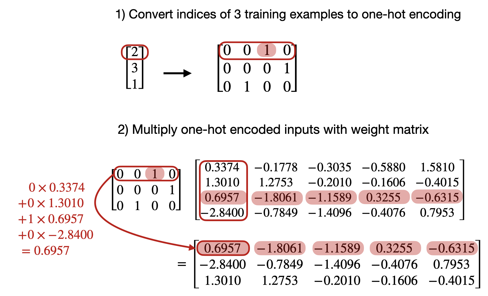
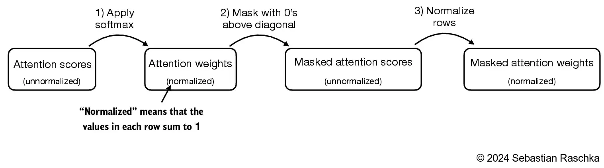
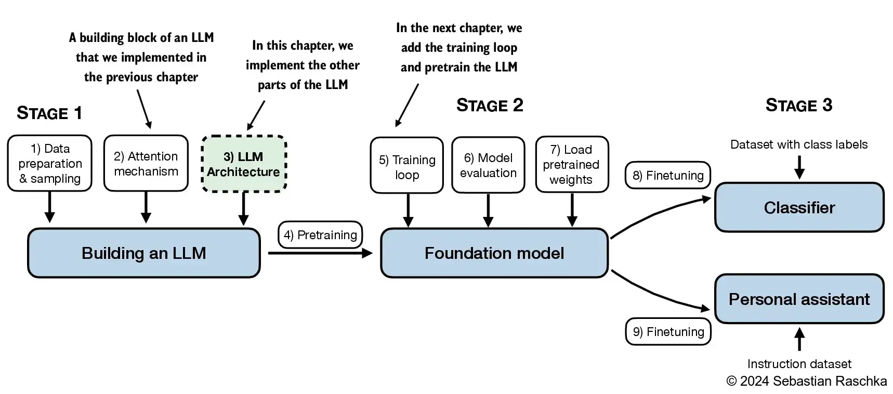
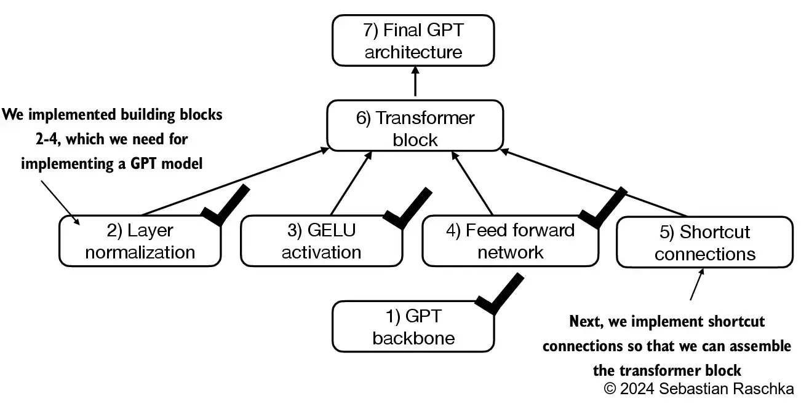
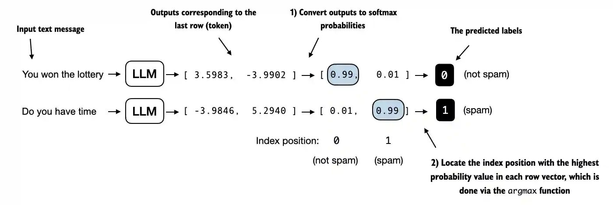
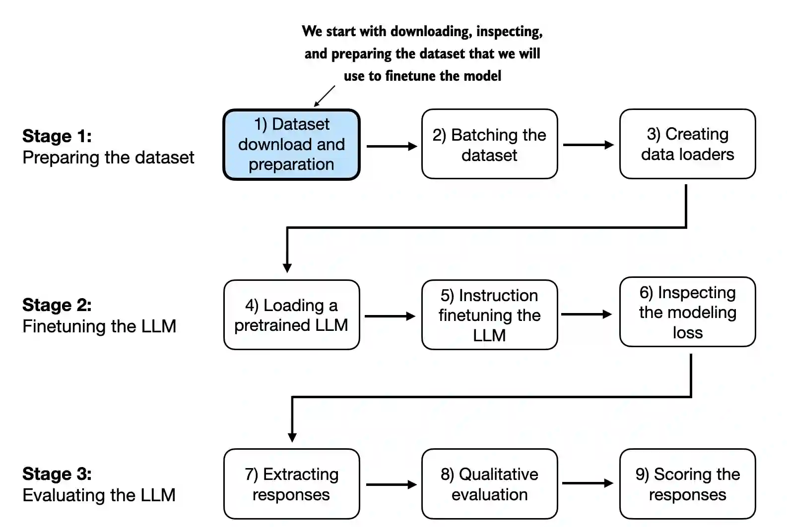

[TOC]

# Transformer相关

## 理解Embedding层和线性层的区别

- Pytorch中的Embedding层实现了与执行矩阵乘法的线性层相同的功能
- 我们使用Embedding层的原因是计算效率

### Embedding层

```python
import torch
import torch.nn as nn
print("PyTorch version:", torch.__version__)

idx = torch.tensor([2, 3, 1])

num_idx = max(idx) + 1

output_dim = 5

torch.manual_seed(123)

embedding_layers = nn.Embedding(num_idx, output_dim)

embedding_layers.weight
```

```
Parameter containing:
tensor([[ 0.3374, -0.1778, -0.3035, -0.5880,  1.5810],
        [ 1.3010,  1.2753, -0.2010, -0.1606, -0.4015],
        [ 0.6957, -1.8061, -1.1589,  0.3255, -0.6315],
        [-2.8400, -0.7849, -1.4096, -0.4076,  0.7953]], requires_grad=True)
```

```python
embedding_layers(torch.tensor([1]))
```

```
tensor([[ 1.3010,  1.2753, -0.2010, -0.1606, -0.4015]],
       grad_fn=<EmbeddingBackward0>)
```

- 来可视化一下看看发生了什么

  

- 现在，让我们转换之前定义的所有训练示例

  ```python
  idx = torch.tensor([2, 3, 1])
  embedding_layers(idx)
  ```

  ```
  tensor([[ 0.6957, -1.8061, -1.1589,  0.3255, -0.6315],
          [-2.8400, -0.7849, -1.4096, -0.4076,  0.7953],
          [ 1.3010,  1.2753, -0.2010, -0.1606, -0.4015]],
         grad_fn=<EmbeddingBackward0>)
  ```

  

### Linear层

- 现在，我们将要证明上面的Embedding层实现了与nn完全相同的功能，即Pytorch中一个热编码表示的线性层

- 首先，我们将token IDs转换为一个热表示

  ```python
  onehot = torch.nn.functional.one_hot(idx)
  onehot
  ```

  ```
  tensor([[0, 0, 1, 0],
          [0, 0, 0, 1],
          [0, 1, 0, 0]])
  ```

- 接下来，我们初始化一个线性层，它进行矩阵乘法 **XW^T**

  ```python
  torch.manual_seed(123)
  linear = torch.nn.Linear(num_idx, output_dim, bias=False)
  linear.weight
  ```

  ```
  Parameter containing:
  tensor([[-0.2039,  0.0166, -0.2483,  0.1886],
          [-0.4260,  0.3665, -0.3634, -0.3975],
          [-0.3159,  0.2264, -0.1847,  0.1871],
          [-0.4244, -0.3034, -0.1836, -0.0983],
          [-0.3814,  0.3274, -0.1179,  0.1605]], requires_grad=True)
  ```

- 需要注意的是，Pytorch中的线性层也使用小的随机权重进行初始化。要直接将其与上面的Embedding层进行比较，我们必须使用相同的小随机权重

  ```python
  linear.weight = torch.nn.Parameter(embedding_layers.weight.T.detach())
  ```

- 现在，我们可以在输入的热编码表示上使用线性层

  ```python
  linear(onehot.float())
  ```

  ```
  tensor([[ 0.6957, -1.8061, -1.1589,  0.3255, -0.6315],
          [-2.8400, -0.7849, -1.4096, -0.4076,  0.7953],
          [ 1.3010,  1.2753, -0.2010, -0.1606, -0.4015]], grad_fn=<MmBackward0>)
  ```

- 正如我们所看到的，这与我们使用Embedding层时得到的结果完全相同

  ```python
  embedding_layers(idx)
  ```

  ```
  tensor([[ 0.6957, -1.8061, -1.1589,  0.3255, -0.6315],
          [-2.8400, -0.7849, -1.4096, -0.4076,  0.7953],
          [ 1.3010,  1.2753, -0.2010, -0.1606, -0.4015]],
         grad_fn=<EmbeddingBackward0>)
  ```

- 第一个训练示例的token ID的计算

  

  

- 由于每一个热编码行中除一个索引外的所有索引都为0（按设计），因此此矩阵乘法基本上与查找一个热元素相同

- 在一个热编码上使用矩阵乘法相当于嵌入层查找，但如果我们使用大的Embedding矩阵，则可能效率低下，因为存在大量浪费的乘零运算

## Transformer基础架构


可以看到，**Transformer**由**Encoder**（编码器）和**Decoder**（解码器）两个部分组成。

- Encoder部分
  - **Embedding**：首先获取输入的sentence，经过embedding之后获得输入句子的embedding向量。其中embedding向量是由句子的每一个单词的embedding组成
  - **位置编码**：将获得的输入Embedding与位置的Embedding相加。具体的公式在Decoder部分详细说明。
  - **Multi-Head Attention**：由于获得的输入embedding是一个向量矩阵，每一行为每个单词的embedding以及相应的位置信息。值得注意的是，每一个Encoder Block输出的矩阵维度与输入完全一致。
  - **残差连接**
  - **LayerNorm**
  - **前馈神经网络**
- Decoder部分
  - **Embedding**：与Encoder部分相同
  - **位置编码**：包含了每一个单词在句子内所在位置的信息。保存了单词在句子序列中的绝对位置或者相对位置。当输入序列为整段文本时，为绝对位置；若是单个句子的时候，为相对位置。
  - **Masked Multi-head Attention**：第一个多头注意力机制使用了masked操作，用于掩盖序列之后的信息，防止信息泄露，避免过拟合
  - **Add & Norm**：残差连接与层归一化
  - **Feed Forward**：前馈神经网络，即多层感知器
  - **linear & Softmax**：线性变换层以及最后输出概率


### Layer Normalization（层归一化的作用）


#### 为什么不用Batch Normalization

### 位置编码详解

位置编码包含了每一个单词在句子内所在位置的信息。保存了单词在句子序列中的绝对位置或者相对位置。当输入序列为整段文本时，为绝对位置；若是单个句子的时候，为相对位置。

论文中使用了一个公式


- 泛化能力强
- 唯一性


### 为什么需要使用掩码


### 自注意力机制详解


### 多头注意力机制详解


### **为什么要除以根号dk**

- 首先讨论不同大小的输出对softmax的梯度影响
  - 数量级对softmax得到的分布影响非常大。在数量级较大时，softmax将几乎全部的概率分布都分配给了最大值所对应的标签。

  - 而当输入的数量级很大时，会导致梯度


# 微调

## 什么是微调

微调就是将像GPT-3这样的通用模型，转化为像ChatGPT这样专门用于聊天的模型。即将通用模型转化为用于某一个特定用途的模型。

- 微调对模型实际上做了什么
  - 它使得模型能够处理比提示词（Prompt）更长的数据，使得模型不仅能够访问数据，还可以从中学习，通过这个学习过程，能够将其转化为某一特定用途的模型
  - 帮助模型产生更加一致的输出和行为
  - 帮助模型减少幻觉，即减少模型编造事物的情况
- 微调缺点
  - 数据质量和数量要求
  - 成本问题
- 微调的作用：
  - 改变模型的行为：
  - 学习新的知识
  - 以上均是
- 微调的步骤
  - 使用LLM，通过提示工程来识别一个任务
  - 找到一些它做的还可以的任务
  - 选择一个任务
  - 为这项任务收集一些输入和输出
  - 使用这些数据微调一个小的LLM

## 微调在整个训练过程的位置

- 训练过程
  - 预训练：数据是来自于网络上的庞大语料。费时费钱
  - 微调：通过微调得到一个优化的模型。与预训练不同的地方是微调所需的数据要比预训练少得多，因为是在一个训练好的模型上再训练

## 指令微调

指令微调是微调的一种类型，有时也被称为指令调整。


## 数据准备

数据所需要求

- 高质量
- 多样的
- 真实的
- 大量

收集数据的步骤

- 收集指令-响应对
- 组合这些对
- 对数据进行分词，添加填充或截断数据
- 分为训练集和测试集


# 从零到一搭建LLM

## 一、文本数据处理

本章主要介绍数据准备以及采样，为LLM准备输入数据


### 1.1 理解word Embedding

- 嵌入有多种形式，LLM中我们主要关注文本嵌入


- LLM与高维空间中的 Embedding 向量共同起作用
- 由于我们无法可视化这样的高维空间，下图说明了一个 2维 嵌入空间


### 1.2 Tokenizer 文本

- 在本节中，我们将文本标记化，这意味着将文本分解为更小的单元，例如单个单词和标点符号


- 接下来加载我们需要的文本

  ```python
  import os
  import urllib.request
  
  if not os.path.exists('../../../Data/the-verdict.txt'):
      url = ("https://raw.githubusercontent.com/rasbt/"
             "LLMs-from-scratch/main/ch02/01_main-chapter-code/"
             "the-verdict.txt")
      file_path = "the-verdict.txt"
      urllib.request.urlretrieve(url, file_path)
      
  with open('../../../Data/the-verdict.txt', 'r', encoding='utf-8') as f:
      raw_text = f.read()
  
  print(f"Total number of article: {len(raw_text)}")
  print(raw_text[:99])
  ```

  ```
  Total number of article: 20479
  I HAD always thought Jack Gisburn rather a cheap genius--though a good fellow enough--so it was no 
  ```

- 目标：tokenize 文本为 LLM 所用

  - 基于一些简单的数据开发一个简单的 tokenizer，以便于之后使用
  - 以下正则表达式是将其以 **空格** 进行分割

  ```python
  import re
  
  text = "Hello, world. This is a test."
  result = re.split(r'(\s)', text)
  
  print(result)
  ```

  ```
  ['Hello,', ' ', 'world.', ' ', 'This', ' ', 'is', ' ', 'a', ' ', 'test.']
  ```

  ```python
  result = [item for item in result if item.strip()]
  print(result)
  ```

  ```
  ['Hello,', 'world.', 'This', 'is', 'a', 'test.']
  ```

- 处理其他无意义字符

  ```python
  text = "Hello, world. Is this-- a test?"
  
  result = re.split(r'([,.:;?_!"()\']|--|\s)', text)
  result = [item.strip() for item in result if item.strip()]
  print(result)
  ```

  ```
  ['Hello', ',', 'world', '.', 'Is', 'this', '--', 'a', 'test', '?']
  ```

  

  ```python
  preprocessed = re.split(r'([,.:;?_!"()\']|--|\s)', raw_text)
  preprocessed = [item.strip() for item in preprocessed if item.strip()]
  print(preprocessed[:30])
  ```

  ```
  ['I', 'HAD', 'always', 'thought', 'Jack', 'Gisburn', 'rather', 'a', 'cheap', 'genius', '--', 'though', 'a', 'good', 'fellow', 'enough', '--', 'so', 'it', 'was', 'no', 'great', 'surprise', 'to', 'me', 'to', 'hear', 'that', ',', 'in']
  ```

- 计算总的token长度

  ```python
  print(len(preprocessed)) # 4690
  ```

### 1.3 将 tokens 转换为token IDs

- 接下来，将文本 tokens 转换为 token IDs，以便于之后可以通过 Embedding 层对其进行处理


- 从这些 tokens，我们可以构建一个包括所有 tokens 的词表

  ```python
  # 进行去重
  all_words = sorted(set(preprocessed))
  vocab_size = len(all_words)
  
  print(vocab_size) # 1130
  ```

  ```python
  # 构建词表
  vocab = {token:integer for integer,token in enumerate(all_words)}
  for i, item in enumerate(vocab.items()):
      print(item)
      if i >= 20:
          break
  ```

  ```
  ('!', 0)
  ('"', 1)
  ("'", 2)
  ('(', 3)
  (')', 4)
  (',', 5)
  ('--', 6)
  ('.', 7)
  (':', 8)
  (';', 9)
  ('?', 10)
  ('A', 11)
  ('Ah', 12)
  ('Among', 13)
  ('And', 14)
  ('Are', 15)
  ('Arrt', 16)
  ('As', 17)
  ('At', 18)
  ('Be', 19)
  ('Begin', 20)
  ```

- 构建一个tokenizer类

  ```python
  class SimpleTokenizerV1:
      def __init__(self, vocab):
          '''
          Tokenizer类
          :param vocab: 词表 
          '''
          self.str_to_int = vocab
          self.int_to_str = {i:s for s, i in vocab.items()}
          
      def encode(self, text):
          preprocessed = re.split(r'([,.?_!"()\']|--|\s)', text)
          preprocessed = [
              item.strip() for item in preprocessed if item.strip()
          ]
          ids = [self.str_to_int[s] for s in preprocessed]
          return ids
      
      def decode(self, ids):
          text = " ".join([self.int_to_str[i] for i in ids])
          
          text = re.sub(r'\s+([,.?!"()\'])', r'\1', text)
          return text
  ```

  - encode 函数将词表转换为 token IDs

  - decode 函数将 token IDs 转换回文本

    

- 我们可以用tokenizer将文本转换为整数，这些整数可以作为 LLM 的 Embedding 输入层

- 将 token IDs decode 回文本

### 1.4 加入特殊文本tokens

- 为未知单词添加一些“特殊”标记并表示文本的结尾是很有用的


- 一些 tokenizer 使用特殊的 tokens 来帮助 LLM 提供额外的上下文

- 其中一些特殊 tokens 是
  - **[BOS]**（序列的开始）标记文本的开始
  - **[EOS]**（序列结束）标记文本的结束位置（这通常用于连接多个不相关的文本，例如，两篇不同的维基百科文章或两本不同的书，等等）
  - **[PAD]**（填充）如果我们训练批量大小1的LLM（我们可能包括多个不同长度的文本；使用填充 token，我们将较短的文本填充到最长的长度，使所有文本的长度相等）
  - **[UNK]** 表示未包含在词汇表中的词汇
- 请注意，GPT-2 不需要上述任何 tokens，而只使用 <|endoftext|> token 来降低复杂性
- **<|endoftext|>** 类似于上面提到的 [EOS] token
- GPT还使用 <|endoftext|> 进行填充（因为我们在对批处理输入进行训练时通常使用掩码，所以无论如何我们都不会使用填充的 tokens，所以这些 tokens 是什么并不重要）
- GPT-2 不对词汇表外的单词使用 <|UNK|> 标记；相反，GPT-2 使用了一个字节对编码（BPE）标记器，它将字分解为子字单元，我们将在后面的部分中讨论


```python
tokenizer = SimpleTokenizerV1(vocab)

text = "Hello, do you like tea. Is this-- a test?"

tokenizer.encode(text)

# 会报错 KeyError: 'Hello'
```

- 由于词表中未包含 Hello 一词，因此上述操作会报错

- 为了处理这种情况，我们可以向词表中添加特殊的标记，如 <|UNK|>，以表示未知单词

- 由于我们已经扩展词表，让我们添加一个 <|endoftext|> 标记，它在 GPT-2 训练中表示文本的末尾

  ```python
  preprocessed = re.split(r'([,.?_!"()\']|--|\s)', raw_text)
  preprocessed = [item.strip() for item in preprocessed if item.strip()]
  
  all_tokens = sorted(list(set(preprocessed)))
  all_tokens.extend(["<|endoftext|>", "<|unk|>"])
  
  vocab = {token:integer for integer, token in enumerate(all_tokens)}
  
  len(vocab.items()) # 1161
  ```

  ```python
  for i, item in enumerate(list(vocab.items())[-5:]):
      print(item)
  ```

  ```
  ('younger', 1156)
  ('your', 1157)
  ('yourself', 1158)
  ('<|endoftext|>', 1159)
  ('<|unk|>', 1160)
  ```

- 我们还需要相应地调整 tokenizer，以便于知道何时以及如何使用新的 <|UNK|> token

  ```python
  class SimpleTokenizerV2:
      def __init__(self, vocab):
          '''
          Tokenizer类
          :param vocab: 词表 
          '''
          self.str_to_int = vocab
          self.int_to_str = {i:s for s, i in vocab.items()}
          
      def encode(self, text):
          preprocessed = re.split(r'([,.?_!"()\']|--|\s)', text)
          preprocessed = [
              item.strip() for item in preprocessed if item.strip()
          ]
          preprocessed = [
              item if item in self.str_to_int
              else "<|unk|>" for item in preprocessed
          ]
          
          ids = [self.str_to_int[s] for s in preprocessed]
          return ids
      
      def decode(self, ids):
          text = " ".join([self.int_to_str[i] for i in ids])
          
          text = re.sub(r'\s+([,.?!"()\'])', r'\1', text)
          return text
  ```

- 用修正后的 tokenizer 尝试一下

  ```python
  tokenizer = SimpleTokenizerV2(vocab)
  
  text1 = "Hello, do you like tea?"
  text2 = "In the sunlit terraces of the palace."
  
  text = " <|endoftext|> ".join((text1, text2))
  
  print(text)
  ```

  ```
  Hello, do you like tea? <|endoftext|> In the sunlit terraces of the palace.
  ```

  ```python
  tokenizer.encode(text)
  ```

  ```
  [1160,
   5,
   362,
   1155,
   642,
   1000,
   10,
   1159,
   57,
   1013,
   981,
   1009,
   738,
   1013,
   1160,
   7]
  ```

  ```python
  tokenizer.decode(tokenizer.encode(text))
  ```

  ```
  '<|unk|>, do you like tea? <|endoftext|> In the sunlit terraces of the <|unk|>.'
  ```

### 1.5 BytePair编码

- GPT-2 使用字节对编码（BPE）作为其标记器

- 它允许模型将不在其预定义词汇表中的单词分解为更小的子单词单元甚至单个字符，使其能够处理词表外的单词

- 例如，如果GPT-2的词汇表中没有单词“unfmiliarword”，它可能会将其标记为[“unfam”、“iliar”、“word”]或其他一些子单词细分，这取决于其经过训练的BPE合并

- 原始的BPE标记器可以在这里找到：https://github.com/openai/gpt-2/blob/master/src/encoder.py

- 在本章中，我们将使用OpenAI开源tiktoken库中的BPE标记器，该库在Rust中实现其核心算法，以提高计算性能

- 我创建了一个笔记本，并排比较这两种实现的bytepair_encoder（tiktoken比示例文本快5倍）

  ```python
  import importlib
  import tiktoken
  
  tokenizer = tiktoken.get_encoding("gpt2")
  text = (
      "Hello, do you like tea? <|endoftext|> In the sunlit terraces"
       "of someunknownPlace."
  )
  
  integers = tokenizer.encode(text, allowed_special={"<|endoftext|>"})
  
  print(integers)
  ```

  ```
  [15496, 11, 466, 345, 588, 8887, 30, 220, 50256, 554, 262, 4252, 18250, 8812, 2114, 1659, 617, 34680, 27271, 13]
  ```

  ```python
  strings = tokenizer.decode(integers)
  
  print(strings)
  ```

  ```
  Hello, do you like tea? <|endoftext|> In the sunlit terracesof someunknownPlace.
  ```

- BPE标记器将未知单词分解为子单词和单个字符

  

### 1.6 滑动窗口数据采样

- 我们训练LLM一次生成一个单词，因此我们希望相应地准备训练数据，其中序列中的下一个单词表示要预测的目标

  

  ```python
  with open("../../../Data/the-verdict.txt", "r", encoding="utf-8") as f:
      raw_text = f.read()
  
  enc_text = tokenizer.encode(raw_text)
  print(len(enc_text)) # 5145
  ```

- 对于每一个文本块，我们需要输入和目标。由于我们希望模型预测下一个单词，因此目标是向右移动一个位置的输入

  ```python
  enc_sample = enc_text[50:]
  context_size = 4
  
  x = enc_sample[:context_size]
  y = enc_sample[1:context_size+1]
  
  print(f'x: {x}')
  print(f'y:      {y}')
  ```

  ```
  x: [290, 4920, 2241, 287]
  y:      [4920, 2241, 287, 257]
  ```

- 一个接着一个，预测如下

  ```python
  for i in range(1, context_size + 1):
      context = enc_sample[:i]
      desired = enc_sample[i]
      
      print(context, '------>', desired)
  ```

  ```
  [290] ------> 4920
  [290, 4920] ------> 2241
  [290, 4920, 2241] ------> 287
  [290, 4920, 2241, 287] ------> 257
  ```

  ```python
  for i in range(1, context_size+1):
      context = enc_sample[:i]
      desired = enc_sample[i]
  
      print(tokenizer.decode(context), "---->", tokenizer.decode([desired]))
  ```

  ```
   and ---->  established
   and established ---->  himself
   and established himself ---->  in
   and established himself in ---->  a
  ```

- 我们使用滑动窗口方法，将位置更改+1

  

- 创建数据集和数据加载器，从输入文本数据集中提取块

  ```python
  import torch
  from torch.utils.data import DataLoader, Dataset
  
  class GPTDatasetV1(Dataset):
      def __init__(self, txt, tokenizer, max_length, stride):
          '''
          :param txt: 文本 
          :param tokenizer: 
          :param max_length: 滑动窗口最大长度 
          :param stride: 滑动步长
          '''
          self.input_ids = []
          self.tar_ids = []
          
          token_ids = tokenizer.encode(txt, allowed_special={"<|endoftext|>"})
          
          for i in range(0, len(token_ids) - max_length, stride):
              input_chunk = token_ids[i:i + max_length]
              tar_chunk = token_ids[i + 1:i + max_length + 1]
              self.input_ids.append(torch.tensor(input_chunk))
              self.tar_ids.append(torch.tensor(tar_chunk))
              
      def __len__(self):
          return len(self.input_ids)
      
      def __getitem__(self, idx):
          return self.input_ids[idx], self.tar_ids[idx]
      
  def create_dataloader_v1(txt, batch_size=4, max_length=256,
                           stride=128, shuffle=True, drop_last=True,
                           num_workers=0):
      tokenizer = tiktoken.get_encoding("gpt2")
      
      dataset = GPTDatasetV1(txt, tokenizer, max_length, stride)
      
      dataloader = DataLoader(
          dataset,
          batch_size=batch_size,
          shuffle=shuffle,
          drop_last=drop_last,
          num_workers=0
      )
      return dataloader
  ```

- 针对上下文大小为4的LLM测试批大小为1的数据加载器

  ```python
  with open(r'../../../Data/the-verdict.txt', 'r', encoding='utf-8') as f:
      raw_text = f.read()
  
  dataloader = create_dataloader_v1(
      raw_text, batch_size=1, max_length=4, stride=1, shuffle=False
  )
  
  data_iter = iter(dataloader)
  first_batch = next(data_iter)
  print(first_batch)
  ```

  ```
  [tensor([[  40,  367, 2885, 1464]]), tensor([[ 367, 2885, 1464, 1807]])]
  ```

  ```python
  second_batch = next(data_iter)
  print(second_batch)
  ```

  ```
  [tensor([[ 367, 2885, 1464, 1807]]), tensor([[2885, 1464, 1807, 3619]])]
  ```

- 使用等于上下文长度的步幅（4）的示例如下

  

- 我们还可以创建批处理输出

- 在这里增加步长，这样批次之间就不会有重叠，因为**更多的重叠可能会导致过拟合**

  ```python
  dataloader = create_dataloader_v1(raw_text, batch_size=8, max_length=4, stride=4, shuffle=False)
  
  data_iter = iter(dataloader)
  inputs, targets = next(data_iter)
  print("Inputs:\n", inputs)
  print("\nTargets:\n", targets)
  ```

  ```
  Inputs:
   tensor([[   40,   367,  2885,  1464],
          [ 1807,  3619,   402,   271],
          [10899,  2138,   257,  7026],
          [15632,   438,  2016,   257],
          [  922,  5891,  1576,   438],
          [  568,   340,   373,   645],
          [ 1049,  5975,   284,   502],
          [  284,  3285,   326,    11]])
  
  Targets:
   tensor([[  367,  2885,  1464,  1807],
          [ 3619,   402,   271, 10899],
          [ 2138,   257,  7026, 15632],
          [  438,  2016,   257,   922],
          [ 5891,  1576,   438,   568],
          [  340,   373,   645,  1049],
          [ 5975,   284,   502,   284],
          [ 3285,   326,    11,   287]])
  
  ```

### 1.7 创建token Embedding向量

- 使用 Embedding 层将标记嵌入到连续向量表示中

- 通常这些 Embedding 层是 LLM 本身的一部分，并在模型训练期间进行更新训练

  

- 假设我们有以下四个输入示例，输入 ID 分别为5、1、3和2（标记之后）。且为了简单起见，假设我们的词汇量很小，只有6个单词，并且我们想要创建大小为3的嵌入

  ```python
  input_ids = torch.tensor([2, 3, 5, 1])
  vocab_size = 6
  output_dim = 3
  
  torch.manual_seed(123)
  embedding_layer = torch.nn.Embedding(vocab_size, output_dim)
  
  print(embedding_layer.weight)
  ```

  ```
  Parameter containing:
  tensor([[ 0.3374, -0.1778, -0.1690],
          [ 0.9178,  1.5810,  1.3010],
          [ 1.2753, -0.2010, -0.1606],
          [-0.4015,  0.9666, -1.1481],
          [-1.1589,  0.3255, -0.6315],
          [-2.8400, -0.7849, -1.4096]], requires_grad=True)
  ```

- 对于熟悉热编码的人来说，上面的 Embedding 层方法本质上只是在全连接层中实现一个热编码器，然后进行矩阵乘法的更有效的方法

- 因为 Embedding 层只是一种更有效的实现，相当于一个热编码器和矩阵乘法方法，所以它可以被视为一个可以通过反向传播优化的神经网络层

- 详细区别可以看 [理解Embedding层和线性层的区别](#Transformer相关-理解Embedding层和线性层的区别)

- 要将 id 为 3 的 token 转换为三维向量，执行以下操作

  ```python
  print(embedding_layer(torch.tensor([3])))
  ```

  ```
  tensor([[-0.4015,  0.9666, -1.1481]], grad_fn=<EmbeddingBackward0>)
  ```

- 注意,上面是 embedding_layer 权重矩阵中的第4行。要嵌入上面的所有四个 input_ids 值，我们需要进行以下操作

  ```python
  print(embedding_layer(input_ids))
  ```

  ```
  tensor([[ 1.2753, -0.2010, -0.1606],
          [-0.4015,  0.9666, -1.1481],
          [-2.8400, -0.7849, -1.4096],
          [ 0.9178,  1.5810,  1.3010]], grad_fn=<EmbeddingBackward0>)
  ```

- 所以 Embedding 层本质上就是一种查找操作

  

### 1.8 编码单词位置

- Embedding 层将 ID 转换为相同的向量表示，而不考虑它们在输入序列中的位置

  

- 位置嵌入与标记嵌入向量相结合，形成 LLM 的输入嵌入

  

- BytePair编码器的词表大小为50257

- 假设我们将输入 token 编码为256维向量表示

  ```python
  vocab_size = 50257
  output_dim = 256
  
  token_embedding_layer = torch.nn.Embedding(vocab_size, output_dim)
  ```

- 如果我们从数据加载器中采样数据，我们将每个批次中的token嵌入到256维向量中

- 假设我们有一个批量大小为8，每批有4个token，则会产生一个8 × 4 × 256的张量

  ```python
  max_length = 4
  dataloader = create_dataloader_v1(
      raw_text, batch_size=8, max_length=max_length,
      stride=max_length, shuffle=False
  )
  data_iter = iter(dataloader)
  inputs, targets = next(data_iter)
  print("Token IDs:\n", inputs)
  print("\nInputs shape:\n", inputs.shape)
  ```

  ```
  Token IDs:
   tensor([[   40,   367,  2885,  1464],
          [ 1807,  3619,   402,   271],
          [10899,  2138,   257,  7026],
          [15632,   438,  2016,   257],
          [  922,  5891,  1576,   438],
          [  568,   340,   373,   645],
          [ 1049,  5975,   284,   502],
          [  284,  3285,   326,    11]])
  
  Inputs shape:
   torch.Size([8, 4])
  ```

  ```python
  token_embeddings = token_embedding_layer(inputs)
  print(token_embeddings.shape)
  ```

  ```
  torch.Size([8, 4, 256])
  ```

- GPT-2使用绝对位置嵌入，因此我们只需要创建另一个Embedding层

  ```python
  context_length = max_length
  pos_embedding_layer = torch.nn.Embedding(context_length, output_dim)
  pos_embeddings = pos_embedding_layer(torch.arange(max_length))
  print(pos_embeddings.shape)
  ```

  ```
  torch.Size([4, 256])
  ```

- 要创建LLM中使用的输入嵌入，我们只需要添加标记和位置嵌入

  ```python
  input_embeddings = token_embeddings + pos_embeddings
  print(input_embeddings.shape)  # torch.Size([8, 4, 256])
  ```

- 在输入处理工作流的初始截断，输入文本被分割成单独的标记

- 在分割之后，这些token被转换为基于预定义词表的token IDs

  

## 二、构建注意力机制

- 本章涵盖注意力机制——LLM的引擎

  

  

### 2.1 长序列建模问题

- 由于源语言和目标语言之间的语法结构不同，逐字翻译文本是不可行的

  

- 在引入Transformer模型之前，Encoder-Decoder RNN通常用于机器翻译任务

- 在这种设置中 Encoder使用隐藏层处理源语言中的一系列标记，以生成整个输入序列的压缩表示

  

### 2.2 利用注意力机制捕获数据相关性

- 通过注意力机制，网络的文本生成解码器能够选择性地访问所有输入token，这意味着在特定输出token的生成中，某些输入token比其他输入token具有更大的意义

  

- Transformer中的自注意力机制是一种技术，旨在通过使序列中的每个位置能够参与并确定同一序列中其他每个位置的相关性来增强输入表示

  

### 2.3 以self-attention的方式处理输入的不同部分

#### 2.3.1 一种没有可训练权重的简单自注意力机制

- 本节解释了自注意力机制的一个简化变体，它不包含任何可训练的权重

- 这纯粹是为了说明，而不是transformers中使用的注意力机制

- 下一节将扩展这种简单的注意力机制，以实现真正的自我注意力机制

- 假设我们得到一个输入序列 $x^{(1)}$ 到 $x^{(n)}$

  - 输入是一个文本（例如，像“你的旅程从第一步开始”这样的句子），它已经被转换为token embedding
  - 例如，$x^{(1)}$ 是表示单词 “Your” 的 d维向量，依此类推

- 目标：计算上下文向量 $z^{(i)}$ 对于 $x^{(1)}$ 到 $x^{(T)}$ 序列中的 $x^{(i)}$ ($x$和$z$具有相同的尺寸)

  - 上下文矢量$z^{(i)}$是输入$x^{(1)}$到$x^{(T)}$序列的加权和

  - 上下文向量是特定于某个输入的“上下文”

    - 与其将$x^{(1)}$作为任意输入token的占位符，让我们考虑第二个输入$x^{(2)}$

    - 继续一个具体的例子，而不是占位符$z^{(1)}$, 我们考虑第二输出上下文向量,$z^{(2)}$

    - 第二上下文向量,$z^{(2)}$,是所有输入的加权和$x^{(1)}$到$x^{(T)}$相对于第二输入元素$x^{(2)}$加权

    - 注意力权重是在计算$z^{(2)}$时确定每个输入元素对加权和的贡献程度的权重

    - 简而言之，将$z^{(2)}$作为$x^{(2)}$修改版本,它还包含与手头给定任务相关的所有其他输入元素的信息

      

- （请注意，此图中的数字被截断为小数点后的一位数字，以减少视觉混乱；同样，其他数字也可能包含截断值）

- 按照惯例，未归一化的注意力权重被称为“注意力得分”，而归一化的注意力得分加起来为1，则被称作“注意力权重”

- Step1:计算未归一化的注意力分数$w$

- 假设我们使用第二个输入 token 作为查询，即$q^{(2)}$=$x^{(2)}$,我们通过点积计算未规范化的注意力得分：

  - $w_{21}$=$x^{(1)}$$q^{(2)T}$

  - $w_{22}$=$x^{(2)}$$q^{(2)T}$

  - $w_{23}$=$x^{(3)}$$q^{(2)T}$

  - ...
  - $w_{2n}$=$x^{(n)}$$q^{(2)T}$

- 希腊字母 $w$ 是用来象征未规范的注意力分数的

  - $w_{21}$中的下标“21”意味着输入序列元素2被用作针对输入序列元素1的查询

- 假设我们有以下输入句子，它已经嵌入到三维向量中（为了便于说明，我们在这里使用了一个非常小的Embedding维度，这样它就可以在没有换行的情况下Embedding到页面上）：

  ```python
  import torch
  
  inputs = torch.tensor(
     [[0.43, 0.15, 0.89], # Your     (x^1)
      [0.55, 0.87, 0.66], # journey  (x^2)
      [0.57, 0.85, 0.64], # starts   (x^3)
      [0.22, 0.58, 0.33], # with     (x^4)
      [0.77, 0.25, 0.10], # one      (x^5)
      [0.05, 0.80, 0.55]] # step     (x^6)
  )
  ```

- 我们遵循常见的机器学习和深度学习惯例，其中训练示例表示为行，特征值表示为列；在上述张量的情况下，每行表示一个单词，每列表示一个嵌入维度

- 本节的主要目的是演示上下文向量 $z^{(2)}$ 使用第二输入序列 $x^{(2)}$ 来计算,作为查询

- 该图描绘了这个过程的初始步骤，包括计算$x^{(2)}$之间的注意力得分ω以及通过点积运算的所有其他输入元素

  

- 我们使用输入序列元素2, $x^{(2)}$, 作为计算上下文向量的示例$z^{(2)}$; 在本节的后面,我们将把它推广到计算所有上下文向量。

- 第一步是通过计算查询$x^{(2)}$之间的点积来计算未规范化的注意力得分以及所有其他输入token：

  ```python
  query = inputs[1]
  
  attention_scores_2 = torch.empty(inputs.shape[0])
  
  for i, x_i in enumerate(inputs):
      attention_scores_2[i] = torch.dot(x_i, query)
  
  print(attention_scores_2)
  ```

  ```
  tensor([0.9544, 1.4950, 1.4754, 0.8434, 0.7070, 1.0865])
  ```

  ```python
  res = 0.
  
  for idx, element in enumerate(inputs[0]):
      res += inputs[0][idx] * query[idx]
      
  print(res)
  print(torch.dot(inputs[0], query))
  ```

  ```
  tensor(0.9544)
  tensor(0.9544)
  ```

- 步骤2：将未规范化的注意力得分标准化（“omegas”, $w$)因此它们的总和为1

- 这里有一种简单的方法，可以将未规范化的注意力得分归一化为1（这是一种惯例，对解释很有用，对训练稳定性很重要）

  

  ```python
  attention_weights_2_tmp = attention_scores_2 / attention_scores_2.sum()
  
  print(f"Attention weights:{attention_weights_2_tmp}")
  print(f"Sum:{attention_weights_2_tmp.sum()}")
  ```

  ```
  Attention weights:tensor([0.1455, 0.2278, 0.2249, 0.1285, 0.1077, 0.1656])
  Sum:1.0000001192092896
  ```

- 然而，在实践中，使用softmax函数进行归一化是常见的，也是推荐的，该函数更善于处理极值，并且在训练期间具有更理想的梯度特性。

- 这里是一个用于缩放的softmax函数的简单实现，它还对向量元素进行归一化，使它们的总和为1

  ```python
  def softmax_naive(x):
      return torch.exp(x) / torch.exp(x).sum(dim=0) 
  
  attention_weights_2_naive = softmax_naive(attention_scores_2)
  
  print(f"Attention weights:{attention_weights_2_naive}")
  print(f"Sum:{attention_weights_2_naive.sum()}")
  ```

  ```
  Attention weights:tensor([0.1385, 0.2379, 0.2333, 0.1240, 0.1082, 0.1581])
  Sum:1.0
  ```

- 由于上溢和下溢问题，上面的naive实现可能会遇到大小输入值的数值不稳定性问题

- 因此，在实践中，建议使用softmax的PyTorch实现，该实现已针对性能进行了高度优化

  ```python
  attention_weights_2 = torch.softmax(attention_scores_2, dim=0)
  
  print(f"Attention weights:{attention_weights_2}")
  print(f"Sum:{attention_weights_2.sum()}")
  ```

  ```
  Attention weights:tensor([0.1385, 0.2379, 0.2333, 0.1240, 0.1082, 0.1581])
  Sum:1.0
  ```

- 步骤3：计算上下文向量$z^{(2)}$通过乘以嵌入的输入 token，使用注意力权重并对结果向量$x^{(2)}$求和

  

  ```python
  query = inputs[1]
  
  context_vec_2 = torch.zeros(query.shape)
  for i, x_i in enumerate(inputs):
      context_vec_2 += attention_weights_2[i] * x_i
      
  print(context_vec_2)
  ```

  ```
  tensor([0.4419, 0.6515, 0.5683])
  ```

#### 2.3.2 计算所有输入token的注意力权重

- 上面，我们计算了输入2的注意力权重和上下文向量（如下图中突出显示的行所示）

- 接下来，我们将此计算推广到计算所有注意力权重和上下文向量

  

- （请注意，此图中的数字被截断为小数点后的两位数，以减少视觉混乱；每行中的值加起来应为1.0或100%；同样，其他图中的位数也被截断）

- 在自我注意力中，这个过程从注意力得分的计算开始，随后对其进行归一化，以得出总共为1的注意力权重

- 然后利用这些注意力权重通过输入的加权求和来生成上下文向量

  

- 将前面的步骤1应用于所有成对元素，以计算未规范化的注意力得分矩阵

  ```python
  attention_scores = torch.empty(6, 6)
  
  for i, x_i in enumerate(inputs):
      for j, x_j in enumerate(inputs):
          attention_scores[i, j] = torch.dot(x_i, x_j)
  
  print(attention_scores)
  ```

  ```
  tensor([[0.9995, 0.9544, 0.9422, 0.4753, 0.4576, 0.6310],
          [0.9544, 1.4950, 1.4754, 0.8434, 0.7070, 1.0865],
          [0.9422, 1.4754, 1.4570, 0.8296, 0.7154, 1.0605],
          [0.4753, 0.8434, 0.8296, 0.4937, 0.3474, 0.6565],
          [0.4576, 0.7070, 0.7154, 0.3474, 0.6654, 0.2935],
          [0.6310, 1.0865, 1.0605, 0.6565, 0.2935, 0.9450]])
  ```

  ```python
  attention_scores = inputs @ inputs.T
  print(attention_scores)
  ```

  ```
  tensor([[0.9995, 0.9544, 0.9422, 0.4753, 0.4576, 0.6310],
          [0.9544, 1.4950, 1.4754, 0.8434, 0.7070, 1.0865],
          [0.9422, 1.4754, 1.4570, 0.8296, 0.7154, 1.0605],
          [0.4753, 0.8434, 0.8296, 0.4937, 0.3474, 0.6565],
          [0.4576, 0.7070, 0.7154, 0.3474, 0.6654, 0.2935],
          [0.6310, 1.0865, 1.0605, 0.6565, 0.2935, 0.9450]])
  ```

  ```python
  attention_weights = torch.softmax(attention_scores, dim=-1)
  print(attention_weights)
  ```

  ```
  tensor([[0.2098, 0.2006, 0.1981, 0.1242, 0.1220, 0.1452],
          [0.1385, 0.2379, 0.2333, 0.1240, 0.1082, 0.1581],
          [0.1390, 0.2369, 0.2326, 0.1242, 0.1108, 0.1565],
          [0.1435, 0.2074, 0.2046, 0.1462, 0.1263, 0.1720],
          [0.1526, 0.1958, 0.1975, 0.1367, 0.1879, 0.1295],
          [0.1385, 0.2184, 0.2128, 0.1420, 0.0988, 0.1896]])
  ```

  ```python
  row_2_sum = sum([0.1385, 0.2379, 0.2333, 0.1240, 0.1082, 0.1581])
  print("Row 2 sum:", row_2_sum)
  print("All row sums:", attention_weights.sum(dim=-1))
  ```

  ```
  Row 2 sum: 1.0
  All row sums: tensor([1.0000, 1.0000, 1.0000, 1.0000, 1.0000, 1.0000])
  ```

- 应用步骤3来计算所有上下文向量

  ```python
  all_context_vecs = attention_weights @ inputs
  print(all_context_vecs)
  ```

  ```
  tensor([[0.4421, 0.5931, 0.5790],
          [0.4419, 0.6515, 0.5683],
          [0.4431, 0.6496, 0.5671],
          [0.4304, 0.6298, 0.5510],
          [0.4671, 0.5910, 0.5266],
          [0.4177, 0.6503, 0.5645]])
  ```

- 作为健全性检查，之前计算的上下文向量 $z^{(2)}$=[0.4419, 0.6515, 0.5683] 可以在上面的第二行找到

  ```python
  print("Previous 2nd context vector:", context_vec_2)
  ```

  ```
  Previous 2nd context vector: tensor([0.4419, 0.6515, 0.5683])
  ```

### 2.4 用可训练的权重实现自我注意力机制

- 一个概念框架，说明了本节中发展的自注意力机制如何融入本书和本章的整体叙事和结构

  

#### 2.4.1 逐步计算注意力权重

- 在本节中，我们将实现在原始Transformer架构、GPT模型和大多数其他流行的LLM中使用的自注意机制

- 这种自我注意力机制也被称为“缩放点积注意力”

- 总体思路与之前类似：

  - 我们希望将上下文向量计算为特定于某个输入元素的输入向量的加权和
  - 对于以上内容，我们需要注意力权重

- 正如我们看到的，与前面介绍的基本注意力机制相比，只有细微的区别：

  - 最显著的区别是引入了在模型训练期间更新的权重矩阵
  - 这些可训练的权重矩阵至关重要，因此模型（特别是模型内部的注意力模块）可以学习生成“好”的上下文向量

  

- 逐步实现自我注意机制，我们将从引入三个训练权重矩阵开始,分别为$W_{q}$,$W_{k}$,$W_{v}$

- 这三个矩阵用于投影Embedding的输入token，$x^{i}$，通过矩阵乘法转换为查询、键和值向量：

  - query 向量: $q^{(i)}$=$W_{q}x^{(i)}$
  - key 向量: $k^{(i)}$=$W_{k}x^{(i)}$
  - value 向量: $v^{(i)}$=$W_{v}x^{(i)}$

- 输入的嵌入维度 $x$ 和 query 向量 $q$ 可以相同也可以不同，这取决于模型的设计和具体实现

- 在GPT模型中，输入和输出维度通常是相同的，但为了便于说明，为了更好地遵循计算，我们在这里选择了不同的输入和输出维度

  ```python
  x_2 = inputs[1] # second input element
  d_in = inputs.shape[1] # the input embedding size, d=3
  d_out = 2 # the output embedding size, d=2
  torch.manual_seed(123)
  W_q = torch.nn.Parameter(torch.rand(d_in, d_out), requires_grad=False)
  W_k = torch.nn.Parameter(torch.rand(d_in, d_out), requires_grad=False)
  W_v = torch.nn.Parameter(torch.rand(d_in, d_out), requires_grad=False)
  ```

- 接下来，我们计算查询、键和值向量

  ```python
  query_2 = x_2 @ W_q
  key_2 = x_2 @ W_k
  value_2 = x_2 @ W_v
  
  print(query_2)
  ```

  ```
  tensor([0.4306, 1.4551])
  ```

- 如下所示，我们成功地将6个输入token从3D投影到2D嵌入空间

  ```python
  keys = inputs @ W_k
  values = inputs @ W_v
  
  print(f"key.shape:{keys.shape}")
  print(f"values.shape:{values.shape}")
  ```

  ```
  key.shape:torch.Size([6, 2])
  values.shape:torch.Size([6, 2])
  ```

- 在下一步，即第2步中，我们通过计算查询和每个关键向量之间的点积来计算未规范化的注意力得分

  

  ```python
  keys_2 = keys[1]
  attention_score_22 = query_2.dot(keys_2)
  print(attention_score_22)
  ```

  ```
  tensor(1.8524)
  ```

- 由于我们有6个输入，因此对于给定的查询向量，我们有6种注意力得分

  ```python
  attention_scores_2 = query_2 @ keys.T
  print(attention_scores_2)
  ```

  ```
  tensor([1.2705, 1.8524, 1.8111, 1.0795, 0.5577, 1.5440])
  ```

  

- 接下来，在步骤3中，我们使用前面使用的softmax函数计算注意力权重（归一化注意力得分，总和为1）

- 与之前的不同之处在于，我们现在通过将注意力分数除以嵌入维度的平方根来缩放注意力分数，$\sqrt{d_k}$

  ```python
  d_k = keys.shape[1]
  attention_weights_2 = torch.softmax(attention_scores_2 / d_k ** 0.5, dim=-1)
  print(attention_weights_2)
  ```

  ```
  tensor([0.1500, 0.2264, 0.2199, 0.1311, 0.0906, 0.1820])
  ```

  

- 在步骤4中，我们现在计算输入查询向量2的上下文向量：

  ```python
  context_vec_2 = attention_weights_2 @ values
  print(context_vec_2)
  ```

  ```
  tensor([0.3061, 0.8210])
  ```

#### 2.4.2 实现一个 Self-Attention 类

```python
import torch.nn as nn

class SelfAttentionV1(nn.Module):
    def __init__(self, d_in, d_out):
        super().__init__()
        self.W_q = nn.Parameter(torch.rand(d_in, d_out))
        self.W_k = nn.Parameter(torch.rand(d_in, d_out))
        self.W_v = nn.Parameter(torch.rand(d_in, d_out))
    
    def forward(self, x):
        key = x @ self.W_k
        query = x @ self.W_q
        value = x @ self.W_v
        
        attention_score = query @ key.T
        attention_weight = torch.softmax(attention_score / key.shape[-1] ** 0.5, dim=-1)
        
        context_vec = attention_score @ value
       	return context_vec
    
torch.manual_seed(123)
sa_v1 = SelfAttentionV1(d_in, d_out)
print(sa_v1(inputs))
```

```
tensor([[0.2897, 0.8043],
        [0.3069, 0.8188],
        [0.3063, 0.8173],
        [0.2972, 0.7936],
        [0.2848, 0.7650],
        [0.3043, 0.8105]], grad_fn=<MmBackward0>)
```


- 我们可以使用PyTorch的线性层来简化上面的实现，如果我们禁用偏置单元，这相当于矩阵乘法

- 使用nn的另一大优势，nn.Linear 超过我们的手册 nn.Parameter(torch.rand(…)) 方法，是一个首选的权重初始化方案，这导致了更稳定的模型训练

  ```python
  class SelfAttention_v2(nn.Module):
  
      def __init__(self, d_in, d_out, qkv_bias=False):
          super().__init__()
          self.W_query = nn.Linear(d_in, d_out, bias=qkv_bias)
          self.W_key   = nn.Linear(d_in, d_out, bias=qkv_bias)
          self.W_value = nn.Linear(d_in, d_out, bias=qkv_bias)
  
      def forward(self, x):
          keys = self.W_key(x)
          queries = self.W_query(x)
          values = self.W_value(x)
          
          attn_scores = queries @ keys.T
          attn_weights = torch.softmax(attn_scores / keys.shape[-1]**0.5, dim=-1)
  
          context_vec = attn_weights @ values
          return context_vec
  
  torch.manual_seed(789)
  sa_v2 = SelfAttention_v2(d_in, d_out)
  print(sa_v2(inputs))
  ```

  ```
  tensor([[-0.0739,  0.0713],
          [-0.0748,  0.0703],
          [-0.0749,  0.0702],
          [-0.0760,  0.0685],
          [-0.0763,  0.0679],
          [-0.0754,  0.0693]], grad_fn=<MmBackward0>)
  ```

### 2.5 使用因果注意力机制隐藏之后的单词

- 在因果注意力中，对角线上方的注意力权重被屏蔽，确保对于任何给定的输入，LLM在计算具有注意力权重的上下文向量时都无法利用未来的标记

  

#### 2.5.1 因果掩码注意力机制的应用

- 在本节中，我们将把以前的自我注意力机制转换为因果自我注意力机制

- 因果自注意力确保模型对序列中某个位置的预测仅取决于先前位置的已知输出，而不是未来位置

- 简单地说，这确保了每个下一个单词的预测应该只取决于前一个单词

- 为了实现这一点，对于每个给定的 token，我们屏蔽掉未来的 token（输入文本中当前 token之后的token）：

  

- 为了说明和实现因果自我注意，让我们使用上一节中的注意力得分和权重

  ```python
  query = sa_v2.W_query(inputs)
  key = sa_v2.W_key(inputs)
  attention_score = query @ key.T
  
  attention_weights = torch.softmax(attention_score / key.shape[-1] ** 0.5, dim=-1)
  print(attention_weights)
  ```

  ```
  tensor([[0.1921, 0.1646, 0.1652, 0.1550, 0.1721, 0.1510],
          [0.2041, 0.1659, 0.1662, 0.1496, 0.1665, 0.1477],
          [0.2036, 0.1659, 0.1662, 0.1498, 0.1664, 0.1480],
          [0.1869, 0.1667, 0.1668, 0.1571, 0.1661, 0.1564],
          [0.1830, 0.1669, 0.1670, 0.1588, 0.1658, 0.1585],
          [0.1935, 0.1663, 0.1666, 0.1542, 0.1666, 0.1529]],
         grad_fn=<SoftmaxBackward0>)
  ```

- 屏蔽未来注意力权重的最简单方法是通过PyTorch的tril函数创建一个掩码，其中主对角线下方（包括对角线本身）的元素设置为1，主对角线上方设置为0

  ```python
  context_length = attention_score.shape[0]
  mask_simple = torch.tril(torch.ones(context_length, context_length))
  print(mask_simple)
  ```

  ```
  tensor([[1., 0., 0., 0., 0., 0.],
          [1., 1., 0., 0., 0., 0.],
          [1., 1., 1., 0., 0., 0.],
          [1., 1., 1., 1., 0., 0.],
          [1., 1., 1., 1., 1., 0.],
          [1., 1., 1., 1., 1., 1.]])
  ```

  ```python
  masked_simple = attention_weights * mask_simple
  print(masked_simple)
  ```

  ```
  tensor([[0.2899, 0.0000, 0.0000, -0.0000, 0.0000, -0.0000],
          [0.4656, 0.1723, 0.0000, 0.0000, 0.0000, 0.0000],
          [0.4594, 0.1703, 0.1731, 0.0000, 0.0000, 0.0000],
          [0.2642, 0.1024, 0.1036, 0.0186, 0.0000, 0.0000],
          [0.2183, 0.0874, 0.0882, 0.0177, 0.0786, 0.0000],
          [0.3408, 0.1270, 0.1290, 0.0198, 0.1290, 0.0078]],
         grad_fn=<MulBackward0>)
  ```

- 然而，如果像上面一样在softmax之后应用掩码，它将破坏softmax创建的概率分布

- Softmax确保所有输出值总和为1

- softmax之后的掩码将需要重新标准化输出以再次求和为1，这会使过程复杂化，并可能导致意想不到的效果

- 为了确保行的总和为1，我们可以将注意力权重标准化如下：

  ```python
  row_sums = masked_simple.sum(dim=-1, keepdim=True)
  masked_simple_norm = masked_simple / row_sums
  print(masked_simple_norm)
  ```

  ```
  tensor([[1.0000, 0.0000, 0.0000, -0.0000, 0.0000, -0.0000],
          [0.7300, 0.2700, 0.0000, 0.0000, 0.0000, 0.0000],
          [0.5723, 0.2121, 0.2156, 0.0000, 0.0000, 0.0000],
          [0.5404, 0.2095, 0.2120, 0.0381, 0.0000, 0.0000],
          [0.4454, 0.1782, 0.1799, 0.0361, 0.1603, 0.0000],
          [0.4523, 0.1686, 0.1713, 0.0263, 0.1712, 0.0103]],
         grad_fn=<DivBackward0>)
  ```

- 虽然我们现在已经从技术上完成了对因果注意机制的编码，但让我们简单地看看一种更有效的方法来实现上述目的

- 因此，我们可以在对角线上方的未规范化注意力分数进入softmax函数之前，用负无穷大来掩盖它们，而不是将对角线上方的注意力权重归零并重新规范化结果：

  

  ```python
  mask = torch.triu(torch.ones(context_length, context_length), diagonal=1)
  masked = attention_score.masked_fill(mask.bool(), -torch.inf)
  print(masked)
  ```

  ```
  tensor([[0.2899,   -inf,   -inf,   -inf,   -inf,   -inf],
          [0.4656, 0.1723,   -inf,   -inf,   -inf,   -inf],
          [0.4594, 0.1703, 0.1731,   -inf,   -inf,   -inf],
          [0.2642, 0.1024, 0.1036, 0.0186,   -inf,   -inf],
          [0.2183, 0.0874, 0.0882, 0.0177, 0.0786,   -inf],
          [0.3408, 0.1270, 0.1290, 0.0198, 0.1290, 0.0078]],
         grad_fn=<MaskedFillBackward0>)
  ```

  ```python
  attention_weights = torch.softmax(masked / key.shape[-1] ** 0.5, dim=-1)
  print(attention_weights)
  ```

  ```
  tensor([[1.0000, 0.0000, 0.0000, 0.0000, 0.0000, 0.0000],
          [0.5517, 0.4483, 0.0000, 0.0000, 0.0000, 0.0000],
          [0.3800, 0.3097, 0.3103, 0.0000, 0.0000, 0.0000],
          [0.2758, 0.2460, 0.2462, 0.2319, 0.0000, 0.0000],
          [0.2175, 0.1983, 0.1984, 0.1888, 0.1971, 0.0000],
          [0.1935, 0.1663, 0.1666, 0.1542, 0.1666, 0.1529]],
         grad_fn=<SoftmaxBackward0>)
  ```

#### 2.5.2 mask注意力权重与dropout

- 此外，我们还可以应用dropout来减少训练过程中的过拟合现象

- Dropout可以应用在多个地方

  - 例如在计算注意力权重之后
  - 或者在注意力权重与值向量相乘之后

- 在这里，我们将在计算注意力权重之后应用dropout，因为这个更加常见

- 此外，在这个特定的例子中，我们使用50%的dropout率，这意味着随机屏蔽掉一半的注意力权重。（当我们稍后训练GPT模型时，我们将使用较低的dropout率，例如0.1或0.2

  

- 如果我们应用0.5（50%）的ropout率，则未丢弃的值将相应地按因子1/0.5=2进行缩放。

  ```python
  torch.manual_seed(123)
  dropout = torch.nn.Dropout(0.5)
  example = torch.ones(6, 6)
  print(dropout(example))
  ```

  ```
  tensor([[2., 2., 2., 2., 2., 2.],
          [0., 2., 0., 0., 0., 0.],
          [0., 0., 2., 0., 2., 0.],
          [2., 2., 0., 0., 0., 2.],
          [2., 0., 0., 0., 0., 2.],
          [0., 2., 0., 0., 0., 0.]])
  ```

  ```python
  torch.manual_seed(123)
  print(dropout(attention_weights))
  ```

  ```
  tensor([[2.0000, 0.0000, 0.0000, 0.0000, 0.0000, 0.0000],
          [0.0000, 0.8966, 0.0000, 0.0000, 0.0000, 0.0000],
          [0.0000, 0.0000, 0.6206, 0.0000, 0.0000, 0.0000],
          [0.5517, 0.4921, 0.0000, 0.0000, 0.0000, 0.0000],
          [0.4350, 0.0000, 0.0000, 0.0000, 0.0000, 0.0000],
          [0.0000, 0.3327, 0.0000, 0.0000, 0.0000, 0.0000]],
         grad_fn=<MulBackward0>)
  ```

#### 2.5.3 实现因果自注意类

- 接下来实现代码来处理由多个输入组成的批，以便我们的 CausalAttention 类支持我们实现的数据加载器产生的批输出

- 为了简单起见，为了模拟这种批量输入，我们复制了输入文本示例

  ```python
  batch = torch.stack((inputs, inputs), dim=0)
  print(batch.shape)  # torch.Size([2, 6, 3])
  ```

  ```python
  class CasualAttention(nn.Module):
      def __init__(self, d_in, d_out, context_length, 
                   dropout, qkv_bias=False):
          super().__init__()
          self.d_out = d_out
          self.W_q = nn.Linear(d_in, d_out, bias=qkv_bias)
          self.W_k = nn.Linear(d_in, d_out, bias=qkv_bias)
          self.W_v = nn.Linear(d_in, d_out, bias=qkv_bias)
          self.dropout = nn.Dropout(dropout)
          self.register_buffer('mask',
       			torch.triu(torch.ones(context_length, context_length), diagonal=1)
                              )
        
      def forward(self, x):
          batch, num_tokens, d_in = x.shape
          key = self.W_k(x)
          query = self.W_q(x)
          value = self.W_v(x)
          
          attention_score = query @ key.transpose(1, 2)
          attention_score.masked_fill_(self.mask.bool()[:num_tokens, :num_tokens], -torch.inf)
          attention_weights = torch.softmax(attention_score / key.shape[-1] ** 0.5, dim=-1)
          attention_weights = self.dropout(attention_weights)
          
          context_vec = attention_weights @ value
          return context_vec
      
  torch.manual_seed(123)
  
  context_length = batch.shape[1]
  ca = CasualAttention(d_in, d_out, context_length, 0.0)
  context_vecs = ca(batch)
  print(context_vecs)
  print(f"context_vecs.shape:{context_vecs.shape}")
  ```

  ```
  tensor([[[-0.4519,  0.2216],
           [-0.5695,  0.0343],
           [-0.6141, -0.0377],
           [-0.5642, -0.0717],
           [-0.5490, -0.0906],
           [-0.5291, -0.0961]],
  
          [[-0.4519,  0.2216],
           [-0.5695,  0.0343],
           [-0.6141, -0.0377],
           [-0.5642, -0.0717],
           [-0.5490, -0.0906],
           [-0.5291, -0.0961]]], grad_fn=<CloneBackward0>)
  context_vecs.shape:torch.Size([2, 6, 2])
  ```

- 请注意，dropout仅适用于训练期间，而不适用于推理期间

  

### 2.6 将单头注意力扩展到多头注意力

#### 2.6.1 堆叠多个单头注意力层

- 以下是之前实现的 self-attention 的概况（为简单期间，未显示因果和dropout掩码）

- 也被称为单头注意力

  

- 我们简单地堆叠多个单头注意力模块来获得多头注意力模块

  

- 多头注意力背后的主要思想：用不同的习得的线性投影多次（并行）运行注意力机制，这允许模型联合关注来自不同位置处的表示不同子空间的信息

  ```python
  class MultiHeadAttentionWrapper(nn.Module):
      def __init__(self, d_in, d_out, context_length, dropout, num_heads, qkv_bias=False):
          super().__init__()
          self.heads = nn.ModuleList(
              [CasualAttention(d_in, d_out, context_length, dropout, qkv_bias)
               for _ in range(num_heads)]
          )
          
      def forward(self, x):
          return torch.cat([head(x) for head in self.heads], dim=-1)
      
  torch.manual_seed(123)
  
  context_length = batch.shape[1]
  d_in, d_out = 3, 2
  mha = MultiHeadAttentionWrapper(
      d_in, d_out, context_length, 0.0, num_heads=2
  )
  
  context_vecs = mha(batch)
  
  print(context_vecs)
  print(f"context_vecs.shape:{context_vecs.shape}")
  ```

  ```
  tensor([[[-0.4519,  0.2216,  0.4772,  0.1063],
           [-0.5695,  0.0343,  0.5668,  0.2819],
           [-0.6141, -0.0377,  0.6008,  0.3481],
           [-0.5642, -0.0717,  0.5462,  0.3445],
           [-0.5490, -0.0906,  0.5318,  0.3359],
           [-0.5291, -0.0961,  0.5093,  0.3362]],
  
          [[-0.4519,  0.2216,  0.4772,  0.1063],
           [-0.5695,  0.0343,  0.5668,  0.2819],
           [-0.6141, -0.0377,  0.6008,  0.3481],
           [-0.5642, -0.0717,  0.5462,  0.3445],
           [-0.5490, -0.0906,  0.5318,  0.3359],
           [-0.5291, -0.0961,  0.5093,  0.3362]]], grad_fn=<CatBackward0>)
  context_vecs.shape:torch.Size([2, 6, 4])
  ```

- 在上面的实现中，Embedding维度是4，因为我们的d_out=2作为K、Q和V向量以及上下文向量的Embedding维度。由于我们有两个头，我们输出Embedding维度为2*2=4

#### 2.6.2 通过weight拆分实现多头注意力

- 虽然上面是多头注意力的直观且功能齐全的实现（包装了前面的单头注意力因果注意力实现），但我们可以编写一个名为MultiHeadAttention的独立类来实现

- 我们不为这个独立的MultiHeadAttention类连接单个注意力头

- 相反，我们创建单个W_query、W_key和W_value权重矩阵，然后将它们拆分为每个注意力头的单独矩阵：

  ```python
  class MultiHeadAttention(nn.Module):
      def __init__(self, d_in, d_out, context_length, dropout, num_heads, qkv_bias=False):
          super().__init__()
          assert (d_out % num_heads == 0), \
              "d_out must be divisible by num_heads"
          
          self.d_out = d_out
          self.num_heads = num_heads
          self.head_dim = d_out // num_heads
          
          self.W_q = nn.Linear(d_in, d_out, bias=qkv_bias)
          self.W_k = nn.Linear(d_in, d_out, bias=qkv_bias)
          self.W_v = nn.Linear(d_in, d_out, bias=qkv_bias)
          self.dropout = nn.Dropout(dropout)
          self.register_buffer(
              'mask', 
              torch.triu(torch.ones(context_length, context_length), diagonal=1))
          self.out_proj = nn.Linear(d_out, d_out)
          
      def forward(self, x):
          b, num_tokens, d_in = x.shape
          
          key = self.W_k(x)
          query = self.W_q(x)
          value = self.W_v(x)
          
          # We implicitly split the matrix by adding a `num_heads` dimension
          # Unroll last dim: (b, num_tokens, d_out) -> (b, num_tokens, num_heads, head_dim)
          key = key.view(b, num_tokens, self.num_heads, self.head_dim) 
          value = value.view(b, num_tokens, self.num_heads, self.head_dim)
          query = query.view(b, num_tokens, self.num_heads, self.head_dim)
          
          # Transpose: (b, num_tokens, num_heads, head_dim) -> (b, num_heads, num_tokens, head_dim)
          key = key.transpose(1, 2)
          query = query.transpose(1, 2)
          value = value.transpose(1, 2)
          
          attention_score = query @ key.transpose(2, 3)
          mask_bool = self.mask.bool()[:num_tokens, :num_tokens]
          
          attention_score.masked_fill_(mask_bool, -torch.inf)
          
          attention_weights = torch.softmax(attention_score / key.shape[-1] ** 0.5, dim=-1)
          attention_weights = self.dropout(attention_weights)
          
          # Shape: (b, num_tokens, num_heads, head_dim)
          context_vec = (attention_weights @ value).transpose(1, 2) 
          
          # Combine heads, where self.d_out = self.num_heads * self.head_dim
          context_vec = context_vec.contiguous().view(b, num_tokens, self.d_out)
          context_vec = self.out_proj(context_vec) # optional projection
  
          return context_vec
      
  torch.manual_seed(123)
  
  batch_size, context_length, d_in = batch.shape
  d_out = 2
  mha = MultiHeadAttention(d_in, d_out, context_length, 0.0, num_heads=2)
  
  context_vecs = mha(batch)
  
  print(context_vecs)
  print("context_vecs.shape:", context_vecs.shape)
  ```

  ```
  torch.Size([2, 2, 6, 1])
  tensor([[[0.3190, 0.4858],
           [0.2943, 0.3897],
           [0.2856, 0.3593],
           [0.2693, 0.3873],
           [0.2639, 0.3928],
           [0.2575, 0.4028]],
  
          [[0.3190, 0.4858],
           [0.2943, 0.3897],
           [0.2856, 0.3593],
           [0.2693, 0.3873],
           [0.2639, 0.3928],
           [0.2575, 0.4028]]], grad_fn=<ViewBackward0>)
  context_vecs.shape: torch.Size([2, 6, 2])
  ```

- 请注意，以上内容本质上是MultiHeadAttentionWrapper的重写版本，它更高效

- 由于随机权重初始化不同，结果输出看起来有点不同，但两者都是功能齐全的实现，可以在我们将在接下来的章节中实现的GPT类中使用

- 请注意，此外，我们还在上面的MultiHeadAttention类中添加了一个线性投影层（self.out_proj）。这只是一个不改变尺寸的线性变换。在LLM实现中使用这样的投影层是一种标准约定，但并非绝对必要（最近的研究表明，可以在不影响建模性能的情况下删除它）

  

- 请注意，如果您对上述内容的紧凑高效实现感兴趣，也可以考虑使用torch.nn.PyTorch中的MultiheadAttention类

- 由于上面的实现乍一看可能有点复杂，让我们看看当执行attention_scores=queries@keys.transpose(2, 3)时会发生什么：

  ```python
  # (b, num_heads, num_tokens, head_dim) = (1, 2, 3, 4)
  a = torch.tensor([[[[0.2745, 0.6584, 0.2775, 0.8573],
                      [0.8993, 0.0390, 0.9268, 0.7388],
                      [0.7179, 0.7058, 0.9156, 0.4340]],
  
                     [[0.0772, 0.3565, 0.1479, 0.5331],
                      [0.4066, 0.2318, 0.4545, 0.9737],
                      [0.4606, 0.5159, 0.4220, 0.5786]]]])
  
  print(a @ a.transpose(2, 3))
  ```

  ```
  tensor([[[[1.3208, 1.1631, 1.2879],
            [1.1631, 2.2150, 1.8424],
            [1.2879, 1.8424, 2.0402]],
  
           [[0.4391, 0.7003, 0.5903],
            [0.7003, 1.3737, 1.0620],
            [0.5903, 1.0620, 0.9912]]]])
  ```

- 在这种情况下，PyTorch中的矩阵乘法实现将处理4维输入张量，以便在最后2个维度（num_tokens，head_dim）之间执行矩阵乘法，然后对各个头重复执行

- 例如，以下成为单独计算每个头的矩阵乘法的更紧凑的方法：

  ```python
  first_head = a[0, 0, :, :]
  first_res = first_head @ first_head.T
  print("First head:\n", first_res)
  
  second_head = a[0, 1, :, :]
  second_res = second_head @ second_head.T
  print("\nSecond head:\n", second_res)
  ```

  ```
  First head:
   tensor([[1.3208, 1.1631, 1.2879],
          [1.1631, 2.2150, 1.8424],
          [1.2879, 1.8424, 2.0402]])
  
  Second head:
   tensor([[0.4391, 0.7003, 0.5903],
          [0.7003, 1.3737, 1.0620],
          [0.5903, 1.0620, 0.9912]])
  ```

## 三、从头实现GPT

- 在本章中，实现了一个类似GPT的LLM体系结构；下一章将侧重于培训这种LLM

  

### 3.1 LLM架构代码实现

- 第一章讨论了GPT和Llama模型，它们按照顺序生成单词，并且基于原始Transformer架构的解码器部分

- 因此这些LLM通常被成为解码器式LLM

- 与传统的深度学习模型相比，LLM更大，主要是因为它们有大量的参数

- 我们将看到LLM的体系结构中重复了许多元素

  

- 在前几章中，为了便于说明，我们对token输入和输出使用了较小的嵌入维度，确保它们适合单个页面

- 在本章中，我们考虑类似于小型GPT-2模型的嵌入和模型大小

- 我们将具体编码最小的GPT-2模型（1.24亿个参数）的架构，如Radford等人的《语言模型是无监督的多任务学习者》中所述（注意，最初的报告将其列为117M个参数，但后来在模型权重库中进行了更正）

- 之后的章节将展示如何将预训练的权重加载到我们的实现中，该实现将与345、762和15.42亿参数的模型大小兼容

- 1.24亿参数GPT-2模型的配置详细信息包括：

  ```python
  GPT_CONFIG_124M = {
      "vocab_size": 50257,
      "context_length": 1024,
      "embedding_dim": 768,
      "n_heads": 12,
      "n_layers": 12,
      "drop_rate": 0.1,
      "qkv_bias": False
  }
  ```

  - vocab_size:表示50257个单词的词汇大小，由第1章中讨论的BPE标记器支持

  - context_length:表示模型的最大输入token数，如第2章所述的位置嵌入所启用

  - emb_dim: 是token输入的嵌入大小，将每个输入token转换为768维向量

  - n_heads: 是第2章中实现的多头注意力机制中注意力头的数量

  - n_layers: 是模型中Transformer块的数量，我们将在接下来的部分中实现

  - drop_rate: 是dropout的强度，在第二章中进行了讨论；0.1意味着在训练期间减少10%的隐藏单位，以减少过度拟合

  - qkv_bias: 决定在计算查询（Q）、密钥（K）和值（V）张量时，多头注意力机制（来自第3章）中的线性层是否应包括偏差向量；我们将禁用此选项，这是现代LLM的标准做法；然而，我们稍后将在之后从OpenAI加载预训练的GPT-2权重到我们的重新实现中时重新讨论这一点

    

  ```python
  import torch
  import torch.nn as nn
  
  class DummyGPTModel(nn.Module):
      def __init__(self, cfg):
          super().__init__()
          self.cfg = cfg
          self.token_emb = nn.Embedding(cfg['vocab_size'], cfg['embedding_dim'])
          self.pos_emb = nn.Embedding(cfg['context_length'], cfg['embedding_dim'])
          self.drop_emb = nn.Dropout(cfg['drop_rate'])
          
          self.trf_blocks = nn.Sequential(
              *[DummyTransformerBlock(cfg) for _ in range(cfg['n_layers'])]
          )
          
          self.final_norm = DummyLayerNorm(cfg['embedding_dim'])
          self.out_head = nn.Linear(
              cfg['embedding_dim'], cfg['vocab_size'], bias=False
          )
          
      def forward(self, in_idx):
          batch_size, seq_len = in_idx.shape
          tok_embeds = self.token_emb(in_idx)
          pos_embeds = self.pos_emb(torch.arange(seq_len, device=in_idx.device))
          x = tok_embeds + pos_embeds
          x = self.drop_emb(x)
          x = self.trf_blocks(x)
          logits = self.out_head(x)
          return logits
          
          
  class DummyTransformerBlock(nn.Module):
      def __init__(self, cfg):
          super().__init__()
          
      def forward(self, x):
          return x
      
      
  class DummyLayerNorm(nn.Module):
      def __init__(self, normalized_shape, eps=1e-5):
          super().__init__()
          
      def forward(self, x):
          return x
  ```

  

  ```python
  import tiktoken
  
  tokenizer = tiktoken.get_encoding('gpt2')
  
  batch = []
  
  txt1 = 'Every effort moves you'
  txt2 = 'Every day holds a'
  
  batch.append(torch.tensor(tokenizer.encode(txt1)))
  batch.append(torch.tensor(tokenizer.encode(txt2)))
  
  batch = torch.stack(batch, dim=0)
  print(batch)
  ```

  ```
  tensor([[6109, 3626, 6100,  345],
          [6109, 1110, 6622,  257]])
  ```

  ```python
  torch.manual_seed(123)
  model = DummyGPTModel(GPT_CONFIG_124M)
  
  logits = model(batch)
  print(f"output shape:{logits.shape}")
  print(logits)
  ```

  ```
  output shape:torch.Size([2, 4, 50257])
  tensor([[[-0.9289,  0.2748, -0.7557,  ..., -1.6070,  0.2702, -0.5888],
           [-0.4476,  0.1726,  0.5354,  ..., -0.3932,  1.5285,  0.8557],
           [ 0.5680,  1.6053, -0.2155,  ...,  1.1624,  0.1380,  0.7425],
           [ 0.0447,  2.4787, -0.8843,  ...,  1.3219, -0.0864, -0.5856]],
  
          [[-1.5474, -0.0542, -1.0571,  ..., -1.8061, -0.4494, -0.6747],
           [-0.8422,  0.8243, -0.1098,  ..., -0.1434,  0.2079,  1.2046],
           [ 0.1355,  1.1858, -0.1453,  ...,  0.0869, -0.1590,  0.1552],
           [ 0.1666, -0.8138,  0.2307,  ...,  2.5035, -0.3055, -0.3083]]],
         grad_fn=<UnsafeViewBackward0>)
  ```

### 3.2 使用LayerNormalize对输出进行规范化

- 层归一化，也称为LayerNorm（Ba等人，2016），将神经网络层的激活集中在平均值0附近，并将其方差归一化为1

- 这稳定了训练，并能够更快地收敛到有效权重

- 在Transformer块内的多头注意力模块之前和之后都应用了层规范化，我们稍后将实现；它也应用于最终输出层之前

  

- 让我们看看层规范化是如何通过一个简单的神经网络层传递一个小的输入样本来工作的：

  ```python
  torch.manual_seed(123)
  
  batch_example = torch.randn(2, 5)
  
  layer = nn.Sequential(nn.Linear(5, 6), nn.ReLU())
  out = layer(batch_example)
  print(out)
  ```

  ```
  tensor([[0.2260, 0.3470, 0.0000, 0.2216, 0.0000, 0.0000],
          [0.2133, 0.2394, 0.0000, 0.5198, 0.3297, 0.0000]],
         grad_fn=<ReluBackward0>)
  ```

- 让我们计算上面两个输入中每一个的平均值和方差：

  ```python
  mean = out.mean(dim=-1, keepdim=True)
  variance = out.var(dim=-1, keepdim=True)
  
  print("Mean:\n", mean)
  print("Variance:\n", variance)
  ```

  ```
  Mean:
   tensor([[0.1324],
          [0.2170]], grad_fn=<MeanBackward1>)
  Variance:
   tensor([[0.0231],
          [0.0398]], grad_fn=<VarBackward0>)
  ```

- 归一化被独立地应用于两个输入（行）中的每一个；使用dim=-1将计算应用于最后一个维度（在本例中为特征维度）, 而不是行维度

  

- 减去平均值并除以方差的平方根（标准偏差），使输入在列（特征）维度上的平均值为0，方差为1：

  ```python
  out_norm = (out - mean) / torch.sqrt(variance)
  print("Normalized layer outputs:\n", out_norm)
  
  mean = out_norm.mean(dim=-1, keepdim=True)
  variance = out_norm.var(dim=-1, keepdim=True)
  print("Mean:\n", mean)
  print("Variance:\n", variance)
  ```

  ```
  Normalized layer outputs:
   tensor([[ 0.6159,  1.4126, -0.8719,  0.5872, -0.8719, -0.8719],
          [-0.0189,  0.1121, -1.0876,  1.5173,  0.5647, -1.0876]],
         grad_fn=<DivBackward0>)
  Mean:
   tensor([[9.9341e-09],
          [0.0000e+00]], grad_fn=<MeanBackward1>)
  Variance:
   tensor([[1.0000],
          [1.0000]], grad_fn=<VarBackward0>)
  ```

- 每个输入都以0为中心，并且具有1的单位方差；为了提高可读性，我们可以禁用PyTorch的科学表示法：

  ```python
  torch.set_printoptions(sci_mode=False)
  print("Mean:\n", mean)
  print("Variance:\n", variance)
  ```

  ```
  Mean:
   tensor([[    0.0000],
          [    0.0000]], grad_fn=<MeanBackward1>)
  Variance:
   tensor([[1.0000],
          [1.0000]], grad_fn=<VarBackward0>)
  ```

- 上面，我们对每个输入的特征进行了归一化

- 现在，使用相同的思想，我们可以实现LayerNorm类：

  ```python
  class LayerNorm(nn.Module):
      def __init__(self, embedding_dim):
          super().__init__()
          self.eps = 1e-5
          self.scale = nn.Parameter(torch.ones(embedding_dim))
          self.shift = nn.Parameter(torch.zeros(embedding_dim))
          
      def forward(self, x):
          mean = x.mean(dim=-1, keepdim=True)
          var = x.var(dim=-1, keepdim=True, unbiased=False)
          norm_x = (x - mean) / torch.sqrt(var + self.eps)
          return self.scale * norm_x + self.shift
  ```

- 缩放和偏移

  - 注意，除了通过减去平均值和除以方差来执行归一化外，我们还添加了两个可训练参数，一个尺度和一个偏移参数
  - 初始缩放（乘以1）和偏移（加0）值没有任何效果；然而，如果确定这样做可以提高模型在训练任务中的性能，则LLM会在训练过程中自动调整规模和偏移量
  - 这使模型能够学习最适合其处理的数据的适当缩放和移位
  - 注意，在计算方差的平方根之前，我们还添加了一个较小的值（eps）；这是为了避免在方差为0的情况下除以零的错误

- 有偏方差

  - 在上面的方差计算中，设置无偏=False意味着使用公式 $\frac{\sum_i{({x^i-\bar{x}}})^2}{n}$计算方差，其中n是样本大小（这里是特征或列的数量）；该公式不包括贝塞尔校正（分母中使用n-1），因此提供了方差的有偏估计
  - 对于LLM，其中嵌入维度n非常大，使用n和n-1之间的差异可以忽略不计
  - 然而，GPT-2在归一化层中使用有偏差的方差进行训练，这就是为什么出于与我们将在后面章节中加载的预训练权重的兼容性原因，我们也采用了此设置
  - 现在让我们在实践中试用LayerNorm：

  ```python
  ln = LayerNorm(embedding_dim=5)
  out_ln = ln(batch_example)
  
  mean = out_ln.mean(dim=-1, keepdim=True)
  variance = out_ln.var(dim=-1, unbiased=False, keepdim=True)
  
  print("Mean:\n", mean)
  print("Variance:\n", variance)
  ```

  ```
  Mean:
   tensor([[    -0.0000],
          [     0.0000]], grad_fn=<MeanBackward1>)
  Variance:
   tensor([[1.0000],
          [1.0000]], grad_fn=<VarBackward0>)
  ```

  

### 3.3 通过GELU激活函数实现前馈网络

- 在本节中，我们实现了一个小型神经网络子模块，该子模块用作LLM中Transformer块的一部分，我们从激活函数开始

- 在深度学习中，ReLU（整流线性单元）激活函数因其在各种神经网络架构中的简单性和有效性而被广泛使用

- 在LLM中，除了传统的ReLU之外，还使用了各种其他类型的激活功能；两个值得注意的例子是GELU（高斯误差线性单元）和SwiGLU（Swish-Gated线性单元）

- GELU和SwiGLU是更复杂、更平滑的激活函数，分别包含高斯和S形门控线性单元，为深度学习模型提供了更好的性能，不同于ReLU的更简单的分段线性函数

- GELU可以通过多种方式实现；精确的版本定义为GELU(x)=x·Φ(x)，其中Φ(x)是标准高斯分布的累积分布函数。

- 在实践中，实现计算上更简化的近似是很常见的：

- $GELU(x)\thickapprox0.5·x·(1+tanh[\sqrt{\frac{2}{\pi}}·(x+0.044715·x^3])$

- (原始GPT-2模型也使用此近似值进行了训练)

  ```python
  class GELU(nn.Module):
      def __init__(self):
          super().__init__()
  
      def forward(self, x):
          return 0.5 * x * (1 + torch.tanh(
              torch.sqrt(torch.tensor(2.0 / torch.pi)) * 
              (x + 0.044715 * torch.pow(x, 3))
          ))
  ```

  ```python
  import matplotlib.pyplot as plt
  
  gelu, relu = GELU(), nn.ReLU()
  
  # Some sample data
  x = torch.linspace(-3, 3, 100)
  y_gelu, y_relu = gelu(x), relu(x)
  
  plt.figure(figsize=(8, 3))
  for i, (y, label) in enumerate(zip([y_gelu, y_relu], ["GELU", "ReLU"]), 1):
      plt.subplot(1, 2, i)
      plt.plot(x, y)
      plt.title(f"{label} activation function")
      plt.xlabel("x")
      plt.ylabel(f"{label}(x)")
      plt.grid(True)
  
  plt.tight_layout()
  plt.show()
  ```

  

- 正如我们所看到的，ReLU是一个分段线性函数，如果它是正的，则直接输出输入；否则，它输出零

- GELU是一个平滑的非线性函数，近似ReLU，但负值的梯度为非零

- 接下来，让我们实现一个小型神经网络模块FeedForward，稍后我们将在LLM的Transformer块中使用它：

  ```python
  class FeedForward(nn.Module):
      def __init__(self, cfg):
          super().__init__()
          self.layers = nn.Sequential(
              nn.Linear(cfg['embedding_dim'], 4 * cfg['embedding_dim']),
              GELU(),
              nn.Linear(cfg['embedding_dim'] * 4, cfg['embedding_dim']),
          )
          
      def forward(self, x):
          return self.layers(x)
  ```

  

  ```python
  ffn = FeedForward(GPT_CONFIG_124M)
  
  # input shape: [batch_size, num_token, emb_size]
  x = torch.rand(2, 3, 768) 
  out = ffn(x)
  print(out.shape)
  ```

  ```
  torch.Size([2, 3, 768])
  ```

  

  

### 3.4 添加残差连接

- 接下来，让我们谈谈shortcut连接背后的概念，也称为残差连接

- 最初，在计算机视觉的深度网络（残差网络）中提出了shortcut连接，以缓解消失梯度问题

- shortcut连接为坡度在网络中流动创建了一个替代的较短路径

- 这是通过将一个层的输出添加到后一层的输出来实现的，通常跳过中间的一个或多个层

- 让我们用一个小的网络示例来说明这个想法：

  

  ```python
  class ExampleDeepNeuralNetwork(nn.Module):
      def __init__(self, layer_sizes, use_shortcut):
          super().__init__()
          self.use_shortcut = use_shortcut
          self.layers = nn.ModuleList([
              nn.Sequential(nn.Linear(layer_sizes[i], layer_sizes[i+1]), GELU())
              for i in range(len(layer_sizes) - 1)
          ])
          
      def forward(self, x):
          for layer in self.layers:
              layer_output = layer(x)
              if self.use_shortcut and x.shape == layer_output.shape:
                  x = x + layer_output
              else:
                  x = layer_output
          return x
      
  
  def print_gradients(model, x):
      output = model(x)
      tar = torch.tensor([[0.]])
      
      loss = nn.MSELoss()
      loss = loss(output, tar)
      
      loss.backward()
      
      for name, param in model.named_parameters():
          if 'weight' in name:
              print(f"{name} has gradient mean of {param.grad.abs().mean().item()}")
  ```

- 看一下没有shortcut连接的梯度值

  ```python
  layer_sizes = [3, 3, 3, 3, 3, 1]  
  
  sample_input = torch.tensor([[1., 0., -1.]])
  
  torch.manual_seed(123)
  model_without_shortcut = ExampleDeepNeuralNetwork(
      layer_sizes, use_shortcut=False
  )
  print_gradients(model_without_shortcut, sample_input)
  ```

  ```
  layers.0.0.weight has gradient mean of 0.00020173587836325169
  layers.1.0.weight has gradient mean of 0.0001201116101583466
  layers.2.0.weight has gradient mean of 0.0007152041653171182
  layers.3.0.weight has gradient mean of 0.001398873864673078
  layers.4.0.weight has gradient mean of 0.005049646366387606
  ```

- 接下来看一下有shortcut连接的梯度值

  ```python
  torch.manual_seed(123)
  model_with_shortcut = ExampleDeepNeuralNetwork(
      layer_sizes, use_shortcut=True
  )
  print_gradients(model_with_shortcut, sample_input)
  ```

  ```
  layers.0.0.weight has gradient mean of 0.22169792652130127
  layers.1.0.weight has gradient mean of 0.20694106817245483
  layers.2.0.weight has gradient mean of 0.32896995544433594
  layers.3.0.weight has gradient mean of 0.2665732502937317
  layers.4.0.weight has gradient mean of 1.3258541822433472
  ```

- 根据上面的输出，我们可以看到，快捷连接可以防止梯度在早期层(layer.0)中消失

- 接下来，当我们实现Transformer块时，我们将使用shortcut连接的概念

### 3.5 Transformer块中的注意力和线性层

- 在本节中，我们现在将前面的概念组合成一个所谓的transformer块

- transformer块将上一章中的因果多头注意力模块与线性层相结合，线性层是我们在前一节中实现的前馈神经网络

- 此外，transformer块还使用dropout和残差连接

  ```python
  from previous_chapters import MultiHeadAttention
  
  class TransformerBlock(nn.Module):
      def __init__(self, cfg):
          super().__init__()
          self.d_in=cfg['embedding_dim']
          self.d_out=cfg['embedding_dim']
          self.context_length=cfg['context_length']
          self.num_heads=cfg['n_heads']
          self.dropout=cfg['drop_rate']
          self.qkv_bias=cfg['qkv_bias']
          
          self.attention = MultiHeadAttention(
              d_in=self.d_in,
              d_out=self.d_out,
              context_length=self.context_length,
              num_heads=self.num_heads,
              dropout=self.dropout,
              qkv_bias=self.qkv_bias
          )
          self.ffn = FeedForward(cfg)
          self.norm1 = LayerNorm(self.d_in)
          self.norm2 = LayerNorm(self.d_in)
          self.drop_shortcut = nn.Dropout(self.dropout)
          
      def forward(self, x):
          shortcut = x
          x = self.norm1(x)
          x = self.attention(x)
          x = self.drop_shortcut(x)
          x = x + shortcut
          
          shortcut = x
          x = self.norm2(x)
          x = self.ffn(x)
          x = self.drop_shortcut(x)
          x = x + shortcut
          
          return x
  ```

  

- 假设我们有2个输入样本，每个样本有6个标记，其中每个标记是768维的嵌入向量；然后这个Transformer块应用自注意，然后是线性层，以产生类似大小的输出

- 可以将输出视为我们在上一章中讨论的上下文向量的增强版本

  ```python
  torch.manual_seed(123)
  x = torch.rand(2, 4, 768)  # Shape: [batch_size, num_tokens, emb_dim]
  block = TransformerBlock(GPT_CONFIG_124M)
  out = block(x)
  
  print(f"Input shape:{x.shape}")
  print(f"Output shape:{out.shape}")
  ```

  ```
  Input shape:torch.Size([2, 4, 768])
  Output shape:torch.Size([2, 4, 768])
  ```

  

### 3.6 GPT模型代码

- 现在让我们将transformer块插入到我们在本章开头编码的体系结构中，以便获得可用的GPT体系结构

- 请注意，transformer块重复多次；在最小的124M GPT-2模型的情况下，我们重复它12次：

  

  ```python
  class GPTModel(nn.Module):
      def __init__(self, cfg):
          super().__init__()
          self.tok_emb = nn.Embedding(cfg['vocab_size'], cfg['embedding_dim'])
          self.pos_emb = nn.Embedding(cfg['context_length'], cfg['embedding_dim'])
          self.drop_emb = nn.Dropout(cfg['drop_rate'])
          
          self.transformer_block = nn.Sequential(
              *[TransformerBlock(cfg) for _ in range(cfg['n_layers'])]
          )
          
          self.final_norm = LayerNorm(cfg['embedding_dim'])
          self.out_head = nn.Linear(
              cfg['embedding_dim'], cfg['vocab_size'], bias=False
          )
          
      def forward(self, in_idx):
          batch_size, seq_len = in_idx.shape
          token_embeddings = self.tok_emb(in_idx)
          pos_embeddings = self.pos_emb(torch.arange(seq_len, device=in_idx.device))
          x = token_embeddings + pos_embeddings
          x = self.drop_emb(x)
          x = self.transformer_block(x)
          x = self.final_norm(x)
          logits = self.out_head(x)
          return logits
  ```

- 使用124M参数模型的配置，我们现在可以实例化具有随机初始权重的GPT模型，如下所示：

  ```python
  torch.manual_seed(123)
  model = GPTModel(GPT_CONFIG_124M)
  out = model(batch)
  print("Input batch:\n", batch)
  print("Output shape:\n", out.shape)
  print(out)
  ```

  ```
  Input batch:
   tensor([[6109, 3626, 6100,  345],
          [6109, 1110, 6622,  257]])
  Output shape:
   torch.Size([2, 4, 50257])
  tensor([[[ 0.1381,  0.0077, -0.1963,  ..., -0.0222, -0.1060,  0.1717],
           [ 0.3865, -0.8408, -0.6564,  ..., -0.5163,  0.2369, -0.3357],
           [ 0.6989, -0.1829, -0.1631,  ...,  0.1472, -0.6504, -0.0056],
           [-0.4290,  0.1669, -0.1258,  ...,  1.1579,  0.5303, -0.5549]],
  
          [[ 0.1094, -0.2894, -0.1467,  ..., -0.0557,  0.2911, -0.2824],
           [ 0.0882, -0.3552, -0.3527,  ...,  1.2930,  0.0053,  0.1898],
           [ 0.6091,  0.4702, -0.4094,  ...,  0.7688,  0.3787, -0.1974],
           [-0.0612, -0.0737,  0.4751,  ...,  1.2463, -0.3834,  0.0609]]],
         grad_fn=<UnsafeViewBackward0>)
  ```

- 我们将在下一章中训练此模型

- 然而，关于它的大小，请简要说明：我们之前将其称为124M参数模型；我们可以按如下方式对这个数字进行双重检查：

  ```python
  total_params = sum(p.numel() for p in model.parameters())
  print(f"Total number of parameters: {total_params}")
  ```

  ```
  Total number of parameters: 163009536
  ```

- 正如我们在上面看到的，这个模型有163M个参数，而不是124M个参数；为什么？

- 在GPT-2的原始论文中，研究人员应用了权重绑定，这意味着他们将token embedding层重新用作输出层，这意味着您将self.out_head.weight设置为self.tok_emb.weight

- 令牌嵌入层将50257维一热编码输入token投影到768维嵌入表示

- 输出层将768个维度的嵌入投影回50257个维度的表示，这样我们就可以将这些嵌入转换回单词（下一节将详细介绍）

- 因此，嵌入层和输出层具有相同数量的权重参数，正如我们根据其权重矩阵的形状所看到的

- 然而，关于它的大小，请简要说明：我们之前将其称为124M参数模型；我们可以按如下方式对这个数字进行双重检查：

  ```python
  total_params_gpt2 =  total_params - sum(p.numel() for p in model.out_head.parameters())
  print(f"Number of trainable parameters considering weight tying: {total_params_gpt2:,}")
  ```

  ```
  Number of trainable parameters considering weight tying: 124,412,160
  ```

- 在实践中，我发现在没有束缚weight的情况下训练模型更容易，这就是为什么我们没有在这里实现它

- 然而，当我们在之后加载预训练的权重时，我们将重新审视并应用这种权重绑定思想

- 最后，我们可以如下计算模型的内存需求，这可能是一个有用的参考点：

  ```python
  # Calculate the total size in bytes (assuming float32, 4 bytes per parameter)
  total_size_bytes = total_params * 4
  
  # Convert to megabytes
  total_size_mb = total_size_bytes / (1024 * 1024)
  
  print(f"Total size of the model: {total_size_mb:.2f} MB")
  ```

  ```
  Total size of the model: 621.83 MB
  ```

- GPT2-small（我们已经实现的124M配置）：
    - emb_dim=768
    - n_layers=12
    - n_heads=12

- GPT2-medium
    - emb_dim=1024
    - n_layers=24
    - n_heads”=16

- GPT2-large
    - emb_dim=1280
    - n_layers=36
    - n_heads=20

- GPT2-XL
    - emb_dim=1600
    - n_layers=48
    - n_heads=25

### 3.7 文本生成

- 像我们上面实现的GPT模型这样的LLM用于一次生成一个单词

  

- 下面的generate_text_simple函数实现了贪婪解码，这是一种简单快速的生成文本的方法

- 在贪婪解码中，在每一步，模型都会选择具有最高概率的单词（或token）作为其下一个输出（最高logit对应于最高概率，因此从技术上讲，我们甚至不必显式计算softmax函数）

- 在下一章中，我们将实现一个更高级的generate_text函数

- 下图描述了给定输入上下文的GPT模型如何生成下一个单词标记

  

  ```python
  def generate_text_simple(model, idx, max_new_tokens, context_size):
      # idx is (batch, n_tokens) array of indices in the current context
      for _ in range(max_new_tokens):
          idx_cond = idx[:, -context_size:]
          
          with torch.no_grad():
              logits = model(idx_cond)
              
          # Focus only on the last time step
          # (batch, n_tokens, vocab_size) becomes (batch, vocab_size)
          logits = logits[:, -1, :]
          
          probas = torch.softmax(logits, dim=-1) # (batch, vocab_size)
          
          idx_next = torch.argmax(probas, dim=-1, keepdim=True)
          
          idx = torch.cat((idx, idx_next), dim=1) # (batch, n_tokens+1)
      return idx
  ```

- 上面的generate_text_simple实现了一个迭代过程，一次创建一个token

  

  ```python
  start_context = "Hello, I am"
  
  encoded = tokenizer.encode(start_context)
  print(f"encoded:{encoded}")
  
  encoded_tensor = torch.tensor(encoded).unsqueeze(0)
  print(f"encoded_tensor.shape:{encoded_tensor.shape}")
  ```

  ```
  encoded:[15496, 11, 314, 716]
  encoded_tensor.shape:torch.Size([1, 4])
  ```

  ```python
  model.eval()
  
  out = generate_text_simple(
      model=model,
      idx=encoded_tensor,
      max_new_tokens=6,
      context_size=GPT_CONFIG_124M['context_length']
  )
  
  print(f"output:{out}")
  print("output length:", len(out[0]))
  ```

  ```
  output:tensor([[15496,    11,   314,   716, 27018, 24086, 47843, 30961, 42348,  7267]])
  output length: 10
  ```

- 删除批次维度并转换回文本

  ```python
  decoded_text = tokenizer.decode(out.squeeze(0).tolist())
  print(decoded_text)
  ```

  ```
  Hello, I am Featureiman Byeswickattribute argue
  ```

- 请注意，该模型未经训练；因此上面的随机输出文本

- 我们将在下一章中训练模型

## 四、预训练模型

- 在本章中，我们实现了基本模型评估的训练循环代码，用于预训练LLM
- 最后我们还将OpenAI中公开可用的预训练权重加载到我们的模型中


- 本章主题如下


### 4.1 评估生成文本模型

- 我们在本节开始时简要回顾一下使用上一章中的代码初始化GPT模型
- 然后，我们讨论LLM的基本评估指标
- 最后，在本节中，我们将这些评估指标应用于训练和验证数据集

#### 4.1.1 使用GPT生成文本

- 首先初始化GPT模型

  ```python
  import torch
  from ch04 import GPTModel
  
  GPT_CONFIG_124M = {
      "vocab_size": 50257,   # Vocabulary size
      "context_length": 256, # Shortened context length (orig: 1024)
      "embedding_dim": 768,  # Embedding dimension
      "n_heads": 12,         # Number of attention heads
      "n_layers": 12,        # Number of layers
      "drop_rate": 0.1,      # Dropout rate
      "qkv_bias": False      # Query-key-value bias
  }
  
  torch.manual_seed(123)
  model = GPTModel(GPT_CONFIG_124M)
  model.eval()
  ```

- 我们使用0.1以上的dropout, 但现在训练LLM而不dropout是相对常见的

- 现代LLM在nn中也不使用偏置向量. query、key和value矩阵的线性层（与早期的GPT模型不同）,这是通过设置qkv_bias：False来实现的

- 我们只减少了256个token的上下文长度（context_length），以减少训练模型的计算资源需求，而原始的1.24亿参数GPT-2模型使用了1024个token
    - 这是为了让更多的读者能够在他们的笔记本电脑上遵循和执行代码示例
    - 但是，请随时将context_length增加到1024个token（这不需要任何代码更改）
    - 稍后，我们还将从预训练的权重中加载一个上下文长度为1024的模型

- 接下来，我们使用上一章中的generate_text_simple函数来生成文本

- 此外，我们定义了两个函数，text_to_token_ids和token_ids_to_text，用于在本章中使用的token和文本表示之间进行转换


```python
import tiktoken
from ch04 import generate_text_simple

def text_to_token_ids(text, tokenizer):
    encoded = tokenizer.encode(text, allowed_special={'<|endoftext|>'})
    encoded_tensor = torch.tensor(encoded).unsqueeze(0)
    return encoded_tensor

def token_ids_to_text(token_ids, tokenizer):
    flat = token_ids.squeeze(0)
    return tokenizer.decode(flat.tolist())

start_context = "Every effort moves you"
tokenizer = tiktoken.get_encoding("gpt2")

token_ids = generate_text_simple(
    model=model,
    idx=text_to_token_ids(start_context, tokenizer),
    max_new_tokens=10,
    context_size=GPT_CONFIG_124M["context_length"]
)

print("Output text:\n", token_ids_to_text(token_ids, tokenizer))
```

```
Output text:
 Every effort moves you rentingetic wasnم refres RexMeCHicular stren
```

- 正如我们在上面看到的，该模型不能生成好的文本，因为它还没有经过训练
- 我们如何测量或捕捉数字形式的“好文本”，以在训练中跟踪它？
- 下一小节介绍了用于计算生成输出的损失度量的度量，我们可以使用该度量来衡量训练进度
- 关于微调LLM的下一章还将介绍测量模型质量的其他方法

#### 4.1.2 计算文本生成损失：交叉熵与幻觉

- 假设我们有一个输入张量，其中包含2个训练示例（行）的token ID
- 与输入相对应，目标包含我们希望模型生成的所需token ID
- 请注意，目标是偏移1个位置的输入，如实现数据加载器时所述

```python
inputs = torch.tensor([[16833, 3626, 6100],   # ["every effort moves",
                       [40,    1107, 588]])   #  "I really like"]

targets = torch.tensor([[3626, 6100, 345  ],  # [" effort moves you",
                        [1107,  588, 11311]]) #  " really like chocolate"]
```

- 将输入提供给模型，我们获得2个输入示例的logits向量，每个示例由3个标记组成
- 每个标记是对应于词汇表大小的50257维向量
- 应用softmax函数，我们可以将logits张量转化为包含概率得分的同维张量

```python
with torch.no_grad():
    logits = model(inputs)
    
probas = torch.softmax(logits, dim=-1)
print(probas.shape)
```

```
torch.Size([2, 3, 50257])
```

- 下图使用了一个非常小的词汇进行说明，概述了我们如何将概率分数转换回文本，我们在上一章结束时对此进行了讨论


- 如前一章所述，我们可以应用argmax函数将概率得分转换为预测的token ID

- 上面的softmax函数为每个token产生了50257维向量；argmax函数返回该向量中最高概率得分的位置，该位置是给定token的预测token ID

- 由于我们有两个输入批次，每个批次有3个token，因此我们获得了2乘3的预测token ID：

  ```python
  token_ids = torch.argmax(probas, dim=-1, keepdim=True)
  print("Token IDs:\n", token_ids)
  ```

  ```
  Token IDs:
   tensor([[[16657],
           [  339],
           [42826]],
  
          [[49906],
           [29669],
           [41751]]])
  ```

- 如果我们解码这些token，我们会发现这些token与我们希望模型预测的token（即目标token）截然不同：

  ```python
  print(f"Targets batch 1: {token_ids_to_text(targets[0], tokenizer)}")
  print(f"Outputs batch 1: {token_ids_to_text(token_ids[0].flatten(), tokenizer)}")
  ```

  ```
  Targets batch 1:  effort moves you
  Outputs batch 1:  Armed heNetflix
  ```

- 那是因为模型还没有经过训练

- 为了训练模型，我们需要知道它离正确的预测（目标）有多远


- 与目标索引相对应的token概率如下：

  ```python
  text_idx = 0
  target_probas_1 = probas[text_idx, [0, 1, 2], targets[text_idx]]
  print(f"Text 1:{target_probas_1}")
  
  text_idx = 1
  target_probas_2 = probas[text_idx, [0, 1, 2], targets[text_idx]]
  print(f"Text 2:{target_probas_2}")
  ```

  ```
  Text 1:tensor([7.4541e-05, 3.1061e-05, 1.1563e-05])
  Text 2:tensor([1.0337e-05, 5.6776e-05, 4.7559e-06])
  ```

- 我们希望最大化所有这些值，使其接近1的概率

- 在数学优化中，使概率得分的对数最大化比使概率得分本身最大化更容易

  ```python
  log_probas = torch.log(torch.cat((target_probas_1, target_probas_2)))
  print(log_probas)
  ```

  ```
  tensor([ -9.5042, -10.3796, -11.3677, -11.4798,  -9.7764, -12.2561])
  ```

- 接下来，我们计算平均对数概率

  ```python
  avg_log_probas = torch.mean(log_probas)
  print(avg_log_probas)
  ```

  ```
  tensor(-10.7940)
  ```

- 目标是通过优化模型权重，使该平均对数概率尽可能大

- 由于日志的原因，最大可能的值是0，而我们目前距离0很远

- 在深度学习中，最小化负平均对数概率值是一种标准惯例，而不是最大化平均对数概率；在我们的例子中，在深度学习中，我们将最小化10.7722，使其接近0，而不是最大化-10.7722

- -10.7722的负值，即10.7722，在深度学习中也称为交叉熵损失

  ```
  neg_avg_log_probas = avg_log_probas * -1
  print(neg_avg_log_probas)
  ```

  ```
  tensor(10.7940)
  ```

- PyTorch已经实现了一个执行前面步骤的cross_entropy函数


- 在我们应用交叉熵函数之前，让我们检查logits和目标的形状

  ```python
  # Logits have shape (batch_size, num_tokens, vocab_size)
  print("Logits shape:", logits.shape)
  
  # Targets have shape (batch_size, num_tokens)
  print("Targets shape:", targets.shape)
  ```

  ```
  Logits shape: torch.Size([2, 3, 50257])
  Targets shape: torch.Size([2, 3])
  ```

- 对于PyTorch中的cross-entropy_loss函数，我们希望通过在批次维度上组合这些张量来压平这些张量：

  ```python
  logits_flat = logits.flatten(0, 1)
  targets_flat = targets.flatten()
  
  print(f"Flatten logits:{logits_flat.shape}")
  print(f"Flatten targets:{targets_flat.shape}")
  ```

  ```
  Flatten logits:torch.Size([6, 50257])
  Flatten targets:torch.Size([6])
  ```

- 注意，目标是token ID，它也表示我们想要最大化的logits张量中的索引位置

- PyTorch中的cross_entry函数将自动负责在内部将softmax和log概率计算应用于要最大化的logits中的那些token 索引

  ```python
  import torch.nn as nn
  import torch.nn.functional as F
  
  loss = F.cross_entropy(logits_flat, targets_flat)
  print(loss)
  ```

  ```
  tensor(10.7940)
  ```

- 一个与交叉熵损失有关的概念是LLM的困惑度

- 困惑度只是交叉熵损失的指数

  ```python
  perplexity = torch.exp(loss)
  print(perplexity)
  ```

  ```
  tensor(48725.8203)
  ```

- 这种困惑度通常被认为更容易解释，因为它可以被理解为模型在每一步都不确定的有效词汇大小（在上面的例子中，是47678个单词或标记）

- 换句话说，困惑度提供了一种衡量模型预测的概率分布与数据集中单词的实际分布匹配程度的指标

- 与损失类似，较低的困惑度表明模型预测更接近实际分布

#### 4.1.3 计算训练和验证集loss

- 我们使用相对较小的数据集来训练LLM（事实上，只有一个小故事）

- 原因是：
    - 你可以在几分钟内在没有合适GPU的笔记本电脑上运行代码示例
    - 培训完成得相对较快（几分钟而不是几周），这有利于教育目的
    - 我们使用来自公共域的文本，该文本可以包含在此GitHub存储库中，而不会侵犯任何使用权限或扩大存储库大小

- 例如，Llama 2 7B在A100 GPU上需要184320 GPU小时才能在2万亿token上进行训练

- 在撰写本文时，AWS的8xA100云服务器的小时成本约为30美元

- 因此，通过非常规计算，训练该LLM将花费184320/8*$30=690000美元

- 下面，我们使用与之前数据集相同的数据集

    ```python
    import os
    import urllib.request
    
    file_path = "the-verdict.txt"
    url = "https://raw.githubusercontent.com/rasbt/LLMs-from-scratch/main/ch02/01_main-chapter-code/the-verdict.txt"
    
    if not os.path.exists(file_path):
        with urllib.request.urlopen(url) as response:
            text_data = response.read().decode('utf-8')
        with open(file_path, "w", encoding="utf-8") as file:
            file.write(text_data)
    else:
        with open(file_path, "r", encoding="utf-8") as file:
            text_data = file.read()
    ```

- 通过打印前100个单词和后100个单词快速检查加载的文本是否正常

    ```python
    print(text_data[:99])
    ```

    ```
    I HAD always thought Jack Gisburn rather a cheap genius--though a good fellow enough--so it was no 
    ```

    ```python
    print(text_data[-99:])
    ```

    ```
    it for me! The Strouds stand alone, and happen once--but there's no exterminating our kind of art."
    ```

    ```python
    total_characters = len(text_data)
    total_tokens = len(tokenizer.encode(text_data))
    
    print(f"Characters:{total_characters}")
    print(f"Tokens:{total_tokens}")
    ```

    ```
    Characters:20479
    Tokens:5145
    ```

- 对于5145个token，文本对于训练LLM来说非常短，但同样，它是出于教育目的（我们稍后也将加载预训练的权重）

- 接下来，我们将数据集划分为训练集和验证集，并使用第2章中的数据加载器为LLM训练准备批次

- 出于可视化目的，下图假设max_length=6，但对于训练加载程序，我们将max_lengh设置为LLM支持的上下文长度

- 为了简单起见，下图仅显示了输入token

- 由于我们训练LLM来预测文本中的下一个单词，因此目标看起来与这些输入相同，只是目标移动了一个位置


```python
from ch04 import create_dataloader_v1

train_ratio = 0.9
split_idx = int(train_ratio * len(text_data))
train_data = text_data[:split_idx]
val_data = text_data[split_idx:]

torch.manual_seed(123)

train_loader = create_dataloader_v1(
    train_data,
    batch_size=2,
    max_length=GPT_CONFIG_124M['context_length'],
    stride=GPT_CONFIG_124M['context_length'],
    drop_last=True,
    shuffle=True,
    num_workers=0
)

val_loader = create_dataloader_v1(
    val_data,
    batch_size=2,
    max_length=GPT_CONFIG_124M['context_length'],
    stride=GPT_CONFIG_124M['context_length'],
    drop_last=False,
    shuffle=False,
    num_workers=0
)
```

```python
if total_tokens * (train_ratio) < GPT_CONFIG_124M['context_length']:
    print("Not enough tokens for the training loader. "
          "Try to lower the `GPT_CONFIG_124M['context_length']` or "
          "increase the `training_ratio`")

if total_tokens * (1-train_ratio) < GPT_CONFIG_124M["context_length"]:
    print("Not enough tokens for the validation loader. "
          "Try to lower the `GPT_CONFIG_124M['context_length']` or "
          "decrease the `training_ratio`")
```

- 我们使用相对较小的批量来减少计算资源需求，而且因为数据集一开始就很小
- 例如，用1024的批量大小训练Llama 2 7B

```python
print("Train loader:")
for x, y in train_loader:
    print(x.shape, y.shape)
    
print("\nValidation loader")
for x, y in val_loader:
    print(x.shape, y.shape)
```

```
Train loader:
torch.Size([2, 256]) torch.Size([2, 256])
torch.Size([2, 256]) torch.Size([2, 256])
torch.Size([2, 256]) torch.Size([2, 256])
torch.Size([2, 256]) torch.Size([2, 256])
torch.Size([2, 256]) torch.Size([2, 256])
torch.Size([2, 256]) torch.Size([2, 256])
torch.Size([2, 256]) torch.Size([2, 256])
torch.Size([2, 256]) torch.Size([2, 256])
torch.Size([2, 256]) torch.Size([2, 256])

Validation loader
torch.Size([2, 256]) torch.Size([2, 256])
```

- 另一项可选检查，以确保token大小在预期的大致范围内：

```python
train_tokens = 0
for input_batch, target_batch in train_loader:
    train_tokens += input_batch.numel()
    
val_tokens = 0
for input_batch, target_batch in val_loader:
    val_tokens += input_batch.numel()
    
print(f"Training tokens:{train_tokens}")
print(f"Validation tokens:{val_tokens}")
print(f"All tokens:{train_tokens + val_tokens}")
```

```
Training tokens:4608
Validation tokens:512
All tokens:5120
```

- 接下来，我们实现一个函数来计算给定批次的交叉熵损失
- 此外，我们实现了第二个实用程序函数来计算数据加载程序中用户指定数量的批次的损失

```python
def calc_loss_batch(input_batch, target_batch, model, device):
    input_batch, target_batch = input_batch.to(device), target_batch.to(device)
    logits = model(input_batch)
    loss = F.cross_entropy(logits.flatten(0, 1), target_batch.flatten())
    return loss

def calc_loss_loader(data_loader, model, device, num_batches=None):
    total_loss = 0.
    if len(data_loader) == 0:
        return float('nan')
    elif num_batches is None:
        num_batches = len(data_loader)
    else:
        num_batches = min(num_batches, len(data_loader))
    for i, (input_batch, target_batch) in enumerate(data_loader):
        if i < num_batches:
            loss = calc_loss_batch(input_batch, target_batch, model, device)
            total_loss += loss.item()
        else:
            break
    return total_loss / num_batches
```

- 如果您的机器具有支持CUDA的GPU，LLM将在GPU上进行训练，而不会对代码进行任何更改
- 通过设备设置，我们确保数据加载到与LLM模型相同的设备上

```python
device = torch.device('cuda' if torch.cuda.is_available() else 'cpu')
model.to(device)

torch.manual_seed(123)

with torch.no_grad():
    train_loss = calc_loss_loader(train_loader, model, device)
    val_loss = calc_loss_loader(val_loader, model, device)
    
print("Training loss:", train_loss)
print("Validation loss:", val_loss)
```

```
Training loss: 10.98758347829183
Validation loss: 10.98110580444336
```


### 4.2 LLM训练

- 在本节中，我们最终实现了用于训练LLM的代码
- 我们专注于一个简单的训练函数


```python
from tqdm import tqdm

def train_model_simple(model, train_loader, val_loader, optimizer, device, num_epochs,
                       eval_freq, eval_iter, start_context, tokenizer):
    train_losses, val_losses, track_tokens_seen = [], [], []
    tokens_seen, global_step = 0, -1
    
    for epoch in tqdm(range(num_epochs)):
        model.train()
        
        for input_batch, target_batch in train_loader:
            optimizer.zero_grad()
            loss = calc_loss_batch(input_batch, target_batch, model, device)
            loss.backward()
            optimizer.step()
            tokens_seen += input_batch.numel()
            global_step += 1
            
            if global_step % eval_freq == 0:
                train_loss, val_loss = evaluate_model(
                    model, train_loader, val_loader, device, eval_iter
                )
                train_losses.append(train_loss)
                val_losses.append(val_loss)
                track_tokens_seen.append(tokens_seen)
                print(f"Epoch:{epoch+1} (Step {global_step:06d}):"
                      f"Train Loss {train_loss:.3f}, Val Loss {val_loss:.3f}")
                
        generate_and_print_sample(
            model, tokenizer, device, start_context
        )
    return train_losses, val_losses, track_tokens_seen


def evaluate_model(model, train_loader, val_loader, device, eval_iter):
    model.eval()
    with torch.no_grad():
        train_loss = calc_loss_loader(train_loader, model, device, num_batches=eval_iter)
        val_loss = calc_loss_loader(val_loader, model, device, num_batches=eval_iter)
    model.train()
    return train_loss, val_loss


def generate_and_print_sample(model, tokenizer, device, start_context):
    model.eval()
    context_size = model.pos_emb.weight.shape[0]
    encoded = text_to_token_ids(start_context, tokenizer).to(device)
    with torch.no_grad():
        token_ids = generate_text_simple(
            model=model, idx=encoded,
            max_new_tokens=50, context_size=context_size
        )
        decoded_text = token_ids_to_text(token_ids, tokenizer)
        print(decoded_text.replace("\n", " "))
    model.train()
```

- 现在，让我们使用上面定义的训练函数来训练LLM：

```python
device = 'cuda' if torch.cuda.is_available() else 'cpu'
torch.manual_seed(123)
model = GPTModel(GPT_CONFIG_124M)
model.to(device)
optimizer = torch.optim.AdamW(model.parameters(), lr=4e-4, weight_decay=0.1)

num_epochs = 10
train_losses, val_losses, tokens_seen = train_model_simple(
    model, train_loader, val_loader, optimizer, device,
    num_epochs=num_epochs, eval_freq=5, eval_iter=5,
    start_context="Every effort moves you", tokenizer=tokenizer
)
```

```python
import matplotlib.pyplot as plt

def plot_losses(epochs_seen, tokens_seen, train_losses, val_losses):
    fig, ax1 = plt.subplots(figsize=(5, 3))
    
    ax1.plot(epochs_seen, train_losses, label='Training Loss')
    ax1.plot(epochs_seen, val_losses, linestyle='-.', label='Validation Loss')
    ax1.set_xlabel('Epochs')
    ax1.set_ylabel('Loss')
    ax1.legend(loc='upper right')
    
    ax2 = ax1.twiny()
    ax2.plot(tokens_seen, train_losses, alpha=0)
    ax2.set_xlabel('Tokens seen')
    
    fig.tight_layout()
    plt.show()
    
epochs_tensor = torch.linspace(0, num_epochs, len(train_losses))
plot_losses(epochs_tensor, tokens_seen, train_losses, val_losses)
```

- 看看上面的结果，我们可以看到，该模型一开始会生成不可理解的字符串，而到最后，它能够生成语法上或多或少正确的句子
- 然而，基于训练和验证集的损失，我们可以看到模型开始过拟合
- 如果我们检查它最后写的几段话，我们会发现它们逐字逐句地包含在训练集中——它只是记住了训练数据
- 稍后，我们将介绍可以在一定程度上减轻这种记忆的解码策略
- 注意，这里出现过拟合是因为我们有一个非常非常小的训练集，并且我们对它迭代了很多次
    - 这里的LLM训练主要用于教育目的；我们主要希望看到模型能够学习生成连贯的文本
    - 我们没有花费数周或数月的时间在大量昂贵的硬件上训练这个模型，而是稍后加载预训练的权重


### 4.3 控制随机性的解码策略

- 推理相对便宜，LLM相对较小，作为我们上面训练的GPT模型，因此没有必要使用GPU来进行推理，以防您使用GPU来训练它
- 使用我们前面在简单训练函数中使用的generate_text_simple函数（来自上一章），我们可以一次生成一个单词（或标记）的新文本
- 下一个生成的token对应于词汇表中所有token中最大概率得分的token

```python
model.to('cpu')
model.eval()

tokenizer = tiktoken.get_encoding('gpt2')

token_ids = generate_text_simple(
    model=model,
    idx=text_to_token_ids("Every effort moves you", tokenizer),
    max_new_tokens=25,
    context_size=GPT_CONFIG_124M['context_length']
)

print("Output text:\n", token_ids_to_text(token_ids, tokenizer))
```

```
Output text:
 Every effort moves you?"

"Yes--quite insensible to the irony. She wanted him vindicated--and by me!"
```

- 即使我们多次执行上面的generate_text_simple函数，LLM也将始终生成相同的输出
- 现在，我们引入两个概念，即所谓的decode策略，来修改generate_text_simple：temperature缩放和top-k采样
- 这些将允许模型控制生成文本的随机性和多样性

#### 4.3.1 temperature缩放

- 以前，我们总是使用torch.argmax对具有最高概率的token进行采样，作为下一个token
- 为了增加多样性，我们可以使用torch.multinomial(probs，num_samples=1)对下一个token进行采样，从概率分布中采样
- 这里，每个索引被选中的几率对应于其在输入张量中的概率
- 以下是生成下一个token的简要回顾，假设用于说明的词汇非常少：

```python
vocab = { 
    "closer": 0,
    "every": 1, 
    "effort": 2, 
    "forward": 3,
    "inches": 4,
    "moves": 5, 
    "pizza": 6,
    "toward": 7,
    "you": 8,
} 

inverse_vocab = {v: k for k, v in vocab.items()}

# Suppose input is "every effort moves you", and the LLM
# returns the following logits for the next token:
next_token_logits = torch.tensor(
    [4.51, 0.89, -1.90, 6.75, 1.63, -1.62, -1.89, 6.28, 1.79]
)

probas = torch.softmax(next_token_logits, dim=0)
next_token_id = torch.argmax(probas).item()

print(inverse_vocab[next_token_id])
```

```
forward
```

```python
torch.manual_seed(123)
next_token_id = torch.multinomial(probas, num_samples=1).item()

print(inverse_vocab[next_token_id])
```

```
toward
```

```python
def print_sampled_tokens(probas):
    torch.manual_seed(123)
    sample = [torch.multinomial(probas, num_samples=1).item() for i in range(1000)]
    sampled_ids = torch.bincount(torch.tensor(sample))
    for i, freq in enumerate(sampled_ids):
        print(f"{freq} x {inverse_vocab[i]}")

print_sampled_tokens(probas)
```

```
71 x closer
2 x every
0 x effort
544 x forward
2 x inches
1 x moves
0 x pizza
376 x toward
4 x you
```

- 我们不是通过torch.argmax来确定最可能的token，而是使用torch.multinomial(probas，num_samples=1)通过从softmax分布中采样来确定最有可能的token
- 为了便于说明，让我们看看当我们使用原始softmax概率对下一个token采样1000次时会发生什么：
- 我们可以通过一个称为 temperature缩放 的概念来控制分布和选择过程
- temperature缩放 只是一个花哨的词，用来将logits除以大于0的数字
- 在应用softmax后，温度大于1将导致更均匀分布的token概率
- 应用softmax后，小于1的温度将导致更可靠（更尖锐或更峰值）的分布

```python
def softmax_with_temperature(logits, temperature):
    scaled_logits = logits / temperature
    return torch.softmax(scaled_logits, dim=0)

temperatures = [1, 0.1, 5]

scaled_probas = [softmax_with_temperature(next_token_logits, T) for T in temperatures]
```

```python
# Plotting
x = torch.arange(len(vocab))
bar_width = 0.15

fig, ax = plt.subplots(figsize=(5, 3))
for i, T in enumerate(temperatures):
    rects = ax.bar(x + i * bar_width, scaled_probas[i], bar_width, label=f'Temperature = {T}')

ax.set_ylabel('Probability')
ax.set_xticks(x)
ax.set_xticklabels(vocab.keys(), rotation=90)
ax.legend()

plt.tight_layout()
plt.savefig("temperature-plot.pdf")
plt.show()
```

- 我们可以看到，通过温度0.1的重新缩放导致更尖锐的分布，接近torch.argmax，因此几乎总是选择最有可能的单词

```python
print_sampled_tokens(scaled_probas[1])
```

```
0 x closer
0 x every
0 x effort
992 x forward
0 x inches
0 x moves
0 x pizza
8 x toward
```

```python
print_sampled_tokens(scaled_probas[2])
```

```
153 x closer
68 x every
55 x effort
223 x forward
102 x inches
50 x moves
43 x pizza
218 x toward
88 x you
```

- 假设LLM输入“every effort moves you”，使用上述方法有时会导致无意义的文本，例如“every effort moves you pizza”，4.3%的时间（1000次中有43次）

#### 4.3.2 Top-k 采样

- 为了能够使用更高的temperature来增加输出多样性并降低无意义句子的概率，我们可以将采样的标记限制为前k个最可能的标记：


- (请注意，此图中的数字被截断为小数点后的两位数，以减少视觉混乱。Softmax行中的值加起来应为1.0)
- 在代码中，我们可以实现如下：

```python
top_k = 3
top_logits, top_pos = torch.topk(next_token_logits, top_k)

print(f"Top logits:{top_logits}")
print(f"Top positions:{top_pos}")
```

```
Top logits:tensor([6.7500, 6.2800, 4.5100])
Top positions:tensor([3, 7, 0])
```

```python
new_logits = torch.where(
    condition=next_token_logits < top_logits[-1],
    input=torch.tensor(float('-inf')), 
    other=next_token_logits
)

print(new_logits)
```

```
tensor([4.5100,   -inf,   -inf, 6.7500,   -inf,   -inf,   -inf, 6.2800,   -inf])
```

```python
topk_probas = torch.softmax(new_logits, dim=0)
print(topk_probas)
```

```
tensor([0.0615, 0.0000, 0.0000, 0.5775, 0.0000, 0.0000, 0.0000, 0.3610, 0.0000])
```

#### 4.3.3 修改文本生成功能

- 前面介绍了温度采样和top-k采样
- 让我们使用这两个概念来修改我们之前用于通过LLM生成文本的generate_simple函数，创建一个新的generate函数：

```python
def generate(model, idx, max_new_tokens, context_size, temperature=0.0, top_k=None, eos_id=None):
    for _ in range(max_new_tokens):
        idx_cond = idx[:, -context_size:]
        with torch.no_grad():
            logits = model(idx_cond)
        logits = logits[:, -1, :]
        
        if top_k is not None:
            top_logits, _ = torch.topk(logits, top_k)
            min_val = top_logits[:, -1]
            logits = torch.where(logits < min_val, torch.tensor(float('-inf')).to(logits.device), logits)
            
        if temperature > 0.0:
            logits = logits / temperature
            
            probs = torch.softmax(logits, dim=-1)
            
            idx_next = torch.multinomial(probs, num_samples=1)
        else:
            idx_next = torch.argmax(logits, dim=-1, keepdim=True)
            
        if idx_next == eos_id:
            break
        idx = torch.cat((idx, idx_next), dim=1)
    
    return idx
```

```python
torch.manual_seed(123)

token_ids = generate(
    model=model,
    idx=text_to_token_ids("Every effort moves you", tokenizer),
    max_new_tokens=15,
    context_size=GPT_CONFIG_124M["context_length"],
    top_k=25,
    temperature=1.4
)

print("Output text:\n", token_ids_to_text(token_ids, tokenizer))
```

```
Output text:
 Every effort moves you know began to my surprise, a little it was the
"Ah enough
```

### 4.4 PyTorch加载和保存模型权重

- 训练LLM的计算成本很高，因此能够保存和加载LLM权重至关重要


- PyTorch中建议的方法是通过将torch.save函数应用于.state_dict()方法来保存

```python
torch.save(model.state_dict(), 'model.pth')
model = GPTModel(GPT_CONFIG_124M)
model.load_state_dict(torch.load("model.pth"))
model.eval()
```

- 使用Adam或AdamW等自适应优化器而不是常规SGD来训练LLM是很常见的
- 这些自适应优化器为每个模型权重存储额外的参数，因此，如果我们计划稍后继续预训练，也可以保存这些参数：

```python
torch.save({
    "model_state_dict": model.state_dict(),
    "optimizer_state_dict": optimizer.state_dict(),
    }, 
    "model_and_optimizer.pth"
)
```

```python
checkpoint = torch.load("model_and_optimizer.pth")

model = GPTModel(GPT_CONFIG_124M)
model.load_state_dict(checkpoint["model_state_dict"])

optimizer = torch.optim.AdamW(model.parameters(), lr=0.0005, weight_decay=0.1)
optimizer.load_state_dict(checkpoint["optimizer_state_dict"])
model.train()
```

### 4.5 从OpenAI加载预训练权重

- 以前，我们只使用一本非常小的短篇小说来训练一个小的GPT-2模型，用于教育目的
- 幸运的是，我们不必花费数万至数十万美元在大型预训练语料库上对模型进行预训练，而是可以加载OpenAI提供的预训练权重
- 有关从Hugging Face加载权重的替代方法
- 首先，一些样板代码从OpenAI下载文件并将权重加载到Python中
- 由于OpenAI使用了TensorFlow，我们将不得不安装并使用TensorFlow来加载权重；tqdm是进度条库
- 取消注释并运行下一个单元以安装所需的库

```python
from gpt_download import download_and_load_gpt2
settings, params = download_and_load_gpt2(model_size="124M", models_dir="gpt2")
```

- 除此之外，“355M”、“774M”和“1558M”也支持model_size参数
- 下图总结了这些不同尺寸模型之间的差异：


- 综上，我们将124M GPT-2模型权重加载到Python中，但是我们仍然需要将它们转移到我们的GPTModel实例中
- 首先，我们初始化一个新的GPTModel实例
- 请注意，原始GPT模型使用偏差向量初始化了多头注意力模块中查询、键和值矩阵的线性层，这不是必需的或推荐的；然而，为了能够正确地加载权重，我们也必须通过在实现中将qkv_bias设置为True来启用这些权重
- 我们还使用了原始GPT-2模型使用的1024 token上下文长度

```python
# Define model configurations in a dictionary for compactness
model_configs = {
    "gpt2-small (124M)": {"emb_dim": 768, "n_layers": 12, "n_heads": 12},
    "gpt2-medium (355M)": {"emb_dim": 1024, "n_layers": 24, "n_heads": 16},
    "gpt2-large (774M)": {"emb_dim": 1280, "n_layers": 36, "n_heads": 20},
    "gpt2-xl (1558M)": {"emb_dim": 1600, "n_layers": 48, "n_heads": 25},
}

# Copy the base configuration and update with specific model settings
model_name = "gpt2-small (124M)"  # Example model name
NEW_CONFIG = GPT_CONFIG_124M.copy()
NEW_CONFIG.update(model_configs[model_name])
NEW_CONFIG.update({"context_length": 1024, "qkv_bias": True})

gpt = GPTModel(NEW_CONFIG)
gpt.eval()
```

- 下一个任务是将OpenAI权重分配给GPTModel实例中相应的权重张量

```python
import numpy as np

def assign(left, right):
    if left.shape != right.shape:
        raise ValueError(f"Shape mismatch. Left: {left.shape}, Right: {right.shape}")
    return nn.Parameter(torch.tensor(right))

def load_weights_into_gpt(gpt, params):
    gpt.pos_emb.weight = assign(gpt.pos_emb.weight, params['wpe'])
    gpt.token_emb.weight = assign(gpt.token_emb.weight, params['wte'])
    
    for b in range(len(params["blocks"])):
        q_w, k_w, v_w = np.split(
            (params["blocks"][b]["attn"]["c_attn"])["w"], 3, axis=-1)
        gpt.transformer_blocks[b].attention.W_q.weight = assign(
            gpt.transformer_blocks[b].attention.W_q.weight, q_w.T)
        gpt.transformer_blocks[b].attention.W_k.weight = assign(
            gpt.transformer_blocks[b].attention.W_k.weight, k_w.T)
        gpt.transformer_blocks[b].attention.W_v.weight = assign(
            gpt.transformer_blocks[b].attention.W_v.weight, v_w.T)

        q_b, k_b, v_b = np.split(
            (params["blocks"][b]["attn"]["c_attn"])["b"], 3, axis=-1)
        gpt.transformer_blocks[b].attention.W_q.bias = assign(
            gpt.transformer_blocks[b].attention.W_q.bias, q_b)
        gpt.transformer_blocks[b].attention.W_k.bias = assign(
            gpt.transformer_blocks[b].attention.W_k.bias, k_b)
        gpt.transformer_blocks[b].attention.W_v.bias = assign(
            gpt.transformer_blocks[b].attention.W_v.bias, v_b)

        gpt.transformer_blocks[b].attention.out_proj.weight = assign(
            gpt.transformer_blocks[b].attention.out_proj.weight, 
            params["blocks"][b]["attn"]["c_proj"]["w"].T)
        gpt.transformer_blocks[b].attention.out_proj.bias = assign(
            gpt.transformer_blocks[b].attention.out_proj.bias, 
            params["blocks"][b]["attn"]["c_proj"]["b"])

        gpt.transformer_blocks[b].ffn.layers[0].weight = assign(
            gpt.transformer_blocks[b].ffn.layers[0].weight, 
            params["blocks"][b]["mlp"]["c_fc"]["w"].T)
        gpt.transformer_blocks[b].ffn.layers[0].bias = assign(
            gpt.transformer_blocks[b].ffn.layers[0].bias, 
            params["blocks"][b]["mlp"]["c_fc"]["b"])
        gpt.transformer_blocks[b].ffn.layers[2].weight = assign(
            gpt.transformer_blocks[b].ffn.layers[2].weight, 
            params["blocks"][b]["mlp"]["c_proj"]["w"].T)
        gpt.transformer_blocks[b].ffn.layers[2].bias = assign(
            gpt.trf_blocks[b].ffn.layers[2].bias, 
            params["blocks"][b]["mlp"]["c_proj"]["b"])

        gpt.transformer_blocks[b].norm1.scale = assign(
            gpt.transformer_blocks[b].norm1.scale, 
            params["blocks"][b]["ln_1"]["g"])
        gpt.transformer_blocks[b].norm1.shift = assign(
            gpt.transformer_blocks[b].norm1.shift, 
            params["blocks"][b]["ln_1"]["b"])
        gpt.transformer_blocks[b].norm2.scale = assign(
            gpt.transformer_blocks[b].norm2.scale, 
            params["blocks"][b]["ln_2"]["g"])
        gpt.transformer_blocks[b].norm2.shift = assign(
            gpt.transformer_blocks[b].norm2.shift, 
            params["blocks"][b]["ln_2"]["b"])

    gpt.final_norm.scale = assign(gpt.final_norm.scale, params["g"])
    gpt.final_norm.shift = assign(gpt.final_norm.shift, params["b"])
    gpt.out_head.weight = assign(gpt.out_head.weight, params["wte"])
    
    
load_weights_into_gpt(gpt, params)
gpt.to(device);
```

- 如果模型加载正确，我们可以使用之前的生成函数来生成新文本：

```python
torch.manual_seed(123)

token_ids = generate(
    model=gpt,
    idx=text_to_token_ids("Every effort moves you", tokenizer).to(device),
    max_new_tokens=25,
    context_size=NEW_CONFIG["context_length"],
    top_k=50,
    temperature=1.5
)

print("Output text:\n", token_ids_to_text(token_ids, tokenizer))
```

- 我们知道我们正确地加载了模型权重，因为模型可以生成连贯的文本

## 五、微调

### 5.1 文本分类微调


#### 5.1.1 不同类别的微调

- 微调语言模型最常见的方法是指令微调和分类微调
- 下面描述的指令微调是下一章的主题


- 如果你有机器学习的背景，本章的主题是分类微调，这是一个你可能已经熟悉的过程——例如，它类似于训练卷积网络来对手写数字进行分类
- 在分类微调中，我们有特定数量的类标签（例如，“垃圾邮件”和“非垃圾邮件”），模型可以输出这些标签
- 分类微调模型只能预测它在训练中看到的类（例如，“垃圾邮件”或“非垃圾邮件”），而指令微调模型通常可以执行许多任务
- 我们可以把分类微调模型看作是一个非常专业的模型；在实践中，创建一个专门的模型要比创建一个在许多不同任务上表现良好的多面手模型容易得多


#### 5.1.2 数据集准备


- 本节准备用于分类微调的数据集
- 我们使用由垃圾邮件和非垃圾邮件组成的数据集来微调LLM以对其进行分类
- 首先，我们下载并解压缩数据集

```python
import urllib.request
import zipfile
import os
from pathlib import Path

url = "https://archive.ics.uci.edu/static/public/228/sms+spam+collection.zip"
zip_path = "sms_spam_collection.zip"
extracted_path = "sms_spam_collection"
data_file_path = Path(extracted_path) / "SMSSpamCollection.tsv"

def download_and_unzip_spam_data(url, zip_path, extracted_path, data_file_path):
    if data_file_path.exists():
        print(f"{data_file_path} already exists. Skipping download and extraction.")
        return

    # Downloading the file
    with urllib.request.urlopen(url) as response:
        with open(zip_path, "wb") as out_file:
            out_file.write(response.read())

    # Unzipping the file
    with zipfile.ZipFile(zip_path, "r") as zip_ref:
        zip_ref.extractall(extracted_path)

    # Add .tsv file extension
    original_file_path = Path(extracted_path) / "SMSSpamCollection"
    os.rename(original_file_path, data_file_path)
    print(f"File downloaded and saved as {data_file_path}")

download_and_unzip_spam_data(url, zip_path, extracted_path, data_file_path)
```

- 数据集被保存为一个以制表符分隔的文本文件，我们可以将其加载到Panda DataFrame中

```python
import pandas as pd

df = pd.read_csv(data_file_path, sep="\t", header=None, names=["Label", "Text"])
```

- 当我们检查类分布时，我们发现数据中包含“ham”（即“非垃圾邮件”）的频率远高于“垃圾邮件”

```python
print(df["Label"].value_counts())
```

```
Label
ham     4825
spam     747
Name: count, dtype: int64
```

- 为了简单起见，而且因为出于教育目的，我们更喜欢小的数据集（这将使更快地微调LLM成为可能），我们对数据集进行了子采样（欠采样），使其包含每个类的747个实例

```python
def create_balanced_dataset(df):
    num_spam = df[df["Label"] == "spam"].shape[0]
    
    ham_subset = df[df["Label"] == "ham"].sample(num_spam, random_state=123)
    
    balanced_df = pd.concat([ham_subset, df[df["Label"] == "spam"]])
    return balanced_df

balanced_df = create_balanced_dataset(df)
print(balanced_df["Label"].value_counts())
```

```
Label
ham     747
spam    747
Name: count, dtype: int64
```

```python
balanced_df["Label"] = balanced_df["Label"].map({"ham": 0, "spam": 1})
```

- 现在，让我们定义一个函数，将数据集随机划分为训练、验证和测试集

```python
def random_split(df, train_frac, validation_frac):
    df = df.sample(frac=1, random_state=123).reset_index(drop=True)
    
    train_end = int(len(df) * train_frac)
    validation_end = train_end + int(len(df) * validation_frac)
    
    train_df = df[:train_end]
    validation_df = df[train_end:validation_end]
    test_df = df[validation_end:]
    
    return train_df, validation_df, test_df

train_df, validation_df, test_df = random_split(balanced_df, 0.7, 0.1)

train_df.to_csv("train.csv", index=None)
validation_df.to_csv("validation.csv", index=None)
test_df.to_csv("test.csv", index=None)
```

#### 5.1.3 创建数据加载程序

- 请注意，文本消息具有不同的长度；如果我们想在一批中组合多个训练示例，我们必须
    - 将所有消息截断为数据集中或批处理中最短消息的长度
    - 将所有消息填充到数据集中或批处理中最长消息的长度
- 我们选择选项2，并将所有消息填充到数据集中最长的消息中
- 为此，我们使用<|endoftext|>作为填充标记


```python
import tiktoken

tokenizer = tiktoken.get_encoding("gpt2")
print(tokenizer.encode("<|endoftext|>", allowed_special={"<|endoftext|>"}))
```

```
[50256]
```

- 下面的SpamDataset类标识训练数据集中最长的序列，并将填充标记添加到其他序列以匹配该序列长度

```python
import torch
from torch.utils.data import Dataset

class SpamDataset(Dataset):
    def __init__(self, csv_file, tokenizer, max_length=None, pad_token_id=50256):
        self.data = pd.read_csv(csv_file)
        
        self.encoded_texts = [
            tokenizer.encode(text) for text in self.data["Text"]
        ]
        
        if max_length is None:
            self.max_length = self._longest_encoded_length()
        else:
            self.max_length = max_length
            self.encoded_texts = [
                encoded_text[:self.max_length]
                for encoded_text in self.encoded_texts
            ]
            
        self.encoded_texts = [
            encoded_text + [pad_token_id] * (self.max_length - len(encoded_text))
            for encoded_text in self.encoded_texts
        ]
      
    def __getitem__(self, index):
        encoded = self.encoded_texts[index]
        label = self.data.iloc[index]["Label"]
        return (
            torch.tensor(encoded, dtype=torch.long),
            torch.tensor(label, dtype=torch.long)
        )
      
    def __len__(self):
        return len(self.data)
    
    def _longest_encoded_length(self):
        max_length = 0
        for encoded_text in self.encoded_texts:
            encode_length = len(encoded_text)
            if encode_length > max_length:
                max_length = encode_length
        return max_length
```

```python
train_dataset = SpamDataset(
    csv_file="train.csv",
    max_length=None,
    tokenizer=tokenizer
)

print(train_dataset.max_length)
```

```
120
```

- 我们还将验证和测试集添加到最长的训练序列中
- 请注意，比最长训练示例更长的验证和测试集样本将通过SpamDataset代码中的encode_text[：self.max_length]截断
- 这种行为是完全可选的，如果我们在验证和测试集的情况下都将max_length设置为None，它也会很好地工作

```python
val_dataset = SpamDataset(
    csv_file="validation.csv",
    max_length=None,
    tokenizer=tokenizer
)
test_dataset = SpamDataset(
    csv_file="test.csv",
    max_length=None,
    tokenizer=tokenizer
)
```

- 接下来，我们使用数据集实例化数据加载程序，这与前几章中创建数据加载程序类似


```python
from torch.utils.data import DataLoader

num_workers = 0
batch_size = 8

torch.manual_seed(123)

train_loader = DataLoader(
    dataset=train_dataset,
    batch_size=batch_size,
    shuffle=True,
    num_workers=num_workers,
    drop_last=True
)

val_loader = DataLoader(
    dataset=val_dataset,
    batch_size=batch_size,
    num_workers=num_workers,
    drop_last=False
)

test_loader = DataLoader(
    dataset=test_dataset,
    batch_size=batch_size,
    num_workers=num_workers,
    drop_last=False
)
```

- 作为验证步骤，我们对数据加载程序进行迭代，并确保批次中每个包含8个训练示例，其中每个训练示例由120个token组成

```python
print("Train loader:")
for input_batch, target_batch in train_loader:
    pass

print("Input batch dimensions:", input_batch.shape)
print("Label batch dimensions:", target_batch.shape)
```

```
Train loader:
Input batch dimensions: torch.Size([8, 120])
Label batch dimensions: torch.Size([8])
```

- 最后，让我们打印每个数据集中的批次总数

```python
print(f"{len(train_loader)} training batches")
print(f"{len(val_loader)} validation batches")
print(f"{len(test_loader)} test batches")
```

```
130 training batches
19 validation batches
38 test batches
```

#### 5.1.4 使用预先训练的权重初始化模型

- 在本节中，我们初始化上一章中使用的预训练模型

```python
CHOOSE_MODEL = "gpt2-small (124M)"
INPUT_PROMPT = "Every effort moves"

BASE_CONFIG = {
    "vocab_size": 50257,
    "context_length": 1024,
    "drop_rate": 0.0,
    "qkv_bias": True
}

model_configs = {
    "gpt2-small (124M)": {"embedding_dim": 768, "n_layers": 12, "n_heads": 12},
    "gpt2-medium (355M)": {"embedding_dim": 1024, "n_layers": 24, "n_heads": 16},
    "gpt2-large (774M)": {"embedding_dim": 1280, "n_layers": 36, "n_heads": 20},
    "gpt2-xl (1558M)": {"embedding_dim": 1600, "n_layers": 48, "n_heads": 25},
}

BASE_CONFIG.update(model_configs[CHOOSE_MODEL])

assert train_dataset.max_length <= BASE_CONFIG["context_length"], (
    f"Dataset length {train_dataset.max_length} exceeds model's context "
    f"length {BASE_CONFIG['context_length']}. Reinitialize data sets with "
    f"`max_length={BASE_CONFIG['context_length']}`"
)
```

```python
from gpt_download import download_and_load_gpt2
from ch05 import GPTModel, load_weights_into_gpt

model_size = CHOOSE_MODEL.split(" ")[-1].lstrip("(").rstrip(")")
settings, params = download_and_load_gpt2(model_size, "gpt2")

model = GPTModel(BASE_CONFIG)
load_weights_into_gpt(model, params)
model.eval()
```

- 为了确保模型被正确加载，让我们仔细检查一下它是否生成了连贯的文本

```python
from ch05 import generate_text_simple, text_to_token_ids, token_ids_to_text

text1 = "Every effort moves you"

token_ids = generate_text_simple(
    model=model,
    idx=text_to_token_ids(text1, tokenizer),
    max_new_tokens=15,
    context_size=BASE_CONFIG["context_length"]
)

print(token_ids_to_text(token_ids, tokenizer))
```

```
Every effort moves you forward.

The first step is to understand the importance of your work
```

- 在我们将模型作为分类器进行微调之前，让我们看看该模型是否已经可以通过提示对垃圾邮件进行分类

```python
text2 = (
    "Is the following text 'spam'? Answer with 'yes' or 'no':"
    " 'You are a winner you have been specially"
    " selected to receive $1000 cash or a $2000 award.'"
)

token_ids = generate_text_simple(
    model=model,
    idx=text_to_token_ids(text2, tokenizer),
    max_new_tokens=23,
    context_size=BASE_CONFIG['context_length']
)

print(token_ids_to_text(token_ids, tokenizer))
```

```
Is the following text 'spam'? Answer with 'yes' or 'no': 'You are a winner you have been specially selected to receive $1000 cash or a $2000 award.'

The following text 'spam'? Answer with 'yes' or 'no': 'You are a winner
```

- 正如我们所看到的，该模型在以下说明方面不是很好
- 这是意料之中的事，因为它只是经过了预训练，而不是指令微调（指令微调将在下一章中介绍）

#### 5.1.5 添加分类head


- 在本节中，我们将修改预训练的LLM，使其为分类微调做好准备

- 目标是替换和微调输出层
- 为了实现这一点，我们首先冻结模型，这意味着我们使所有层都不可训练

```python
for param in model.parameters():
    param.requires_grad = False
```

- 然后，我们替换输出层（model.out_head），它最初将层输入映射到50257个维度（词汇表的大小）
- 由于我们对二进制分类的模型进行了微调（预测了两个类，“垃圾邮件”和“非垃圾邮件”），我们可以替换输出层，如下所示，默认情况下可以进行训练
- 请注意，我们使用BASE_CONFIG[“emb_dim”]（在“gpt2 small（124M）”模型中等于768）来保持下面的代码更通用

```python
torch.manual_seed(123)

num_classes = 2
model.out_head = torch.nn.Linear(in_features=BASE_CONFIG["embedding_dim"], out_features=num_classes)
```

- 从技术上讲，只训练输出层就足够了
- 然而，正如我在微调大型语言模型中发现的那样，实验表明微调附加层可以显著提高性能
- 因此，我们还使最后一个Transformer块和将最后一个Transformer块连接到输出层的最后一个LayerNorm模块可训练


```python
for param in model.transformer_blocks[-1].parameters():
    param.requires_grad = True
    
for param in model.final_norm.parameters():
    param.requires_grad = True
```

- 我们仍然可以使用与前几章中类似的模型
- 例如，让我们给它一些文本输入

```python
inputs = tokenizer.encode("Do you have time")
inputs = torch.tensor(inputs).unsqueeze(0)
print("Inputs:", inputs)
print("Inputs dimensions:", inputs.shape)
```

```
Inputs: tensor([[5211,  345,  423,  640]])
Inputs dimensions: torch.Size([1, 4])
```

- 与前几章不同的是，它现在有两个输出维度，而不是50257

```python
with torch.no_grad():
    outputs = model(inputs)
    
print("Outputs:\n", outputs)
print("Outputs dimensions:", outputs.shape)
```

```
Outputs:
 tensor([[[-1.5854,  0.9904],
         [-3.7235,  7.4548],
         [-2.2661,  6.6049],
         [-3.5983,  3.9902]]])
Outputs dimensions: torch.Size([1, 4, 2])
```

- 如前几章所述，对于每个输入token，都有一个输出向量
- 由于我们向模型提供了一个具有4个输入标记的文本样本，因此输出由上面的4个二维输出向量组成


- 在第2章中，我们讨论了注意力机制，它将每个输入token连接到另一个输入token
- 在第2章中，我们还介绍了在类GPT模型中使用的因果注意掩码；该因果掩码使当前token只关注当前和以前的token位置
- 基于这种因果注意机制，第四个（最后一个）token 包含了所有token中最多的信息，因为它是唯一包含所有其他token信息的token
- 因此，我们对最后一个token特别感兴趣，我们将为垃圾邮件分类任务对其进行微调

```python
print("Last output token:", outputs[:, -1, :])
```

```
Last output token: tensor([[-3.5983,  3.9902]])
```


#### 5.1.6 计算分类损失和准确率


- 在解释损失计算之前，让我们简要了解一下模型输出是如何转换为类标签的



```python
print("Last output token:", outputs[:, -1, :])
```

```
Last output token: tensor([[-3.5983,  3.9902]])
```

- 与第4章类似，我们通过softmax函数将输出（logits）转换为概率得分，然后通过argmax函数获得最大概率值的索引位置

```python
probas = torch.softmax(outputs[:, -1, :], dim=-1)
label = torch.argmax(probas)
print("Class label", label.item())
```

```
Class label 1
```

- 请注意，如第4章所述，softmax函数在这里是可选的，因为最大的输出对应于最大的概率分数

```python
logits = outputs[:, -1, :]
label = torch.argmax(logits)
print("Class label", label.item())
```

```
Class label 1
```

- 我们可以将这一概念应用于计算所谓的分类精度，即计算给定数据集中正确预测的百分比
- 为了计算分类精度，我们可以将前面基于argmax的预测代码应用于数据集中的所有示例，并计算正确预测的分数，如下所示：

```python
def calc_accuracy_loader(data_loader, model, device, num_batches=None):
    model.eval()
    correct_predictions, num_examples = 0, 0
    
    if num_batches is None:
        num_batches = len(data_loader)
    else:
        num_batches = min(num_batches, len(data_loader))
    for i, (input_batch, target_batch) in enumerate(data_loader):
        if i < num_batches:
            input_batch, target_batch = input_batch.to(device), target_batch.to(device)
            
            with torch.no_grad():
                logits = model(input_batch)[:, -1, :]
            predicted_labels = torch.argmax(logits, dim=-1)
            
            num_examples += predicted_labels.shape[0]
            correct_predictions += (predicted_labels == target_batch).sum().item()
        else:
            break
    return correct_predictions / num_examples
```

- 让我们应用该函数来计算不同数据集的分类精度

```python
device = torch.device("cuda" if torch.cuda.is_available() else 'cpu')
model.to(device)

torch.manual_seed(123)

train_accuracy = calc_accuracy_loader(train_loader, model, device, num_batches=10)
val_accuracy = calc_accuracy_loader(val_loader, model, device, num_batches=10)
test_accuracy = calc_accuracy_loader(test_loader, model, device, num_batches=10)

print(f"Training accuracy: {train_accuracy*100:.2f}%")
print(f"Validation accuracy: {val_accuracy*100:.2f}%")
print(f"Test accuracy: {test_accuracy*100:.2f}%")
```

```
Training accuracy: 46.25%
Validation accuracy: 45.00%
Test accuracy: 48.75%
```

- 正如我们所看到的，预测精度不是很好，因为我们还没有微调模型
- 在我们开始微调（/训练）之前，我们首先必须定义训练期间要优化的损失函数

- 目标是最大限度地提高垃圾邮件分类模型的准确性；然而，分类精度不是一个可微函数

- 因此，相反，我们将交叉熵损失最小化，作为最大化分类精度的代理（您可以在我免费提供的深度学习导论课程的第8讲中了解更多关于此主题的信息）

- 这里的calc_loss_batch函数与第5章中的相同，只是我们只对优化最后一个token模型 (input_batch) [：，-1，：]而不是所有token模型 (input_batch)

```python
def calc_loss_batch(input_batch, target_batch, model, device):
    input_batch, target_batch = input_batch.to(device), target_batch.to(device)
    logits = model(input_batch)[:, -1, :]
    loss = torch.nn.functional.cross_entropy(logits, target_batch)
    return loss
    
def calc_loss_loader(data_loader, model, device, num_batches=None):
    total_loss = 0.
    if len(data_loader) == 0:
        return float("nan")
    elif num_batches is None:
        num_batches = len(data_loader)
    else:
        # Reduce the number of batches to match the total number of batches in the data loader
        # if num_batches exceeds the number of batches in the data loader
        num_batches = min(num_batches, len(data_loader))
    for i, (input_batch, target_batch) in enumerate(data_loader):
        if i < num_batches:
            loss = calc_loss_batch(input_batch, target_batch, model, device)
            total_loss += loss.item()
        else:
            break
    return total_loss / num_batches
```

```python
with torch.no_grad(): # Disable gradient tracking for efficiency because we are not training, yet
    train_loss = calc_loss_loader(train_loader, model, device, num_batches=5)
    val_loss = calc_loss_loader(val_loader, model, device, num_batches=5)
    test_loss = calc_loss_loader(test_loader, model, device, num_batches=5)

print(f"Training loss: {train_loss:.3f}")
print(f"Validation loss: {val_loss:.3f}")
print(f"Test loss: {test_loss:.3f}")
```

```
Training loss: 2.453
Validation loss: 2.525
Test loss: 2.413
```

#### 5.1.7 使用有监督数据微调模型

- 在本节中，我们定义并使用训练函数来提高模型的分类精度
- 下面的train_classifier_sample函数实际上与我们在第5章中用于预训练模型的train_model_simple函数相同
- 唯一的两个区别是我们现在
    - 跟踪看到的训练示例数（examples_seen），而不是看到的示例数
    - 计算每个epoch之后的精度，而不是在每个epoch后打印示例文本


```python
def evaluate_model(model, train_loader, val_loader, device, eval_iter):
    model.eval()
    with torch.no_grad():
        train_loss = calc_loss_loader(train_loader, model, device, num_batches=eval_iter)
        val_loss = calc_loss_loader(val_loader, model, device, num_batches=eval_iter)
    model.train()
    return train_loss, val_loss
```

```python
from tqdm import tqdm

def train_classifier_simple(model, train_loader, val_loader, optimizer, device, num_epochs, eval_freq, eval_iter):
    train_losses, val_losses, train_accs, val_accs = [], [], [], []
    example_seen, global_step = 0, -1
    
    for epoch in tqdm(range(num_epochs)):
        model.train()
        
        for input_batch, target_batch in train_loader:
            optimizer.zero_grad()
            loss = calc_loss_batch(input_batch, target_batch, model, device)
            loss.backward()
            optimizer.step()
            example_seen += input_batch.shape[0]
            global_step += 1
            
            if global_step % eval_freq == 0:
                train_loss, val_loss = evaluate_model(model, train_loader, val_loader, device, eval_iter)
                train_losses.append(train_loss)
                val_losses.append(val_loss)
                print(f"Ep {epoch+1} (Step {global_step:06d}): "
                      f"Train loss {train_loss:.3f}, Val loss {val_loss:.3f}")
                
        train_accuracy = calc_accuracy_loader(train_loader, model, device, num_batches=eval_iter)
        val_accuracy = calc_accuracy_loader(val_loader, model, device, num_batches=eval_iter)
        print(f"Training accuracy: {train_accuracy*100:.2f}% | ", end="")
        print(f"Validation accuracy: {val_accuracy*100:.2f}%")
        train_accs.append(train_accuracy)
        val_accs.append(val_accuracy)
    return train_losses, val_losses, train_accs, val_accs, example_seen
```

```python
import time

start_time = time.time()

torch.manual_seed(123)

optimizer = torch.optim.AdamW(model.parameters(), lr=5e-5, weight_decay=0.1)

num_epochs = 2
train_losses, val_losses, train_accs, val_accs, examples_seen = train_classifier_simple(
    model, train_loader, val_loader, optimizer, device, num_epochs=num_epochs, 
    eval_freq=50, eval_iter=5
)

end_time = time.time()
execution_time_minutes = (end_time - start_time) / 60
print(f"Train completed in {execution_time_minutes:.2f} minutes.")
```

- 我们可以计算完整数据集的训练、验证和测试集性能，如下所示

```python
train_accuracy = calc_accuracy_loader(train_loader, model, device)
val_accuracy = calc_accuracy_loader(val_loader, model, device)
test_accuracy = calc_accuracy_loader(test_loader, model, device)

print(f"Training accuracy: {train_accuracy*100:.2f}%")
print(f"Validation accuracy: {val_accuracy*100:.2f}%")
print(f"Test accuracy: {test_accuracy*100:.2f}%")
```

```
Training accuracy: 84.52%
Validation accuracy: 73.83%
Test accuracy: 83.00%
```

- 我们可以看到，训练集和验证集的性能实际上是相同的
- 然而，基于略低的测试集性能，我们可以看到，该模型在很小的程度上过度拟合了训练数据，以及用于调整一些超参数的验证数据，如学习率
- 然而，这是正常的，通过增加模型的丢弃率（drop_rate）或优化器设置中的weight_decay，这种差距可能会进一步缩小

#### 5.1.8 使用LLM作为垃圾邮件分类器


- 最后，让我们使用经过微调的GPT模型
- 下面的classification_preview函数实现了与我们前面实现的SpamDataset类似的数据预处理步骤
- 然后，函数从模型中返回预测的整数类标签，并返回相应的类名

```python
def classify_review(text, model, tokenizer, device, max_length=None, pad_token_id=50256):
    model.eval()

    # Prepare inputs to the model
    input_ids = tokenizer.encode(text)
    supported_context_length = model.pos_emb.weight.shape[1]

    # Truncate sequences if they too long
    input_ids = input_ids[:min(max_length, supported_context_length)]

    # Pad sequences to the longest sequence
    input_ids += [pad_token_id] * (max_length - len(input_ids))
    input_tensor = torch.tensor(input_ids, device=device).unsqueeze(0) # add batch dimension

    # Model inference
    with torch.no_grad():
        logits = model(input_tensor)[:, -1, :]  # Logits of the last output token
    predicted_label = torch.argmax(logits, dim=-1).item()

    # Return the classified result
    return "spam" if predicted_label == 1 else "not spam"
```

```python
text_1 = (
    "You are a winner you have been specially"
    " selected to receive $1000 cash or a $2000 award."
)

print(classify_review(
    text_1, model, tokenizer, device, max_length=train_dataset.max_length
))
```

```
not spam
```

```python
text_2 = (
    "Hey, just wanted to check if we're still on"
    " for dinner tonight? Let me know!"
)

print(classify_review(
    text_2, model, tokenizer, device, max_length=train_dataset.max_length
))
```

```
not spam
```

```python
torch.save(model.state_dict(), "review_classifier.pth")
model_state_dict = torch.load("review_classifier.pth")
model.load_state_dict(model_state_dict)
```

### 5.2 指令微调


#### 5.2.1 指令微调简介

- 在之前，我们看到LLM的预训练包括一个训练过程，在这个过程中，LLM一次学习生成一个单词
- 因此，经过预训练的LLM擅长文本完成，但不擅长遵循指令
- 在本章中，我们教LLM更好地遵循说明


- 本章所涵盖的主题总结如下图所示



#### 5.2.2 有监督指令微调数据集准备

```python
import json
import os
import urllib

def download_and_load_file(file_path, url):
    if not os.path.exists(file_path):
        with urllib.request.urlopen(url) as response:
            text_data = response.read().decode("utf-8")
        with open(file_path, "w", encoding="utf-8") as file:
            file.write(text_data)
    else:
        with open(file_path, "r", encoding="utf-8") as file:
            text_data = file.read()
    
    with open(file_path, "r") as file:
        data = json.load(file)
    
    return data


file_path = "instruction-data.json"
url = "https://raw.githubusercontent.com/rasbt/LLMs-from-scratch/main/ch07/01_main-chapter-code/instruction-data.json"

data = download_and_load_file(file_path, url)
print("Number of entries:", len(data))
```

```
Number of entries: 1100
```

- 我们从上面的JSON文件加载的数据列表中的每个项都是以下形式的字典

```python
print("Example entry:\n", data[50])
```

```
Example entry:
 {'instruction': 'Identify the correct spelling of the following word.', 'input': 'Ocassion', 'output': "The correct spelling is 'Occasion.'"}
```

- 请注意，“input”字段可以为空：

```python
print("Another example entry:\n", data[999])
```

```
Another example entry:
 {'instruction': "What is an antonym of 'complicated'?", 'input': '', 'output': "An antonym of 'complicated' is 'simple'."}
```

- 指令微调通常被称为“监督指令微调”，因为它涉及在明确提供输入输出对的数据集上训练模型
- 有不同的方式将条目格式化为LLM的输入；下图展示了用于训练Alpaca和Phi-3的两种示例格式


- 在本章中，我们使用Alpaca风格的提示格式，这是用于指令微调的原始提示模板
- 下面，我们格式化将作为LLM的输入传递的输入

```python
def format_input(entry):
    instruction_text = (
        f"Below is an instruction that describes a task. "
        f"Write a response that appropriately completes the request."
        f"\n\n### Instruction:\n{entry['instruction']}"
    )

    input_text = f"\n\n### Input:\n{entry['input']}" if entry["input"] else ""

    return instruction_text + input_text
```

- 带有输入字段的格式化响应如下所示

```python
model_input = format_input(data[50])
desired_response = f"\n\n### Response:\n{data[50]['output']}"

print(model_input + desired_response)
```

```
Below is an instruction that describes a task. Write a response that appropriately completes the request.

### Instruction:
Identify the correct spelling of the following word.

### Input:
Ocassion

### Response:
The correct spelling is 'Occasion.'
```

- 下面是一个没有输入字段的格式化响应

```python
model_input = format_input(data[999])
desired_response = f"\n\n### Response:\n{data[999]['output']}"

print(model_input + desired_response)
```

```
Below is an instruction that describes a task. Write a response that appropriately completes the request.

### Instruction:
What is an antonym of 'complicated'?

### Response:
An antonym of 'complicated' is 'simple'.
```

- 我们将数据集划分为训练集、验证集和测试集

```python
train_portion = int(len(data) * 0.85)
test_portion = int(len(data) * 0.1)
val_portion = len(data) - train_portion - test_portion

train_data = data[:train_portion]
test_data = data[train_portion:train_portion+test_portion]
val_data = data[train_portion+test_portion:]

print("Training set length:", len(train_data))
print("Validation set length:", len(val_data))
print("Test set length:", len(test_data))
```

```
Training set length: 935
Validation set length: 55
Test set length: 110
```

#### 5.2.3 将数据组织成训练批次


- 我们分几个步骤处理这个数据集批处理，如下图所示


- 首先，我们实现了一个InstructionDataset类，它预标记数据集中的所有输入，类似于第5章中的SpamDataset


```python
import torch
from torch.utils.data import Dataset


class InstructionDataset(Dataset):
    def __init__(self, data, tokenizer):
        self.data = data
        
        self.encoded_texts = []
        for entry in data:
            instruction_plus_input = format_input(entry)
            response_text = f"\n\n### Response:\n{entry['output']}"
            full_text = instruction_plus_input + response_text
            self.encoded_texts.append(
                tokenizer.encode(full_text)
            )
            
    def __getitem__(self, index):
        return self.encoded_texts[index]

    def __len__(self):
        return len(self.data)
```

- 我们希望批量收集多个训练示例，以加速训练；这需要将所有输入填充到相似的长度
- 我们使用<|endoftext|>标记作为填充标记

```python
import tiktoken

tokenizer = tiktoken.get_encoding("gpt2")

print(tokenizer.encode("<|endoftext|>", allowed_special={"<|endoftext|>"}))
# [50256]
```

- 在第6章中，我们将数据集中的所有示例填充到相同的长度
    - 在这里，我们采用了一种更复杂的方法，并开发了一个自定义的“collate”函数，我们可以将其传递给数据加载器
    - 此自定义整理功能将每个批次中的训练示例填充为具有相同的长度（但不同批次可以具有不同的长度）


```python
def custome_collate_draft_1(batch, pad_token_id=50256, device="cpu"):
    batch_max_length = max(len(item) + 1 for item in batch)
    
    inputs_lst = []
    
    for item in batch:
        new_item = item.copy()
        new_item += [pad_token_id]
        
        padded = new_item + [pad_token_id] * (batch_max_length - len(new_item))
        
        inputs = torch.tensor(padded[:-1])
        inputs_lst.append(inputs)
    
    inputs_tensor = torch.stack(inputs_lst).to(device)
    return inputs_tensor
```

```python
inputs_1 = [0, 1, 2, 3, 4]
inputs_2 = [5, 6]
inputs_3 = [7, 8, 9]

batch = (
    inputs_1,
    inputs_2,
    inputs_3
)

print(custome_collate_draft_1(batch))
```

```
tensor([[    0,     1,     2,     3,     4],
        [    5,     6, 50256, 50256, 50256],
        [    7,     8,     9, 50256, 50256]])
```


- 上面，我们只返回LLM的输入；然而，对于LLM训练，我们也需要目标值
- 与预训练LLM类似，目标是向右移动1个位置的输入，因此LLM学习预测下一个token


```python
def custome_collate_draft_2(batch, pad_token_id=50256, device="cpu"):
    batch_max_length = max(len(item) + 1 for item in batch)
    
    inputs_lst, targets_lst = [], []
    
    for item in batch:
        new_item = item.copy()
        new_item += [pad_token_id]
        padded = new_item + [pad_token_id] * (batch_max_length - len(new_item))
        inputs = torch.tensor(padded[:-1])
        targets = torch.tensor(padded[1:])
        inputs_lst.append(inputs)
        targets_lst.append(targets)
    
    inputs_tensor = torch.stack(inputs_lst).to(device)
    targets_tensor = torch.stack(targets_lst).to(device)
    return inputs_tensor, targets_tensor
```

```
inputs, targets = custome_collate_draft_2(batch)
print(inputs)
print(targets)
```

```
tensor([[    0,     1,     2,     3,     4],
        [    5,     6, 50256, 50256, 50256],
        [    7,     8,     9, 50256, 50256]])
tensor([[    1,     2,     3,     4, 50256],
        [    6, 50256, 50256, 50256, 50256],
        [    8,     9, 50256, 50256, 50256]])
```

- 接下来, 我们引入一个ignore_index值来用一个新值替换所有填充token ID;这个 ignore_index 的目的是我们可以忽略loss函数中的填充值(稍后会详细介绍)


- 具体来说，这意味着我们将50256对应的tokenID替换为-100，如下所示


```python
def custom_collate_fn(
    batch,
    pad_token_id=50256,
    ignore_index=-100,
    allowed_max_length=None,
    device="cpu"
):
    # Find the longest sequence in the batch
    batch_max_length = max(len(item)+1 for item in batch)

    # Pad and prepare inputs and targets
    inputs_lst, targets_lst = [], []

    for item in batch:
        new_item = item.copy()
        # Add an <|endoftext|> token
        new_item += [pad_token_id]
        # Pad sequences to max_length
        padded = new_item + [pad_token_id] * (batch_max_length - len(new_item))
        inputs = torch.tensor(padded[:-1])  # Truncate the last token for inputs
        targets = torch.tensor(padded[1:])  # Shift +1 to the right for targets

        # New: Replace all but the first padding tokens in targets by ignore_index
        mask = targets == pad_token_id
        indices = torch.nonzero(mask).squeeze()
        if indices.numel() > 1:
            targets[indices[1:]] = ignore_index

        # New: Optionally truncate to maximum sequence length
        if allowed_max_length is not None:
            inputs = inputs[:allowed_max_length]
            targets = targets[:allowed_max_length]

        inputs_lst.append(inputs)
        targets_lst.append(targets)

    # Convert list of inputs and targets to tensors and transfer to target device
    inputs_tensor = torch.stack(inputs_lst).to(device)
    targets_tensor = torch.stack(targets_lst).to(device)

    return inputs_tensor, targets_tensor
```

```python
inputs, targets = custom_collate_fn(batch)
print(inputs)
print(targets)
```

```
tensor([[    0,     1,     2,     3,     4],
        [    5,     6, 50256, 50256, 50256],
        [    7,     8,     9, 50256, 50256]])
tensor([[    1,     2,     3,     4, 50256],
        [    6, 50256,  -100,  -100,  -100],
        [    8,     9, 50256,  -100,  -100]])
```

- 让我们看看-100的替代能实现什么
- 为了便于说明，让我们假设我们有一个小的分类任务，有两个类标签，0和1，类似于第5章
- 如果我们有以下logits值（模型最后一层的输出），我们计算以下损失

```python
import torch.nn.functional as F
logits_1 = torch.tensor(
    [[-1.0, 1.0],
     [-0.5, 1.5]]
)
targets_1 = torch.tensor([0, 1])

loss_1 = F.cross_entropy(logits_1, targets_1)
print(loss_1)
```

```
tensor(1.1269)
```

- 现在，正如预期的那样，再增加一个训练示例将影响损失

```python
logits_2 = torch.tensor(
    [[-1.0, 1.0],
     [-0.5, 1.5],
     [-0.5, 1.5]]  # New 3rd training example
)
targets_2 = torch.tensor([0, 1, 1])

loss_2 = torch.nn.functional.cross_entropy(logits_2, targets_2)
print(loss_2)
```

```
tensor(0.7936)
```

- 让我们看看如果我们将其中一个示例的类标签替换为-100会发生什么

```python
targets_3 = torch.tensor([0, 1, -100])

loss_3 = torch.nn.functional.cross_entropy(logits_2, targets_3)
print(loss_3)
print("loss_1 == loss_3:", loss_1 == loss_3)
```

```
tensor(1.1269)
loss_1 == loss_3: tensor(True)
```

- 正如我们所看到的，这3个训练示例上的损失与我们从2个训练示例中计算的损失相同，这意味着交叉熵损失函数忽略了带有-100标签的训练示例
- 默认情况下，PyTorch具有cross_entropy（…，ignore_index=-100）设置以忽略与标签-100相对应的示例
- 使用这个-100 ignore_index，我们可以忽略用于将训练示例填充为相等长度的批处理中的额外文本末尾（填充）标记
- 然而，我们不想忽略文本结束（填充）标记（50256）的第一个实例，因为它可以帮助在响应完成时向LLM发出信号


#### 5.2.4 为指令数据集创建数据加载程序

- 在本节中，我们使用InstructionDataset类和customer_collate_fn函数来实例化训练、验证和测试数据加载程序


- 前面的custom_colate_fn函数的另一个附加细节是，我们现在直接将数据移动到目标设备（例如GPU），而不是在主训练循环中进行，这提高了效率，因为当我们将custom_colat_fn用作数据加载器的一部分时，它可以作为后台进程来执行
- 使用Python的functools标准库中的分部函数，我们创建了一个新函数，其中预先填充了原始函数的设备参数

- 接下来，我们实例化与前几章类似的数据加载程序，只是我们现在为批处理过程提供了自己的collate函数

```python
from functools import partial

custom_collate_fn = partial(custom_collate_fn, device=device, allowed_max_length=1024)

from torch.utils.data import DataLoader

num_workers = 0
batch_size = 8

torch.manual_seed(123)

train_dataset = InstructionDataset(train_data, tokenizer)
train_loader = DataLoader(
    train_dataset,
    batch_size=batch_size,
    collate_fn=custom_collate_fn,
    shuffle=True,
    drop_last=True,
    num_workers=num_workers
)

val_dataset = InstructionDataset(val_data, tokenizer)
val_loader = DataLoader(
    val_dataset,
    batch_size=batch_size,
    collate_fn=custom_collate_fn,
    shuffle=False,
    drop_last=False,
    num_workers=num_workers
)

test_dataset = InstructionDataset(test_data, tokenizer)
test_loader = DataLoader(
    test_dataset,
    batch_size=batch_size,
    collate_fn=custom_collate_fn,
    shuffle=False,
    drop_last=False,
    num_workers=num_workers
)
```

```python
print("Train loader:")
for inputs, targets in train_loader:
    print(inputs.shape, targets.shape)
```

- 根据上面的输出，我们可以看到，正如预期的那样，所有批次的批次大小都为8，但长度不同
- 还让我们通过在输入批中打印第一个训练示例的内容来双重检查输入是否包含与token ID 50256相对应的<|endoftext|>填充token

```python
print(inputs[0])
```

```
tensor([21106,   318,   281, 12064,   326,  8477,   257,  4876,    13, 19430,
          257,  2882,   326, 20431, 32543,   262,  2581,    13,   198,   198,
        21017, 46486,    25,   198, 30003,  6525,   262,  6827,  1262,   257,
          985,   576,    13,   198,   198, 21017, 23412,    25,   198,   464,
         5156,   318,   845, 13779,    13,   198,   198, 21017, 18261,    25,
          198,   464,  5156,   318,   355, 13779,   355,   257,  4936,    13,
        50256, 50256, 50256, 50256, 50256, 50256, 50256, 50256, 50256])
```

```python
print(targets[0])
```

```
tensor([  318,   281, 12064,   326,  8477,   257,  4876,    13, 19430,   257,
         2882,   326, 20431, 32543,   262,  2581,    13,   198,   198, 21017,
        46486,    25,   198, 30003,  6525,   262,  6827,  1262,   257,   985,
          576,    13,   198,   198, 21017, 23412,    25,   198,   464,  5156,
          318,   845, 13779,    13,   198,   198, 21017, 18261,    25,   198,
          464,  5156,   318,   355, 13779,   355,   257,  4936,    13, 50256,
         -100,  -100,  -100,  -100,  -100,  -100,  -100,  -100,  -100])
```

#### 5.2.5 加载预训练模型


- 然而，我们没有加载最小的1.24亿参数模型，而是加载具有3.55亿参数的中等版本，因为1.24亿模型太小，无法通过指令微调实现质量合理的结果

```python
from gpt_download import download_and_load_gpt2
from ch06 import GPTModel, load_weights_into_gpt


BASE_CONFIG = {
    "vocab_size": 50257,     # Vocabulary size
    "context_length": 1024,  # Context length
    "drop_rate": 0.0,        # Dropout rate
    "qkv_bias": True         # Query-key-value bias
}

model_configs = {
    "gpt2-small (124M)": {"embedding_dim": 768, "n_layers": 12, "n_heads": 12},
    "gpt2-medium (355M)": {"embedding_dim": 1024, "n_layers": 24, "n_heads": 16},
    "gpt2-large (774M)": {"embedding_dim": 1280, "n_layers": 36, "n_heads": 20},
    "gpt2-xl (1558M)": {"embedding_dim": 1600, "n_layers": 48, "n_heads": 25},
}

CHOOSE_MODEL = "gpt2-medium (355M)"

BASE_CONFIG.update(model_configs[CHOOSE_MODEL])

model_size = CHOOSE_MODEL.split(" ")[-1].lstrip("(").rstrip(")")
settings, params = download_and_load_gpt2(model_size=model_size, models_dir="gpt2")

model = GPTModel(BASE_CONFIG)
load_weights_into_gpt(model, params)
model.eval()
```

- 在我们下一节开始微调模型之前，让我们看看它是如何执行其中一个验证任务的

```python
torch.manual_seed(123)

input_text = format_input(val_data[0])
print(input_text)
```

```
Below is an instruction that describes a task. Write a response that appropriately completes the request.

### Instruction:
Convert the active sentence to passive: 'The chef cooks the meal every day.'
```

```python
from ch06 import generate, text_to_token_ids, token_ids_to_text

token_ids = generate(
    model=model,
    idx=text_to_token_ids(input_text, tokenizer),
    max_new_tokens=35,
    context_size=BASE_CONFIG["context_length"],
    eos_id=50256
)
generated_text = token_ids_to_text(token_ids, tokenizer)
```

- 请注意，我们在前几章中使用的generate函数返回组合的输入和输出文本，这在前一节中很方便创建易读的文本
- 为了隔离响应，我们可以从生成的generated_text的开头减去指令的长度

```python
response_text = generated_text[len(input_text):].strip()
print(response_text)
```

```
### Response:

The chef cooks the meal every day.

### Instruction:

Convert the active sentence to passive: 'The chef cooks the
```

- 正如我们所看到的，该模型还不能遵循说明；它创建了一个“响应”部分，但它只是重复原始输入句子和指令

#### 5.2.6 在指令数据基础上微调LLM

- 在开始训练之前，让我们计算初始训练和验证集的损失（与前几章一样，目标是尽量减少损失）

```python
from ch06 import calc_loss_loader, train_model_simple

model.to(device)

torch.manual_seed(123)

with torch.no_grad():
    train_loss = calc_loss_loader(train_loader, model, device, num_batches=5)
    val_loss = calc_loss_loader(val_loader, model, device, num_batches=5)

print("Training loss:", train_loss)
print("Validation loss:", val_loss)
```

```
Training loss: 3.825895595550537
Validation loss: 3.7619208812713625
```

- 请注意，由于我们使用的是更大的模型（3.55亿而不是1.24亿个参数），因此训练比前几章贵一些
- 下面显示了各种设备的运行时供参考（在兼容的GPU设备上运行此笔记本电脑不需要更改代码）

| Model              |        Device        | Runtime for 2 Epochs |
| ------------------ | :------------------: | -------------------: |
| gpt2-medium (355M) | CPU (M3 MacBook Air) |        15.78 minutes |
| gpt2-medium (355M) | GPU (M3 MacBook Air) |        10.77 minutes |
| gpt2-medium (355M) |       GPU (L4)       |         1.83 minutes |
| gpt2-medium (355M) |      GPU (A100)      |         0.86 minutes |
| gpt2-small (124M)  | CPU (M3 MacBook Air) |         5.74 minutes |
| gpt2-small (124M)  | GPU (M3 MacBook Air) |         3.73 minutes |
| gpt2-small (124M)  |       GPU (L4)       |         0.69 minutes |
| gpt2-small (124M)  |      GPU (A100)      |         0.39 minutes |

```python
import time

start_time = time.time()

torch.manual_seed(123)

optimizer = torch.optim.AdamW(model.parameters(), lr=0.00005, weight_decay=0.1)

num_epochs = 2

train_losses, val_losses, tokens_seen = train_model_simple(
    model, train_loader, val_loader, optimizer, device,
    num_epochs=num_epochs, eval_freq=5, eval_iter=5,
    start_context=format_input(val_data[0]), tokenizer=tokenizer
)

end_time = time.time()
execution_time_minutes = (end_time - start_time) / 60
print(f"Training completed on {execution_time_minutes:.2f} minutes.")
```

- 根据上述输出，我们可以看到，模型训练良好，从训练损失和验证损失值的减少可以看出
- 此外，根据每个历元后打印的响应文本，我们可以看到模型正确地按照指令转换了输入句子“厨师每天做饭”被动地说：“这顿饭每天都是厨师做的。”（我们将在后面的部分中正确格式化和评估回复）
- 最后，让我们来看看训练和验证损失曲线

```python
from ch06 import plot_losses

epochs_tensor = torch.linspace(0, num_epochs, len(train_losses))
plot_losses(epochs_tensor, tokens_seen, train_losses, val_losses)
```

- 正如我们所看到的，损失在第一个纪元开始时急剧下降，这意味着模型开始快速学习
- 我们可以看到，在大约1个训练周期时，会出现轻微的过拟合

#### 5.2.7 提取并保存响应


- 在本节中，我们将保存测试集响应，以便在下一节中评分
- 我们还保存了模型的副本以备将来使用
- 但首先，让我们简要看看微调模型生成的响应

```python
torch.manual_seed(123)

for entry in test_data[:3]:
    input_text = format_input(entry)
    
    token_ids = generated_text(
        model=model,
        idx=text_to_token_ids(input_text, tokenizer).to(device),
        max_new_tokens=256,
        context_size=BASE_CONFIG["context_length"],
        eos_id=50256
    )
    generated_text = token_ids_to_text(token_ids, tokenizer)
    response_text = (
        generated_text[len(input_text):]
        .replace("### Response:", "")
        .strip()
    )
    
    print(input_text)
    print(f"\nCorrect response:\n>> {entry['output']}")
    print(f"\nModel response:\n>> {response_text.strip()}")
    print("-------------------------------------")
```

- 正如我们根据测试集指令、给定响应和模型的响应所看到的，模型的性能相对较好

- 第一条和最后一条指令的答案显然是正确的

- 第二个答案很接近；该模型用“积云”而不是“积雨云”来回答（但是，请注意，积雨云可以发展成能够产生雷暴的积雨云）

- 最重要的是，我们可以看到，模型评估并不像前一章那样简单，在前一章中，我们只需计算正确的垃圾邮件/非垃圾邮件类标签的百分比即可获得分类准确性

- 在实践中，通过多种方法评估聊天机器人等指令微调的LLM

    - 诸如MMLU（“测量大规模多任务语言理解”，https://arxiv.org/abs/2009.03300)，测试模型的知识
    - 人类偏好与其他LLM（如LMSYS聊天机器人竞技场）的比较(https://arena.lmsys.org)
    - 自动会话基准测试，其中使用GPT-4等另一种LLM来评估响应，如AlpacaEval(https://tatsu-lab.github.io/alpaca_eval/)
- 在下一节中，我们将使用类似于AlpacaEval的方法，并使用另一种LLM来评估我们模型的响应；但是，我们将使用自己的测试集，而不是使用公开可用的基准数据集

- 为此，我们将模型响应添加到test_data字典中，并将其保存为“带response.json的指令数据”文件进行记录，以便在需要时可以在单独的Python会话中加载和分析它

```python
from tqdm import tqdm

for i, entry in tqdm(enumerate(test_data), total=len(test_data)):
    input_text = format_input(entry)
    
    token_ids = generated_text(
        model=model,
        idx=text_to_token_ids(input_text, tokenizer).to(device),
        max_new_tokens=256,
        context_size=BASE_CONFIG["context_length"],
        eos_id=50256
    )
    generated_text = token_ids_to_text(token_ids, tokenizer)
    response_text = generated_text[len(input_text):].replace("### Response:", "").strip()
    
    test_data[i]["model_response"] = response_text
    
with open("instruction-data.json", "w") as file:
    json.dump(test_data, file, indent=4)
```

- 让我们仔细检查其中一个条目，看看响应是否已正确添加到test_data字典中

```python
print(test_data[0])
```

- 最后，我们还保存了模型，以备将来重用

```python
import re

file_name = f"{re.sub(r'[ ()]', '', CHOOSE_MODEL)}-sft.pth"
torch.save(model.state_dict(), file_name)
print(f"Model saved as {file_name}")
```

#### 5.2.8 评估微调后的LLM


- 在本节中，我们将使用另一个更大的LLM来自动化微调LLM的响应评估
- 特别是，我们使用Meta AI微调的80亿参数Llama 3模型，该模型可以通过ollama在本地运行(https://ollama.com)
- （或者，如果您更喜欢通过OpenAI API使用功能更强大的LLM，如GPT-4，请参阅LLM-instruction-eval-OpenAI.ipnb笔记本）
- Ollama是一个高效运行LLM的应用程序
- 它是llama.cpp的包装(https://github.com/ggerganov/llama.cpp)，它在纯C/C++中实现LLM，以最大限度地提高效率
- 请注意，它是一个使用LLM生成文本（推理）的工具，而不是训练或微调LLM
- 在运行以下代码之前，请访问以下网址安装ollamahttps://ollama.com并按照说明进行操作（例如，单击“下载”按钮并下载适用于您的操作系统的ollama应用程序）
- 对于macOS和Windows用户，请单击您下载的ollama应用程序；如果它提示您安装命令行用法，请说“是”

- Linux用户可以使用ollama网站上提供的安装命令

- 一般来说，在从命令行使用ollama之前，我们必须启动ollama应用程序或在单独的终端中运行ollama-server


- 当ollama应用程序或ollama服务在不同的终端中运行时，在命令行上执行以下命令以尝试80亿个参数的Llama 3模型（该模型占用4.7 GB的存储空间，将在您第一次执行此命令时自动下载）8B model

ollama run llama3
The output looks like as follows

    $ ollama run llama3
    pulling manifest
    pulling 6a0746a1ec1a... 100% ▕████████████████▏ 4.7 GB
    pulling 4fa551d4f938... 100% ▕████████████████▏  12 KB
    pulling 8ab4849b038c... 100% ▕████████████████▏  254 B
    pulling 577073ffcc6c... 100% ▕████████████████▏  110 B
    pulling 3f8eb4da87fa... 100% ▕████████████████▏  485 B
    verifying sha256 digest
    writing manifest
    removing any unused layers
    success

- 请注意，llama3是指经过指令微调的80亿Llama 3模型

- 将ollama与“llama3”模型（8B参数模型）一起使用需要16GB的RAM；如果您的计算机不支持此功能，您可以尝试较小的型号，例如通过设置model=“phi-3”来尝试3.8B参数的phi-3型号，这只需要8GB的RAM

- 或者，如果您的机器支持，您也可以使用更大的700亿参数的Llama 3模型，方法是用llama3:70b替换llama3

- 下载完成后，您将看到一个命令行提示符，允许您与模型聊天

- 尝试一个类似“骆驼吃什么？”的提示，它应该返回类似于以下内容的输出
    >>> What do llamas eat?
    >>> Llamas are ruminant animals, which means they have a four-chambered
    >>> stomach and eat plants that are high in fiber. In the wild, llamas
    >>> typically feed on:
    1. Grasses: They love to graze on various types of grasses, including tall
    grasses, wheat, oats, and barley.
    
- 您可以使用输入/bye结束此会话
- 以下代码在继续使用ollama评估我们在上一节中生成的测试集响应之前，检查ollama会话是否正常运行

```python
import psutil

def check_if_running(process_name):
    running = False
    for proc in psutil.process_iter(["name"]):
        if process_name in proc.info["name"]:
            running = True
            break
    return running

ollama_running = check_if_running("ollama")

if not ollama_running:
    raise RuntimeError("Ollama not running. Launch ollama before proceeding.")
print("Ollama running:", check_if_running("ollama"))
```

```python
import json
from tqdm import tqdm

file_path = "instruction-data-with-response.json"

with open(file_path, "r") as file:
    test_data = json.load(file)
    
def format_input(entry):
    instruction_text = (
        f"Below is an instruction that describes a task. "
        f"Write a response that appropriately completes the requests."
        f"\n\n### Instruction:\n{entry['instruction']}"
    )
    
    input_text = f"\n\n### Input:\n{entry['input']}" if entry['input'] else ""
    return instruction_text + input_text
```

- 现在，我们前面使用的ollama运行命令与模型交互的另一种方法是通过Python中的RESTneneneba API，通过以下函数
- 在运行此笔记本中的下一个单元格之前，请确保ollama仍在运行（前面的代码单元格应打印“ollama running:True”）
- 接下来，运行以下代码单元格以查询模型

```python
import urllib.request

def query_model(
        prompt,
        model="llama3",
        url="http://localhost:11434/api/chat"
):
    data = {
        "model": model,
        "message": [
            {"role": "user", "content": prompt}
        ],
        "options": {
            "seed": 123,
            "temperature": 0,
            "num_ctx": 2048
        }
    }
    
    payload = json.dumps(data).encode("utf-8")
    
    request = urllib.request.Request(
        url,
        data=payload,
        method="POST"
    )
    request.add_header("Content-Type", "application/json")
    
    response_data = ""
    with urllib.request.urlopen(request) as response:
        while True:
            line = response.readline().decode("utf-8")
            if not line:
                break
            response_json = json.load(line)
            response_data += response_json["message"]["content"]
    return response_data

model = "llama3"
result = query_model("What do Llamas eat?", model)
print(result)
```

- 现在，使用我们上面定义的query_model函数，我们可以评估我们微调模型的响应；让我们在上一节中查看的前3个测试集响应中尝试一下

```python
for entry in test_data[:3]:
    prompt = (
        f"Given the input `{format_input(entry)}` "
        f"and correct output `{entry['output']}`, "
        f"score the model response `{entry['model_response']}`"
        f" on a scale from 0 to 100, where 100 is the best score. "
    )
    print("\nDataset response:")
    print(">>", entry['output'])
    print("\nModel response:")
    print(">>", entry["model_response"])
    print("\nScore:")
    print(">>", query_model(prompt))
    print("\n-------------------------")
```

- 正如我们所看到的，Llama 3模型提供了一个合理的评估，如果模型不完全正确，也会给出部分分数，正如我们在“积云”答案中看到的那样
- 请注意，之前的提示返回了非常详细的评估；我们可以调整提示，生成0到100之间的整数响应（其中100是最好的），以计算模型的平均得分
- 在M3 MacBook Air笔记本电脑上，对测试集中的110个条目进行评估大约需要1分钟

```python
def generate_model_scores(json_data, json_key, model="llama3"):
    scores = []
    for entry in tqdm(json_data, desc="Scoring entries"):
        prompt = (
            f"Given the input `{format_input(entry)}` "
            f"and correct output `{entry['output']}`, "
            f" on a scale from 0 to 100, where 100 is the best score. "
            f"Respond with the integer number only."
        )
        score = query_model(prompt, model)
        try:
            scores.append(int(score))
        except ValueError:
            print(f"Could not convert score: {score}")
            continue
    return scores

scores = generate_model_scores(test_data, "model_response")
print(f"Number of scores: {len(scores)} of {len(test_data)}")
print(f"Average score: {sum(scores) / len(scores):.2f}\n")
```

- 我们的模型平均得分超过50，可以作为参考点来比较其他模型或尝试其他训练设置，以改进模型。

- 请注意，Ollama在不同操作系统上并非完全确定性（截至本文撰写时），所以你得到的分数可能会与上面显示的数字略有不同。

    - 作为参考，原始的Llama 3 8B基础模型得分为58.51

    - Llama 3 8B指导模型得分为82.65

#### 5.2.9 结论

- 这标志着本书的最后一章

- 我们涵盖了LLM开发周期的主要步骤：实现LLM架构、预训练LLM和微调LLM


- 在本章所述的指令微调之后，有时会进行的一个可选步骤是偏好微调

- 偏好微调过程对于使模型更好地符合特定用户偏好特别有用；如果你感兴趣，请参见../04_preference-tuning-with-dpo文件夹

- 此GitHub仓库还包含大量额外的奖励材料，供您享用；欲了解更多信息，请参阅本仓库的README页面中的奖励材料部分
