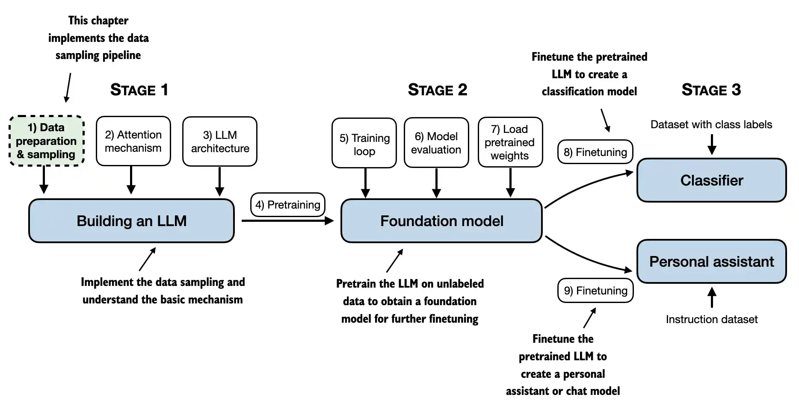
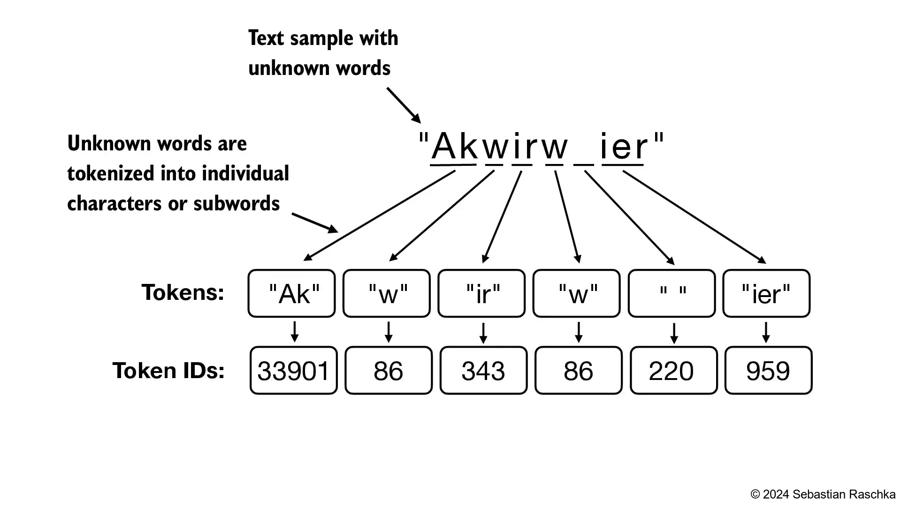
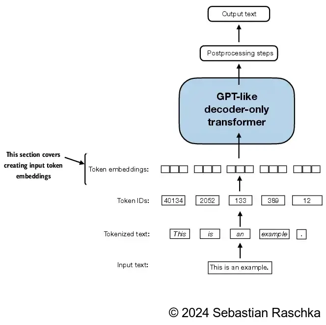
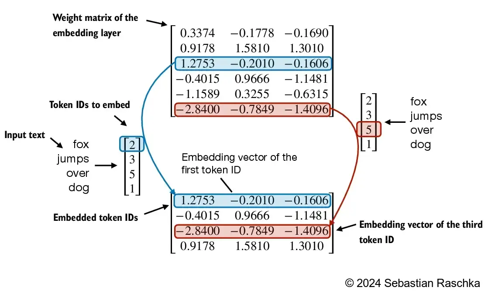

[TOC]

# Transformer相关

## 理解Embedding层和线性层的区别

- Pytorch中的Embedding层实现了与执行矩阵乘法的线性层相同的功能
- 我们使用Embedding层的原因是计算效率

### Embedding层

```python
import torch
import torch.nn as nn
print("PyTorch version:", torch.__version__)

idx = torch.tensor([2, 3, 1])

num_idx = max(idx) + 1

output_dim = 5

torch.manual_seed(123)

embedding_layers = nn.Embedding(num_idx, output_dim)

embedding_layers.weight
```

```
Parameter containing:
tensor([[ 0.3374, -0.1778, -0.3035, -0.5880,  1.5810],
        [ 1.3010,  1.2753, -0.2010, -0.1606, -0.4015],
        [ 0.6957, -1.8061, -1.1589,  0.3255, -0.6315],
        [-2.8400, -0.7849, -1.4096, -0.4076,  0.7953]], requires_grad=True)
```

```python
embedding_layers(torch.tensor([1]))
```

```
tensor([[ 1.3010,  1.2753, -0.2010, -0.1606, -0.4015]],
       grad_fn=<EmbeddingBackward0>)
```

- 来可视化一下看看发生了什么

  


### Linear层


## Transformer基础架构


可以看到，**Transformer**由**Encoder**（编码器）和**Decoder**（解码器）两个部分组成。

- Encoder部分
  - **Embedding**：首先获取输入的sentence，经过embedding之后获得输入句子的embedding向量。其中embedding向量是由句子的每一个单词的embedding组成
  - **位置编码**：将获得的输入Embedding与位置的Embedding相加。具体的公式在Decoder部分详细说明。
  - **Multi-Head Attention**：由于获得的输入embedding是一个向量矩阵，每一行为每个单词的embedding以及相应的位置信息。值得注意的是，每一个Encoder Block输出的矩阵维度与输入完全一致。
  - **残差连接**
  - **LayerNorm**
  - **前馈神经网络**
- Decoder部分
  - **Embedding**：与Encoder部分相同
  - **位置编码**：包含了每一个单词在句子内所在位置的信息。保存了单词在句子序列中的绝对位置或者相对位置。当输入序列为整段文本时，为绝对位置；若是单个句子的时候，为相对位置。
  - **Masked Multi-head Attention**：第一个多头注意力机制使用了masked操作，用于掩盖序列之后的信息，防止信息泄露，避免过拟合
  - **Add & Norm**：残差连接与层归一化
  - **Feed Forward**：前馈神经网络，即多层感知器
  - **linear & Softmax**：线性变换层以及最后输出概率


### Layer Normalization（层归一化的作用）


#### 为什么不用Batch Normalization

### 位置编码详解

位置编码包含了每一个单词在句子内所在位置的信息。保存了单词在句子序列中的绝对位置或者相对位置。当输入序列为整段文本时，为绝对位置；若是单个句子的时候，为相对位置。

论文中使用了一个公式


- 泛化能力强
- 唯一性


### 为什么需要使用掩码


### 自注意力机制详解


### 多头注意力机制详解


### **为什么要除以根号dk**

- 雅可比矩阵导数尽量不会变为0

- 概率分布的方差不会太大


# 微调

## 什么是微调

微调就是将像GPT-3这样的通用模型，转化为像ChatGPT这样专门用于聊天的模型。即将通用模型转化为用于某一个特定用途的模型。

- 微调对模型实际上做了什么
  - 它使得模型能够处理比提示词（Prompt）更长的数据，使得模型不仅能够访问数据，还可以从中学习，通过这个学习过程，能够将其转化为某一特定用途的模型
  - 帮助模型产生更加一致的输出和行为
  - 帮助模型减少幻觉，即减少模型编造事物的情况
- 微调缺点
  - 数据质量和数量要求
  - 成本问题
- 微调的作用：
  - 改变模型的行为：
  - 学习新的知识
  - 以上均是
- 微调的步骤
  - 使用LLM，通过提示工程来识别一个任务
  - 找到一些它做的还可以的任务
  - 选择一个任务
  - 为这项任务收集一些输入和输出
  - 使用这些数据微调一个小的LLM

## 微调在整个训练过程的位置

- 训练过程
  - 预训练：数据是来自于网络上的庞大语料。费时费钱
  - 微调：通过微调得到一个优化的模型。与预训练不同的地方是微调所需的数据要比预训练少得多，因为是在一个训练好的模型上再训练

## 指令微调

指令微调是微调的一种类型，有时也被称为指令调整。


## 数据准备

数据所需要求

- 高质量
- 多样的
- 真实的
- 大量

收集数据的步骤

- 收集指令-响应对
- 组合这些对
- 对数据进行分词，添加填充或截断数据
- 分为训练集和测试集


# 从零到一搭建LLM

## 一、文本数据处理

本章主要介绍数据准备以及采样，为LLM准备输入数据



### 1.1 理解word embedding

- 嵌入有多种形式，LLM中我们主要关注文本嵌入


- LLM与高维空间中的 embedding向量 共同起作用
- 由于我们无法可视化这样的高维空间，下图说明了一个 2维 嵌入空间


### 1.2 Tokenizer 文本

- 在本节中，我们将文本标记化，这意味着将文本分解为更小的单元，例如单个单词和标点符号


- 接下来加载我们需要的文本

  ```python
  import os
  import urllib.request
  
  if not os.path.exists('../../../Data/the-verdict.txt'):
      url = ("https://raw.githubusercontent.com/rasbt/"
             "LLMs-from-scratch/main/ch02/01_main-chapter-code/"
             "the-verdict.txt")
      file_path = "the-verdict.txt"
      urllib.request.urlretrieve(url, file_path)
      
  with open('../../../Data/the-verdict.txt', 'r', encoding='utf-8') as f:
      raw_text = f.read()
  
  print(f"Total number of article: {len(raw_text)}")
  print(raw_text[:99])
  ```

  ```
  Total number of article: 20479
  I HAD always thought Jack Gisburn rather a cheap genius--though a good fellow enough--so it was no 
  ```

- 目标：tokenize 文本为 LLM 所用

  - 基于一些简单的数据开发一个简单的 tokenizer，以便于之后使用
  - 以下正则表达式是将其以 **空格** 进行分割

  ```python
  import re
  
  text = "Hello, world. This is a test."
  result = re.split(r'(\s)', text)
  
  print(result)
  ```

  ```
  ['Hello,', ' ', 'world.', ' ', 'This', ' ', 'is', ' ', 'a', ' ', 'test.']
  ```

  ```python
  result = [item for item in result if item.strip()]
  print(result)
  ```

  ```
  ['Hello,', 'world.', 'This', 'is', 'a', 'test.']
  ```

- 处理其他无意义字符

  ```python
  text = "Hello, world. Is this-- a test?"
  
  result = re.split(r'([,.:;?_!"()\']|--|\s)', text)
  result = [item.strip() for item in result if item.strip()]
  print(result)
  ```

  ```
  ['Hello', ',', 'world', '.', 'Is', 'this', '--', 'a', 'test', '?']
  ```

  

  ```python
  preprocessed = re.split(r'([,.:;?_!"()\']|--|\s)', raw_text)
  preprocessed = [item.strip() for item in preprocessed if item.strip()]
  print(preprocessed[:30])
  ```

  ```
  ['I', 'HAD', 'always', 'thought', 'Jack', 'Gisburn', 'rather', 'a', 'cheap', 'genius', '--', 'though', 'a', 'good', 'fellow', 'enough', '--', 'so', 'it', 'was', 'no', 'great', 'surprise', 'to', 'me', 'to', 'hear', 'that', ',', 'in']
  ```

- 计算总的token长度

  ```python
  print(len(preprocessed)) # 4690
  ```

### 1.3 将 tokens 转换为token IDs

- 接下来，将文本 tokens 转换为 token IDs，以便于之后可以通过embedding层对其进行处理


- 从这些tokens，我们可以构建一个包括所有tokens的词表

  ```python
  # 进行去重
  all_words = sorted(set(preprocessed))
  vocab_size = len(all_words)
  
  print(vocab_size) # 1130
  ```

  ```python
  # 构建词表
  vocab = {token:integer for integer,token in enumerate(all_words)}
  for i, item in enumerate(vocab.items()):
      print(item)
      if i >= 20:
          break
  ```

  ```
  ('!', 0)
  ('"', 1)
  ("'", 2)
  ('(', 3)
  (')', 4)
  (',', 5)
  ('--', 6)
  ('.', 7)
  (':', 8)
  (';', 9)
  ('?', 10)
  ('A', 11)
  ('Ah', 12)
  ('Among', 13)
  ('And', 14)
  ('Are', 15)
  ('Arrt', 16)
  ('As', 17)
  ('At', 18)
  ('Be', 19)
  ('Begin', 20)
  ```

- 构建一个tokenizer类

  ```python
  class SimpleTokenizerV1:
      def __init__(self, vocab):
          '''
          Tokenizer类
          :param vocab: 词表 
          '''
          self.str_to_int = vocab
          self.int_to_str = {i:s for s, i in vocab.items()}
          
      def encode(self, text):
          preprocessed = re.split(r'([,.?_!"()\']|--|\s)', text)
          preprocessed = [
              item.strip() for item in preprocessed if item.strip()
          ]
          ids = [self.str_to_int[s] for s in preprocessed]
          return ids
      
      def decode(self, ids):
          text = " ".join([self.int_to_str[i] for i in ids])
          
          text = re.sub(r'\s+([,.?!"()\'])', r'\1', text)
          return text
  ```

  - encode函数将词表转换为token IDs

  - decode函数将token IDs转换回文本

    

- 我们可以用tokenizer将文本转换为整数，这些整数可以作为LLM的embedding输入层

- 将token IDs decode回文本

### 1.4 加入特殊文本tokens

- 为未知单词添加一些“特殊”标记并表示文本的结尾是很有用的


- 一些 tokenizer 使用特殊的 tokens 来帮助LLM提供额外的上下文

- 其中一些特殊 tokens 是
  - **[BOS]**（序列的开始）标记文本的开始
  - **[EOS]**（序列结束）标记文本的结束位置（这通常用于连接多个不相关的文本，例如，两篇不同的维基百科文章或两本不同的书，等等）
  - **[PAD]**（填充）如果我们训练批量大小大于1的LLM（我们可能包括多个不同长度的文本；使用填充 token，我们将较短的文本填充到最长的长度，使所有文本的长度相等）
  - **[UNK]** 表示未包含在词汇表中的词汇
- 请注意，GPT-2不需要上述任何tokens，而只使用<|endoftext|> token 来降低复杂性
- **<|endoftext|>** 类似于上面提到的 [EOS] token
- GPT还使用 <|endoftext|> 进行填充（因为我们在对批处理输入进行训练时通常使用掩码，所以无论如何我们都不会使用填充的tokens，所以这些tokens是什么并不重要）
- GPT-2不对词汇表外的单词使用 <|UNK|> 标记；相反，GPT-2使用了一个字节对编码（BPE）标记器，它将字分解为子字单元，我们将在后面的部分中讨论


```python
tokenizer = SimpleTokenizerV1(vocab)

text = "Hello, do you like tea. Is this-- a test?"

tokenizer.encode(text)

# 会报错 KeyError: 'Hello'
```

- 由于词表中未包含 Hello 一词，因此上述操作会报错

- 为了处理这种情况，我们可以向词表中添加特殊的标记，如<|UNK|>，以表示未知单词

- 由于我们已经扩展词表，让我们添加一个 <|endoftext|> 标记，它在 GPT-2 训练中表示文本的末尾

  ```python
  preprocessed = re.split(r'([,.?_!"()\']|--|\s)', raw_text)
  preprocessed = [item.strip() for item in preprocessed if item.strip()]
  
  all_tokens = sorted(list(set(preprocessed)))
  all_tokens.extend(["<|endoftext|>", "<|unk|>"])
  
  vocab = {token:integer for integer, token in enumerate(all_tokens)}
  
  len(vocab.items()) # 1161
  ```

  ```python
  for i, item in enumerate(list(vocab.items())[-5:]):
      print(item)
  ```

  ```
  ('younger', 1156)
  ('your', 1157)
  ('yourself', 1158)
  ('<|endoftext|>', 1159)
  ('<|unk|>', 1160)
  ```

- 我们还需要相应地调整tokenizer，以便于知道何时以及如何使用新的 <|UNK|> token

  ```python
  class SimpleTokenizerV2:
      def __init__(self, vocab):
          '''
          Tokenizer类
          :param vocab: 词表 
          '''
          self.str_to_int = vocab
          self.int_to_str = {i:s for s, i in vocab.items()}
          
      def encode(self, text):
          preprocessed = re.split(r'([,.?_!"()\']|--|\s)', text)
          preprocessed = [
              item.strip() for item in preprocessed if item.strip()
          ]
          preprocessed = [
              item if item in self.str_to_int
              else "<|unk|>" for item in preprocessed
          ]
          
          ids = [self.str_to_int[s] for s in preprocessed]
          return ids
      
      def decode(self, ids):
          text = " ".join([self.int_to_str[i] for i in ids])
          
          text = re.sub(r'\s+([,.?!"()\'])', r'\1', text)
          return text
  ```

- 用修正后的tokenizer尝试一下

  ```python
  tokenizer = SimpleTokenizerV2(vocab)
  
  text1 = "Hello, do you like tea?"
  text2 = "In the sunlit terraces of the palace."
  
  text = " <|endoftext|> ".join((text1, text2))
  
  print(text)
  ```

  ```
  Hello, do you like tea? <|endoftext|> In the sunlit terraces of the palace.
  ```

  ```python
  tokenizer.encode(text)
  ```

  ```
  [1160,
   5,
   362,
   1155,
   642,
   1000,
   10,
   1159,
   57,
   1013,
   981,
   1009,
   738,
   1013,
   1160,
   7]
  ```

  ```python
  tokenizer.decode(tokenizer.encode(text))
  ```

  ```
  '<|unk|>, do you like tea? <|endoftext|> In the sunlit terraces of the <|unk|>.'
  ```

### 1.5 BytePair编码

- GPT-2 使用字节对编码（BPE）作为其标记器

- 它允许模型将不在其预定义词汇表中的单词分解为更小的子单词单元甚至单个字符，使其能够处理词表外的单词

- 例如，如果GPT-2的词汇表中没有单词“unmiliarword”，它可能会将其标记为[“unfam”、“iliar”、“word”]或其他一些子单词细分，这取决于其经过训练的BPE合并

- 原始的BPE标记器可以在这里找到：https://github.com/openai/gpt-2/blob/master/src/encoder.py

- 在本章中，我们将使用OpenAI开源tiktoken库中的BPE标记器，该库在Rust中实现其核心算法，以提高计算性能

- 我创建了一个笔记本/并排比较这两种实现的bytepair_encoder（tiktoken比示例文本快5倍）

  ```python
  import importlib
  import tiktoken
  
  tokenizer = tiktoken.get_encoding("gpt2")
  text = (
      "Hello, do you like tea? <|endoftext|> In the sunlit terraces"
       "of someunknownPlace."
  )
  
  integers = tokenizer.encode(text, allowed_special={"<|endoftext|>"})
  
  print(integers)
  ```

  ```
  [15496, 11, 466, 345, 588, 8887, 30, 220, 50256, 554, 262, 4252, 18250, 8812, 2114, 1659, 617, 34680, 27271, 13]
  ```

  ```python
  strings = tokenizer.decode(integers)
  
  print(strings)
  ```

  ```
  Hello, do you like tea? <|endoftext|> In the sunlit terracesof someunknownPlace.
  ```

- BPE标记器将未知单词分解为子单词和单个字符

  

### 1.6 滑动窗口数据采样

- 我们训练LLM一次生成一个单词，因此我们希望相应地准备训练数据，其中序列中的下一个单词表示要预测的目标

  

  ```python
  with open("../../../Data/the-verdict.txt", "r", encoding="utf-8") as f:
      raw_text = f.read()
      
  enc_text = tokenizer.encode(raw_text)
  print(len(enc_text)) # 5145
  ```

- 对于每一个文本块，我们需要输入和目标。由于我们希望模型预测下一个单词，因此目标是向右移动一个位置的输入

  ```python
  enc_sample = enc_text[50:]
  context_size = 4
  
  x = enc_sample[:context_size]
  y = enc_sample[1:context_size+1]
  
  print(f'x: {x}')
  print(f'y:     {y}')
  ```

  ```
  x: [290, 4920, 2241, 287]
  y:     [4920, 2241, 287, 257]
  ```

- 一个接着一个，预测如下

  ```python
  for i in range(1, context_size + 1):
      context = enc_sample[:i]
      desired = enc_sample[i]
      
      print(context, '------>', desired)
  ```

  ```
  [290] ------> 4920
  [290, 4920] ------> 2241
  [290, 4920, 2241] ------> 287
  [290, 4920, 2241, 287] ------> 257
  ```

  ```python
  for i in range(1, context_size+1):
      context = enc_sample[:i]
      desired = enc_sample[i]
  
      print(tokenizer.decode(context), "---->", tokenizer.decode([desired]))
  ```

  ```
   and ---->  established
   and established ---->  himself
   and established himself ---->  in
   and established himself in ---->  a
  ```

- 我们使用滑动窗口方法，将位置更改+1

  

- 创建数据集和数据加载器，从输入文本数据集中提取块

  ```python
  import torch
  from torch.utils.data import DataLoader, Dataset
  
  class GPTDatasetV1(Dataset):
      def __init__(self, txt, tokenizer, max_length, stride):
          '''
          :param txt: 文本 
          :param tokenizer: 
          :param max_length: 滑动窗口最大长度 
          :param stride: 滑动步长
          '''
          self.input_ids = []
          self.tar_ids = []
          
          token_ids = tokenizer.encode(txt, allowed_special={"<|endoftext|>"})
          
          for i in range(0, len(token_ids) - max_length, stride):
              input_chunk = token_ids[i:i + max_length]
              tar_chunk = token_ids[i + 1:i + max_length + 1]
              self.input_ids.append(torch.tensor(input_chunk))
              self.tar_ids.append(torch.tensor(tar_chunk))
              
      def __len__(self):
          return len(self.input_ids)
      
      def __getitem__(self, idx):
          return self.input_ids[idx], self.tar_ids[idx]
      
  def create_dataloader_v1(txt, batch_size=4, max_length=256,
                           stride=128, shuffle=True, drop_last=True,
                           num_workers=0):
      tokenizer = tiktoken.get_encoding("gpt2")
      
      dataset = GPTDatasetV1(txt, tokenizer, max_length, stride)
      
      dataloader = DataLoader(
          dataset,
          batch_size=batch_size,
          shuffle=shuffle,
          drop_last=drop_last,
          num_workers=0
      )
      return dataloader
  ```

- 针对上下文大小为4的LLM测试批大小为1的数据加载器

  ```python
  with open(r'../../../Data/the-verdict.txt', 'r', encoding='utf-8') as f:
      raw_text = f.read()
  
  dataloader = create_dataloader_v1(
      raw_text, batch_size=1, max_length=4, stride=1, shuffle=False
  )
  
  data_iter = iter(dataloader)
  first_batch = next(data_iter)
  print(first_batch)
  ```

  ```
  [tensor([[  40,  367, 2885, 1464]]), tensor([[ 367, 2885, 1464, 1807]])]
  ```

  ```python
  second_batch = next(data_iter)
  print(second_batch)
  ```

  ```
  [tensor([[ 367, 2885, 1464, 1807]]), tensor([[2885, 1464, 1807, 3619]])]
  ```

- 使用等于上下文长度的步幅（4）的示例如下

  

- 我们还可以创建批处理输出

- 在这里增加步长，这样批次之间就不会有重叠，因为更多的重叠可能会导致过拟合

  ```python
  dataloader = create_dataloader_v1(raw_text, batch_size=8, max_length=4, stride=4, shuffle=False)
  
  data_iter = iter(dataloader)
  inputs, targets = next(data_iter)
  print("Inputs:\n", inputs)
  print("\nTargets:\n", targets)
  ```

  ```
  Inputs:
   tensor([[   40,   367,  2885,  1464],
          [ 1807,  3619,   402,   271],
          [10899,  2138,   257,  7026],
          [15632,   438,  2016,   257],
          [  922,  5891,  1576,   438],
          [  568,   340,   373,   645],
          [ 1049,  5975,   284,   502],
          [  284,  3285,   326,    11]])
  
  Targets:
   tensor([[  367,  2885,  1464,  1807],
          [ 3619,   402,   271, 10899],
          [ 2138,   257,  7026, 15632],
          [  438,  2016,   257,   922],
          [ 5891,  1576,   438,   568],
          [  340,   373,   645,  1049],
          [ 5975,   284,   502,   284],
          [ 3285,   326,    11,   287]])
  
  ```

### 1.7 创建token embedding向量

- 使用嵌入层将标记嵌入到连续向量表示中

- 通常这些嵌入层是LLM本身的一部分，并在模型训练期间进行更新训练

  

- 假设我们有以下四个输入示例，输入ID分别为5、1、3和2（标记之后）。且为了简单起见，假设我们的词汇量很小，只有6个单词，并且我们想要创建大小为3的嵌入

  ```python
  input_ids = torch.tensor([2, 3, 5, 1])
  vocab_size = 6
  output_dim = 3
  
  torch.manual_seed(123)
  embedding_layer = torch.nn.Embedding(vocab_size, output_dim)
  
  print(embedding_layer.weight)
  ```

  ```
  Parameter containing:
  tensor([[ 0.3374, -0.1778, -0.1690],
          [ 0.9178,  1.5810,  1.3010],
          [ 1.2753, -0.2010, -0.1606],
          [-0.4015,  0.9666, -1.1481],
          [-1.1589,  0.3255, -0.6315],
          [-2.8400, -0.7849, -1.4096]], requires_grad=True)
  ```

- 对于熟悉热编码的人来说，上面的embedding层方法本质上只是在全连接层中实现一个热编码器，然后进行矩阵乘法的更有效的方法

- 因为嵌入层只是一种更有效的实现，相当于一个热编码器和矩阵乘法方法，所以它可以被视为一个可以通过反向传播优化的神经网络层

- 详细区别可以看 [理解Embedding层和线性层的区别](#Transformer相关-理解Embedding层和线性层的区别)

- 要将id为3的token转换为三维向量，执行以下操作

  ```python
  print(embedding_layer(torch.tensor([3])))
  ```

  ```
  tensor([[-0.4015,  0.9666, -1.1481]], grad_fn=<EmbeddingBackward0>)
  ```

- 注意,上面是embedding_layer权重矩阵中的第4行。要嵌入上面的所有四个input_ids值，我们需要进行以下操作

  ```python
  print(embedding_layer(input_ids))
  ```

  ```
  tensor([[ 1.2753, -0.2010, -0.1606],
          [-0.4015,  0.9666, -1.1481],
          [-2.8400, -0.7849, -1.4096],
          [ 0.9178,  1.5810,  1.3010]], grad_fn=<EmbeddingBackward0>)
  ```

- 所以Embedding层本质上就是一种查找操作

  

### 1.8 编码单词位置


## 二、构建注意力机制

## 三、从头实现GPT

## 四、预训练模型

## 五、微调
